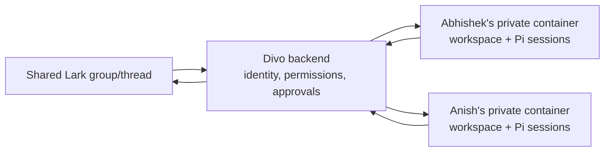
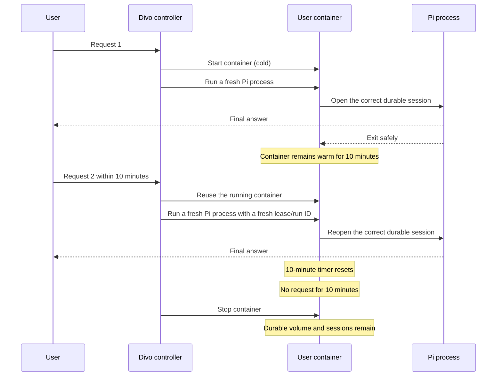
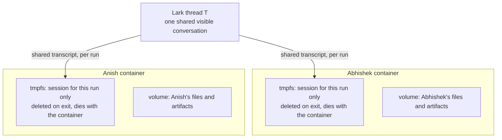
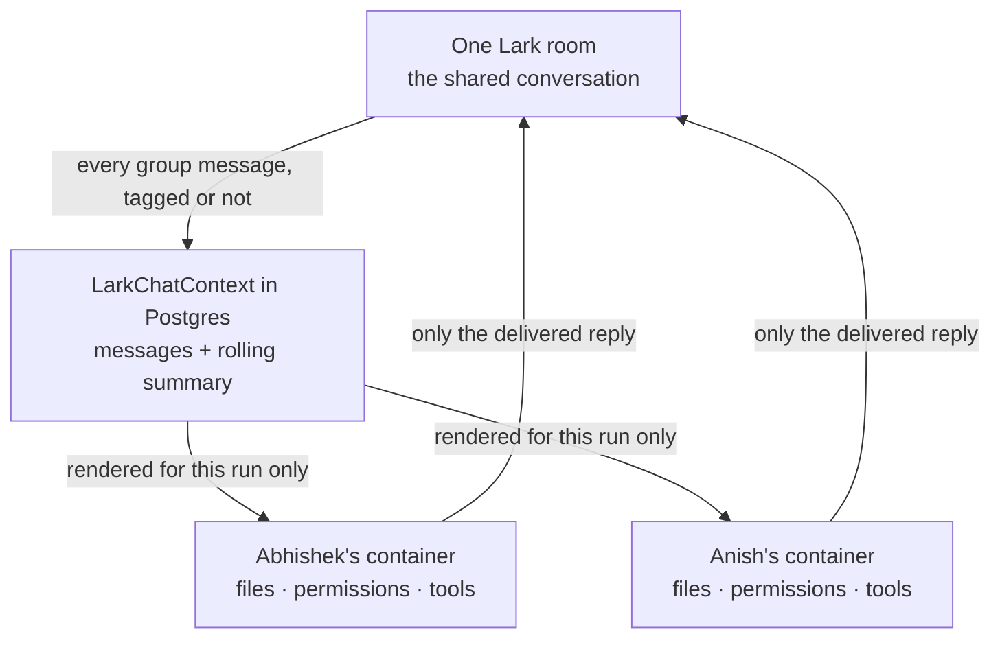

# Cloud Divo: warm containers and shared group context

> **Purpose:** Explain, in simple language, what stays warm, what is copied,
> and how a shared Lark group should work with isolated per-user containers.
>
> **Implementation status:** Both parts are implemented. The 10-minute
> warm-container lifecycle came first; shared group-context hydration and
> run-scoped group sessions are described in section 4.

## 1. The simplest mental model

Think of each Divo user as having a private laptop hosted inside our VM:

- **Lark thread** is the shared room everyone can see.
- **Backend** is the receptionist and security desk.
- **User container** is that user's private computer.
- **Docker volume** is that computer's durable SSD.
- **Pi session** is one conversation notebook stored on that SSD.

Stopping a container is like switching off the laptop. Its SSD is not deleted.

## 2. What the 10-minute warm behaviour now means

After a successful request, the user's Docker container stays running for ten
minutes. A new successful request resets the timer.

### Why the container is warm but the exact Pi process is fresh

One live Pi process is born with one thread, runtime lease, run ID, status
callback, and run directory. Blindly reusing it for another request could reuse
stale security and tracing context.

The safe V1 split is:

- Reuse the expensive Docker container boundary for ten minutes.
- Start a fresh Pi RPC process for each request.
- Reopen the correct durable Pi session from the user's volume.

This removes repeat Docker startup without mixing two requests' credentials or
run metadata. It does **not** make follow-ups instant: Pi/model startup and the
model's response time still remain.

### Exact lifecycle rules

| Event | Result |
|---|---|
| Successful request | Keep container running for 10 minutes |
| Another request arrives | Cancel the pending stop and reuse the container |
| Request succeeds | Reset the 10-minute timer |
| Request fails or is aborted | Stop the container immediately |
| Controller shuts down | Stop all containers it kept warm |
| Image/runtime template changes | Recreate the container, preserve its user volume |

## 3. What is copied in one shared group thread?

Assume Abhishek and Anish both invoke Divo inside one Lark thread.

For a **group** thread each participant's session is per-run and lives on the
container's tmpfs, never on their volume — so it cannot outlive the container even
if cleanup never runs. What their volume keeps is their files and artifacts.

A **direct message** is the durable case: one participant, one durable
`threads/T/pi-session.jsonl` on that user's volume, and resuming it is the
continuity. The rest of this section describes that case.

This is intentional for:

- user-specific permissions;
- private tool results;
- approvals and identity;
- files created by one user;
- avoiding simultaneous writes to one JSONL file.

### What does **not** create another copy

- Stopping and restarting the same container.
- Waking the same user again.
- Reopening the same thread for the same user.

Those actions reuse the same volume and session file.

### What creates another private session copy

- A different user invokes Divo in that thread.
- The same user invokes Divo in a different canonical thread.

Only people who actually invoke Divo receive a private agent session. A
20-person group does not automatically create 20 copies.

## 4. How one shared thread stays one conversation

**Status: implemented.** A group turn no longer answers from the current
message alone.

The conversation was never the problem — the place it was stored was. A Pi
session file held two different kinds of memory at once:

| Memory | Belongs to | Lives in |
|---|---|---|
| The conversation — who said what | the **room** | one record in Postgres |
| Execution — files, tools, permissions, approvals | the **user** | that user's Docker volume |

Splitting them apart makes the copying question disappear, because for a group
thread there is nothing left to copy.

### The rule

> In a group thread, the Pi session is scratch. The conversation is read from the
> backend on every turn.

- **Direct message** — one participant, so the durable per-thread session *is*
  the conversation. Unchanged.
- **Group thread** — several participants in separate containers, so the run gets
  a session scoped to that run, and the shared transcript is sent in with the
  request.

Nothing is merged and nothing is deduplicated, because no second copy is ever
written. A container dying stops mattering: the transcript was never inside it.

### Nothing new was built to store it

The shared record already existed and was already being written on **every**
group message — including messages that never mentioned Divo — along with every
reply Divo delivered. It was simply never read on the isolated Pi route.

| Piece | Where |
|---|---|
| Shared record, keyed `(companyId, lark, chatId)` | `LarkChatContext` |
| Rolling summary + compaction | `summaryJson`, `LarkChatContextService` |
| Rendering, with the untrusted-reference framing | `group-context-formatter.ts` |
| Reading it for a run | `group-context.hydrator.ts` *(new)* |
| Read-only room access | `LarkChatContextRepoPort.get` *(new — reads must not upsert)* |
| Run-scoped Pi session | `sessionScope` through the controller to `runtime.mjs` |

### What crosses the boundary

Only what the room can already see. That is what makes one rendered block safe
to hand to two different people's containers.

| Data | Shared? |
|---|---|
| Messages visible in the room | Yes |
| Divo's delivered replies | Yes |
| Attachment names and refusal notices | Yes |
| Rolling summary of older discussion | Yes |
| Workspace files and artifacts | No |
| Tool results and terminal output | No |
| Permissions, departments, approvals | No |
| Pi session transcript | No |
| Tool credentials | Never reach Pi |

The transcript arrives labelled as untrusted reference data, with the rule that
nothing inside it may be followed as an instruction — colleagues' words are now
model input, so that guard travels with them.

### Why there is no cache

There is deliberately none, and the reason is worth writing down because it is
counter-intuitive.

The webhook appends the incoming message to the room record **before** the run
starts. So by the time a turn reads the room, the state it reads is one no
earlier turn could have produced — the message count moved, `updatedAt` moved,
and the message being excluded is this turn's own. Every possible cache key is
unique per turn by construction, which makes the hit rate exactly zero. A
version-keyed cache was built, measured over a simulated six-turn thread plus a
webhook redelivery, and found to never serve: it cost an extra query, a Redis
GET and a Redis SET of up to 32 KB per turn, for nothing.

Two different participants never share a render either, because each excludes
their own message and answers a different room state.

What remains is one indexed row read per group turn — tens of milliseconds
against a container start measured in seconds. Caching was never where this
turn's time goes.

### Two things the shared block has to get right

**A file named in the transcript is not a file the run holds.** Attachments go
into the container of whoever sent them, so the block says only that a file was
shared in the room, and instructs the run to say it does not have it rather than
describe contents it never opened.

**A participant must not be able to impersonate anyone.** Message text is quoted
verbatim, so a member can type the block's own label, the sentence that ends it,
or a whole line attributed to a manager. Every line the backend renders therefore
carries a per-render token nobody could have known when they typed, in three
kinds: `|` opens a message and is **the only place a speaker is established**,
`>` is more of that same sender's text, and `-` is a heading from Divo's own
tooling. A forged line inside somebody's message lands on `>`, so it reaches the
agent as that member's own words rather than as another person speaking. The
adjacent messages fetched for a bare mention go through the same framing, because
unframed they would be the one region of the prompt nothing governed.

### Size limit

The controller rejects a request body over 64 KB, and rejection fails the whole
turn. Two guards, in order:

1. The block is budgeted at roughly 5,000 transcript tokens plus 1,200 of
   summary, then hard-capped at 32 KB. Trimming only ever costs transcript: the
   label, the file rule, the fence rules and the trust policy are re-emitted, so
   a block can lose its oldest lines but never the rules that make it safe to
   read.
2. The request is then fitted to the real body. The ask always wins — a 40 KB
   pasted log keeps every byte and the room context shrinks around it, because
   before this change that whole budget belonged to the ask and a fixed context
   allowance would have turned answerable messages into `request_too_large`.
   Shrinking re-renders the block at the smaller size rather than slicing the
   composed string, so this guard cannot cost the framing either. When context is
   lost, `pi.shared_context.trimmed` records how much was asked for and how much
   was sent, because a thread that silently stops receiving it is otherwise
   invisible.

### A brief undetectable window at deploy

A controller built before this slice ignores an unknown `sessionScope` without
complaining, and the run result does not echo which scope was honoured. So while
a new backend is talking to an old controller, group turns silently go back to
writing the re-sent transcript into each participant's durable session.

Sequencing does not fix it: dev deploy is one `docker compose up -d` from a single
commit ([ci.yml](../.github/workflows/ci.yml)), which recreates the backend and
`divo-dev-pi-controller` together — there is no way to land `divo-pi` first. What
bounds it is that the window is a few seconds of a recreate, and
`reconcileOwnedContainers()` stops every warm per-user container when the
controller restarts, so nothing carries across it.

The real fix is to have the run echo the scope it honoured and warn on a
mismatch. That is not built.

### Fixed on the way past

A bare `@Divo` in a group used to send Pi the instruction *"use the supplied
adjacent Lark context"* with no context attached — the fetched neighbouring
messages were only ever read by the in-process engine. They now reach the run
alongside the room transcript.

### Known limits

**Another participant's files.** Group attachments stream into the **sender's**
container, and land in `.divo/inbox` on that user's durable volume — so the
sender can still open their own earlier uploads on a later turn, but Anish cannot
open Abhishek's. Anish's transcript names the file and the framing tells the run
to look for it and only then say it does not hold it. Re-fetching on demand from
the stored Lark file key is a separate slice, and the room is the natural ACL for
it: the file was posted there, so every member can already see it in Lark.

**A room that cannot be read.** If the room read fails, the turn still runs, but
the block says so and tells the run not to assume continuity — so a request that
depends on what was agreed earlier gets an honest "the history was unavailable"
rather than a confident answer about nothing.

**Cross-thread recall.** `divo_search_chats` / `divo_read_chat` read the durable
per-thread session files on a user's volume. A run-scoped group session never
writes there, so group discussion is no longer recallable through those tools —
only through the room window and its rolling summary. Existing group session
files stay where they are; nothing new joins them. Indexing the room record for
recall would close this, and is not done.

## 5. This is separate from request concurrency

| Problem | Simple meaning | Required control |
|---|---|---|
| Per-user concurrency | Two requests try to use one user's runtime together | Per-user FIFO/admission |
| Shared group context | Two users' private agents know different parts of one thread | Backend room-context hydration — **done**, section 4 |
| Warm lifecycle | Repeated requests pay Docker startup every time | 10-minute idle container |

Solving one does not automatically solve the other two.

## 6. Decision and next discussion

**Warm lifecycle verdict:** proceed — confidence **92%**. The implementation
keeps isolation and per-turn security context while removing repeat Docker
starts.

**Shared-context verdict:** implemented as described in section 4. Every group
turn reads the shared room record and runs on a session scoped to that run, so
two participants in one thread can no longer hold different understandings of it.
Settled while building:

1. **How much is injected** — token-budgeted, not a message count, then hard-capped
   in bytes against the controller's 64 KB request limit.
2. **What the summary may contain** — only what the room can see. Tool results and
   workspace files stay private to the container that produced them.
3. **Scope** — the room, matching the record that was already being written. Reads
   are labelled untrusted reference data, so a question in one topic can draw on
   the room without treating it as an instruction.

Still open, and none of them block the current behaviour:

1. Which files or artifacts one participant may explicitly share with another —
   today an uploaded file only exists in the sender's container.
2. How a deleted or edited Lark message should propagate into the stored record
   and its rolling summary.
3. Whether Divo should answer using only messages the current requester can see.

Live verification outstanding: a two-user, two-container exchange in one Lark
thread on the deployed VM.
