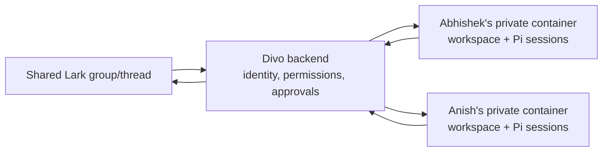
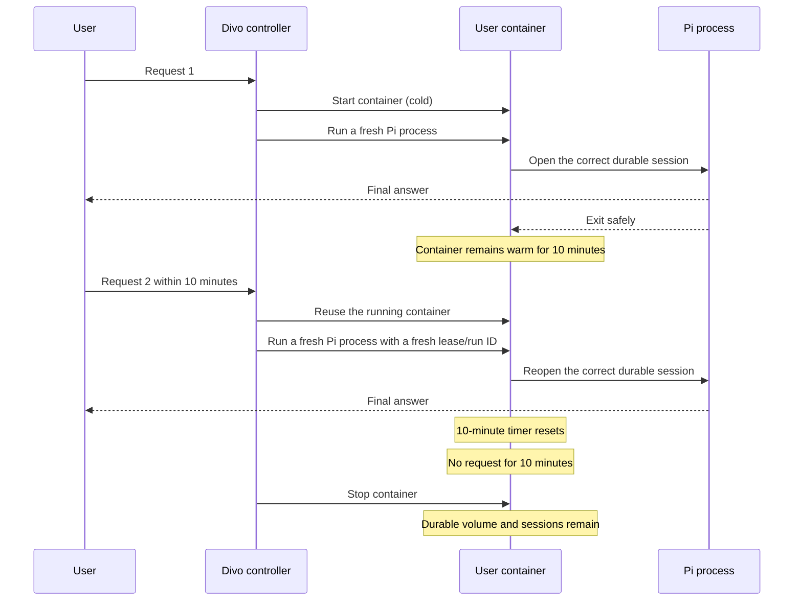
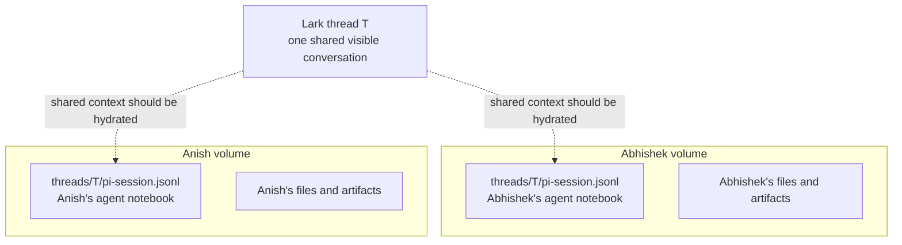
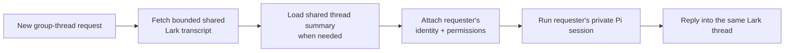

# Cloud Divo: warm containers and shared group context

> **Purpose:** Explain, in simple language, what stays warm, what is copied,
> and how a shared Lark group should work with isolated per-user containers.
>
> **Implementation status:** The 10-minute warm-container lifecycle is
> implemented locally. Shared group-context hydration is a separate design
> decision and is not implemented by this change.

## 1. The simplest mental model

Think of each Divo user as having a private laptop hosted inside our VM:



- **Lark thread** is the shared room everyone can see.
- **Backend** is the receptionist and security desk.
- **User container** is that user's private computer.
- **Docker volume** is that computer's durable SSD.
- **Pi session** is one conversation notebook stored on that SSD.

Stopping a container is like switching off the laptop. Its SSD is not deleted.

## 2. What the 10-minute warm behaviour now means

After a successful request, the user's Docker container stays running for ten
minutes. A new successful request resets the timer.



### Why the container is warm but the exact Pi process is fresh

One live Pi process is born with one thread, runtime lease, run ID, status
callback, and run directory. Blindly reusing it for another request could reuse
stale security and tracing context.

The safe V1 split is:

- Reuse the expensive Docker container boundary for ten minutes.
- Start a fresh Pi RPC process for each request.
- Reopen the correct durable Pi session from the user's volume.

This removes repeat Docker startup without mixing two requests' credentials or
run metadata. It does **not** make follow-ups instant: Pi/model startup and the
model's response time still remain.

### Exact lifecycle rules

| Event | Result |
|---|---|
| Successful request | Keep container running for 10 minutes |
| Another request arrives | Cancel the pending stop and reuse the container |
| Request succeeds | Reset the 10-minute timer |
| Request fails or is aborted | Stop the container immediately |
| Controller shuts down | Stop all containers it kept warm |
| Image/runtime template changes | Recreate the container, preserve its user volume |

## 3. What is copied in one shared group thread?

Assume Abhishek and Anish both invoke Divo inside one Lark thread.



There are two private Pi session files because the users have separate volumes.
The thread identifier can be the same, but the physical files are different.

This is intentional for:

- user-specific permissions;
- private tool results;
- approvals and identity;
- files created by one user;
- avoiding simultaneous writes to one JSONL file.

### What does **not** create another copy

- Stopping and restarting the same container.
- Waking the same user again.
- Reopening the same thread for the same user.

Those actions reuse the same volume and session file.

### What creates another private session copy

- A different user invokes Divo in that thread.
- The same user invokes Divo in a different canonical thread.

Only people who actually invoke Divo receive a private agent session. A
20-person group does not automatically create 20 copies.

## 4. The real shared-context gap

The current isolated Pi route reliably gives Pi the current message. It also
hydrates some special cases such as a quoted parent message and a bare mention
with nearby messages.

It does **not yet** guarantee that every normal request from every user receives
the same bounded shared Lark-thread history. Therefore:

1. Abhishek can discuss something with Divo.
2. Anish can reply in the same Lark thread.
3. Anish's private Pi session may not contain Abhishek's earlier Divo exchange.
4. Both users are visibly in one Lark thread but their private agents can have
   different understandings.

This is not a Docker-copying bug. It is a **shared conversation hydration**
problem.

## 5. What must be shared, and what must stay private

| Data | Shared across the Lark thread? | Where it should live |
|---|---:|---|
| Human and Divo messages visible in the thread | Yes | Lark/backend transcript |
| Bounded thread summary | Yes | Backend conversation record |
| Current requester's identity | No | Backend-issued runtime context |
| Permissions and departments | No | Backend authority |
| Tool credentials | Never sent to Pi | Backend only |
| User workspace files | No by default | User's Docker volume |
| Private tool results | No by default | User session/workspace |
| Pi JSONL session | No | User's Docker volume |
| Approval ownership | No | Backend approval records |

## 6. Recommended shared-context design

Do not mount one shared Pi session into multiple user containers.

For every group-thread request, the backend should build a context package:

```text
Shared recent Lark messages
+ shared long-thread summary
+ quoted/referenced message
+ current user's message
+ current user's identity and permissions
+ current user's private Pi session
= one correctly informed isolated run
```



### Why one shared Pi JSONL is rejected

A shared writable Pi session would create:

- identity and permission leakage;
- private-result leakage;
- approval confusion;
- concurrent JSONL corruption;
- unclear ownership of generated files.

The shared truth should be the Lark/backend transcript, not one container's Pi
session.

## 7. This is separate from request concurrency

| Problem | Simple meaning | Required control |
|---|---|---|
| Per-user concurrency | Two requests try to use one user's runtime together | Per-user FIFO/admission |
| Shared group context | Two users' private agents know different parts of one thread | Backend thread-context hydration |
| Warm lifecycle | Repeated requests pay Docker startup every time | 10-minute idle container |

Solving one does not automatically solve the other two.

## 8. Decision and next discussion

**Warm lifecycle verdict:** proceed — confidence **92%**. The implementation
keeps isolation and per-turn security context while removing repeat Docker
starts.

**Shared-context verdict:** the direction is clear, but the exact transcript
contract still needs agreement — confidence **78%** until these are decided:

1. How many recent messages should be injected: 20, 50, or token-budget based?
2. Should a shared summary include tool results, or only text visible in Lark?
3. Which files/artifacts can another participant explicitly share?
4. How should message deletion and edited Lark messages affect the summary?
5. Should Divo answer using only messages that the current requester can see?

Recommended next slice: define and test a small `GroupThreadContext` contract
owned by the backend, then inject it into the isolated Pi prompt without
changing RBAC, credentials, approvals, or container isolation.
