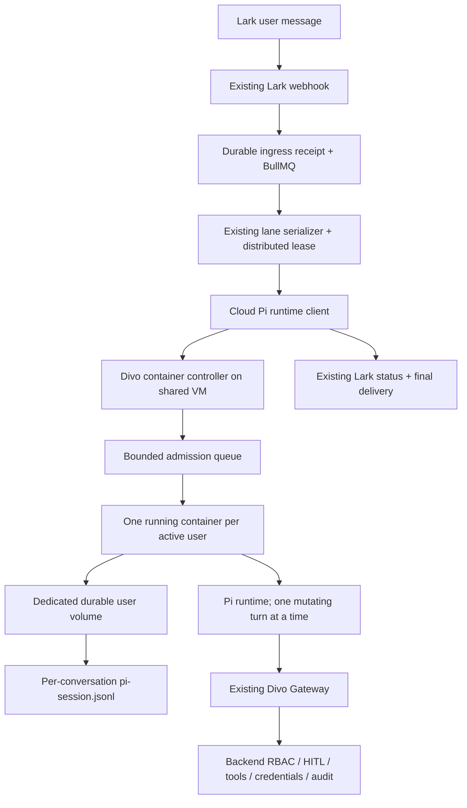
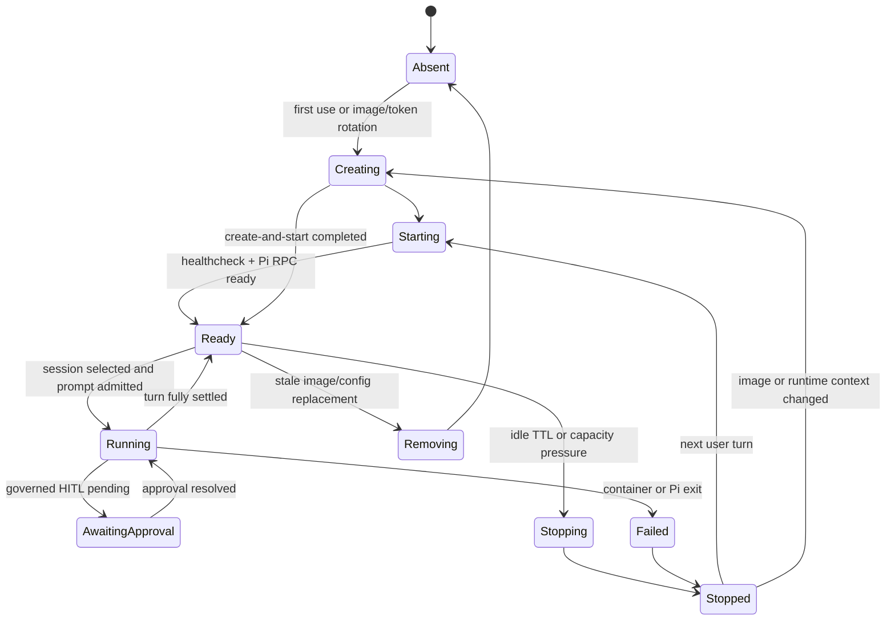

# Cloud Pi in Per-User Docker Containers — Living Implementation Plan

> **Status:** Development Pi stack deployed and proven through permanent Lark ingress
>
> **Owner:** Abhishek / Divo engineering
>
> **Last updated:** 2026-07-30
>
> **Target:** A one-user end-to-end vertical slice in 3–5 engineering days, a
> hardened 5–10-user pilot in roughly 2–3 weeks, then a measured rollout to
> 160–200 employees.
>
> **Primary decision:** V1 uses one Docker container per active user on one
> always-running VM. Each container can hold many durable Pi sessions but
> admits one mutating turn at a time. Idle containers stop; per-user volumes
> preserve workspaces and session files.

---

## 0. How to use and maintain this file

This is the source of truth for the cloud Pi runtime. It covers the path from
architecture validation through the company-wide operating model.

### 0.1 Status legend

- `[ ]` Not started
- `[~]` In discovery or active implementation
- `[x]` Implemented, tested, and verified in the target environment
- `[!]` Blocked or requires an explicit decision

### 0.2 Update protocol

Every implementation change must update this file in the same pull request:

1. Update **Last updated**.
2. Update the phase status table.
3. Check only tasks that are actually complete.
4. Record validation commands and real results under the relevant phase.
5. Record architecture changes in the decision log; do not silently rewrite
   earlier decisions.
6. Add newly discovered but out-of-scope work to the backlog.
7. Update the risk register when a mitigation is proven or invalidated.
8. Add a short changelog entry.

### 0.3 Completion rule

A phase is complete only when all of the following are true:

- Its acceptance criteria pass.
- Its focused automated tests pass.
- Its environment-level verification passes.
- Its recovery path has been exercised where practical.
- Logs and metrics can explain failures without exposing secrets.
- The result and evidence are recorded here.

### 0.4 Current phase status

| Phase | Outcome | Status |
|---|---|---|
| 0 | Scope, assumptions, measurements, and decisions frozen | `[~]` In progress |
| 1 | One containerized Pi runtime starts, stops, and resumes a session | `[ ]` Not started |
| 2 | Per-user volumes preserve workspace and sessions across replacement | `[ ]` Not started |
| 3 | Cloud Pi authenticates through the existing Divo Gateway | `[ ]` Not started |
| 4 | Authenticated Lark turns route only to Pi and fail visibly | `[~]` Status/final delivery proven; forced-failure and group proof pending |
| 4A | Mature cloud-agent behavior is reproduced Pi-natively and the AI SDK agent is retired | `[~]` Behavior inventory complete; implementation pending |
| 5 | Bounded per-user container pool works safely | `[~]` 10-minute warm lifecycle implemented; FIFO and bounded warm-pool policy pending |
| 6 | Docker host is provisioned, hardened, backed up, and observable | `[ ]` Not started |
| 7 | Crash recovery, checkpoints, retries, and idempotency are proven | `[ ]` Not started |
| 8 | Load, latency, memory, and security gates pass | `[ ]` Not started |
| 9 | 5–30-user pilot is completed and evaluated | `[ ]` Not started |
| 10 | 160–200-user rollout and second-host resilience are complete | `[ ]` Not started |
| 11 | Steady-state operations and runtime-provider review are active | `[ ]` Not started |

---

## 1. Executive decision

### 1.1 What we will build

Divo will run Pi in the cloud using:

- One always-running Linux VM for V1.
- Docker Engine on that VM.
- A small Divo-owned container lifecycle controller.
- One container per active Divo user, created on demand.
- A bounded host-wide number of running user containers.
- One mutating turn at a time per user container in V1.
- Multiple durable Pi sessions inside the user's storage namespace.
- Idle containers stopped after a configurable TTL.
- Many durable Pi session files on disk.
- A separate persistent Docker volume for every Divo user.
- A separate Pi session for every canonical Lark conversation.
- The same pinned Pi/Bun bundle, Divo extensions, skills, tool allowlist,
  session layout, RPC behavior, and run-settlement semantics proven by the
  desktop runtime.
- Container namespaces, cgroups, a non-root process, and a hardened static
  container template for cross-user separation.
- The existing Divo Gateway for all governed company capabilities.
- The existing Lark ingress queue, lane serialization, delivery recovery,
  approvals, RBAC, audit, and tool execution.
- One Pi-only Lark runtime path. Once a supported Lark turn is admitted, the
  current AI SDK agent is never selected as fallback or retry.

### 1.2 What we will not build in V1

- One VM per user.
- One container per conversation or Pi session.
- Kubernetes.
- A Firecracker or microVM scheduler.
- Self-hosted E2B.
- A general-purpose sandbox API.
- User-controlled container images, mounts, capabilities, or Docker options.
- A second Lark webhook or delivery pipeline.
- A second RBAC, approval, credential, or tool-execution authority.
- Unlimited Pi processes.
- Permanent Pi processes for all 160–200 employees.
- Direct SaaS credentials inside Pi.
- Direct Lark, Google, Zoho, Meta, or other provider calls from Pi.

### 1.3 Why this is the current recommendation

The desktop implementation already proves the essential model:

- Pi sessions are durable JSONL files.
- Pi can be spawned as a complete Bun process.
- A runtime can switch to an exact session path.
- The selected workspace is supplied as Pi's working directory.
- Many logical sessions can remain on disk while only active runtimes consume
  memory.

Docker adds the missing cloud boundary without requiring an E2B-like platform:

- Every active user receives a separate process, mount, network, and cgroup
  namespace.
- CPU, memory, and process-count limits can be set per user container.
- Stopping a container releases Pi/Bun memory.
- The per-user volume survives container stop, removal, and recreation.
- A pre-pulled, pinned image makes wake-up a local container start rather than
  a VM boot.

Divo still needs a small lifecycle controller. Docker cannot decide which Lark
user owns a container, which Pi session to open, whether a turn is safely idle,
or whether a retry is allowed. That controller is intentionally narrow and is
not a general sandbox platform.

The backend already owns the hard distributed-system work:

- Durable Lark receipt admission and retry.
- Per-conversation serialization.
- Cross-replica lane leases and cancellation.
- Delivery recovery that avoids rerunning completed agent work.
- Identity, live membership, RBAC, HITL, tool contracts, credentials, and
  audit.
- Pre-call and post-call execution checkpoints for governed operations.

Cloud Pi should replace only the model/agent runtime for selected turns. It
must not recreate the rest of Divo.

### 1.4 Confidence

**Architecture confidence: 88%.**

The decision is strong enough for a reversible pilot. It is not yet strong
enough for company-wide rollout because actual image size, container/Pi wake
time, active memory, hardened-container isolation, and 20-way concurrency have
not been measured in the target Linux environment.

### 1.5 Verified Docker facts behind the decision

- Docker containers use Linux namespaces for filesystem, networking, and
  process isolation.
- Cgroups provide CPU, memory, and process resource accounting/limits, but
  Docker applies no resource limits unless we configure them.
- Named volumes have a lifecycle independent of containers, so stop/remove/
  recreate does not delete user work.
- A stopped container can be started again; with the image already local, this
  avoids VM provisioning.
- Docker Engine control is effectively host-root authority in the standard
  daemon configuration. The controller must be trusted, its inputs must be
  fixed/validated, and the Docker socket must never enter a user container.
- Containers share the host kernel. This is stronger than workspace-only
  separation but is not the same security boundary as an E2B/Firecracker
  microVM.

Primary references:

- [Docker container execution and namespaces](https://docs.docker.com/engine/containers/run/)
- [Docker volume lifecycle](https://docs.docker.com/engine/storage/volumes/)
- [Docker resource constraints](https://docs.docker.com/engine/containers/resource_constraints/)
- [Docker Engine security and daemon attack surface](https://docs.docker.com/engine/security/)
- [Docker user-namespace remapping](https://docs.docker.com/engine/security/userns-remap/)

---

## 2. Product outcome and success definition

### 2.1 User outcome

A Divo member should be able to message Divo in Lark and receive work from a
cloud-hosted Pi agent that:

1. Uses the member's correct company identity and permissions.
2. Opens the correct durable workspace.
3. Continues the correct Pi conversation.
4. Creates and edits durable files only in that user's permitted workspace.
5. Uses governed Divo capabilities for company systems.
6. Survives Pi process and VM restarts without losing completed work.
7. Does not repeat completed external mutations after retry.
8. Responds quickly during an active conversation.
9. Queues excess work instead of exhausting the machine.
10. Can be disabled instantly without breaking the existing Lark experience.

### 2.2 V1 engineering success

The V1 is successful when:

- Five pilot users complete real Lark work for at least two working days.
- Warm Pi work begins within 2 seconds at P95.
- A stopped user container plus Pi becomes usable within 10 seconds at P95.
- A VM restart preserves every durable workspace and session.
- A removed and recreated container resumes the correct Pi session.
- Cross-user workspace reads and writes are denied by the container/volume
  boundary.
- Ten simultaneous turns complete without memory exhaustion.
- Twenty simultaneous turns either run or queue without crashing.
- The same Lark conversation never has two active Pi writers.
- Permission removal takes effect on the next gateway call.
- An ambiguous delivery retry does not rerun completed agent work.
- New Pi turns can be drained or disabled without ever routing them through the
  retired AI SDK agent.

### 2.3 Company rollout success

The 160–200-employee rollout is complete only when:

- At least two Docker agent hosts can carry the expected peak or an accepted
  single-host risk is explicitly documented.
- There is no single local disk whose loss destroys user work.
- Backup restoration has been tested.
- Worker admission, queue depth, memory, latency, error rate, and cost are
  observable.
- On-call engineers have restart, drain, rollback, restore, and incident
  runbooks.
- The security review accepts the hardened Docker boundary and network policy.
- Thirty days of usage show that the architecture remains simpler and cheaper
  than the managed-runtime alternative for Divo's real workload.

---

## 3. Current codebase baseline

The implementation must reuse these existing paths rather than introducing
parallel ownership.

### 3.1 Lark ingress and recovery

- `advance-backend/src/application/lark-ingress/lark-ingress.queue.ts`
  provides a durable BullMQ ingress queue with retries and deterministic job
  IDs.
- `advance-backend/src/application/lark-ingress/lark-ingress.worker.ts`
  claims durable receipts, handles leases, records failure, dead-letters
  exhausted work, and reconciles stale receipts.
- `advance-backend/src/infrastructure/channels/lark/lark.webhook.routes.ts`
  acknowledges only after durable admission and separates HTTP acceptance from
  background execution.
- Delivery recovery already prevents an answer-delivery retry from rerunning
  the agent and repeating completed tools.

### 3.2 Conversation serialization

- `advance-backend/src/application/orchestration/chat-message-serializer.ts`
  serializes work per conversation lane and caps total active work.
- `advance-backend/src/application/orchestration/lane-lease.holder.ts`
  prevents two backend replicas from executing the same conversation lane.
- `advance-backend/src/domain/conversation/conversation-key.ts` provides the
  canonical stable key for DMs, inline group lanes, and threaded group
  conversations.

The cloud Pi runtime must use this canonical conversation key. It must not
invent another Lark-thread identity.

### 3.3 Current Lark runtime

Normal Lark work currently ends at:

```ts
deps.engine.run(...)
```

inside:

`advance-backend/src/infrastructure/channels/lark/lark.webhook.routes.ts`

Cloud Pi replaces the Lark agent call at this boundary. A supported message
runs only through Pi; failure never invokes the current engine.

### 3.4 Gateway authority

- `advance-backend/src/http/gateway/gateway.routes.ts` provides the constrained
  Pi/Desktop gateway surface.
- `advance-backend/src/http/middleware/member-auth.middleware.ts` verifies a
  member JWT, checks the corresponding `MemberSession`, and resolves live
  company membership on every call.
- `advance-backend/src/application/gateway/gateway-dispatcher.ts` resolves
  capabilities and routes governed calls.
- The backend remains authoritative for tools, connections, RBAC, HITL,
  credentials, schemas, audit, and external execution.

### 3.5 Desktop Pi runtime evidence

- `jan/src-tauri/src/core/pi/session.rs` stores Pi memory at
  `threads/{threadId}/pi-session.jsonl` and pins its session header to the
  selected workspace.
- `jan/src-tauri/src/core/pi/manager.rs` starts Pi in RPC mode, assigns a
  session, bounds the number of physical Bun workers, queues excess turns,
  reclaims idle runtimes, and handles process exit.
- `jan/pi-extensions/divo-gateway` implements the single governed gateway tool.
- The local approval gate explicitly states that command-text inspection is not
  a shell security boundary. Cloud V1 therefore uses a hardened container and
  a per-user volume as the minimum isolation boundary.

### 3.6 Desktop parity contract for cloud

The cloud runtime should preserve the proven desktop behavior, not copy the
entire desktop manager source file.

Preserve exactly where practical:

- The output of `jan/scripts/vendor-pi.mjs`: pinned Pi package, patched runtime,
  bundled agent package, extensions, and skills.
- The bundled Bun executable and Pi CLI invocation in RPC mode.
- Explicit trusted extension/skill paths and the company tool allowlist.
- Session JSONL structure, exact session-path switching, and workspace `cwd`
  repair.
- Request/run correlation, readiness, prompt, abort, process-exit, and final
  settlement behavior.
- One active owner for a mutating workspace, bounded admission, and safe-idle
  rules.
- Divo Gateway environment and protected run-context semantics.

Do not copy into the cloud host:

- Tauri `AppHandle`, desktop commands, window events, macOS resource
  resolution, desktop browser UI, file pickers, or other desktop presentation
  code.
- Desktop-local approval or credential ownership. Cloud authorization,
  approvals, credentials, and audit remain backend-owned.

Recommended production seam:

```text
shared headless Pi lifecycle core
  ├── desktop adapter: Tauri events + bundled macOS resource resolution
  └── cloud adapter: Docker paths + structured backend event stream
```

Phase 1 may begin with the smallest headless adapter needed to prove the
contract. Before production wiring, approve either extracting the existing
Tauri-independent lifecycle into a shared Rust core or accepting a deliberately
temporary duplicate. A full copy of `manager.rs` is rejected because its
desktop dependencies would create fragile cloud-only branches and two
diverging lifecycle implementations.

### 3.7 Legacy behavior extraction and deletion ledger

The old cloud agent is a behavioral reference only. We will reuse backend
authority and channel infrastructure, reproduce the useful behavior through
isolated Pi, then remove the AI SDK agent code. No new Pi path may call
`engine.run()` directly or indirectly.

| Behavior to preserve | Existing source of truth | Pi-native owner | Current gap / deletion gate |
|---|---|---|---|
| Signed Lark ingress, tenant binding, durable ACK | Lark webhook, security, ingress receipt and BullMQ worker | Existing backend Lark ingress | Reuse unchanged; never move webhook verification into Pi |
| DM/group/thread identity and ordering | Conversation keys, message serializer, distributed lane lease and fence | Existing backend routing plus Pi thread mapping | Prove separate group threads and per-turn sender authority |
| Sign-in and original-message replay | First-touch card, Lark OAuth nonce and pending-event replay | Backend issues/renews a Lark `MemberSession`, then starts Pi | Current callback stores a Lark connection but does not create the session Pi requires |
| Provider connection cards | Google authorization intent, callback, queue and original-request snapshot | Backend card/intent plus fresh Pi continuation | Replace the continuation worker's `engine.run()` call before deleting the old engine |
| Manager approval | Approval gate, immutable args, idempotency, manager card, secure callback | Backend authority plus a `cloud_pi` continuation state | Gateway approvals currently end Pi and tell the requester to retry |
| Status, interrupt and final delivery | Status coordinator, card builder, delivery reservation and recovery | Backend renders typed Pi events | Add waiting-for-login/OAuth/approval, artifact and terminal event types |
| Tool governance | Gateway, permissions, connection policy, approval, rate limits, audit and `ToolExecutor` | Existing backend authority | Reuse; Pi never receives SaaS credentials or becomes policy authority |
| Conversation and quoted-message context | Lark transcript, parent-message hydration and group-context policy | Backend shapes the Pi input manifest | Prove quoted text/images/audio and bare mentions through Pi |
| Inbound files and media | Lark attachment parser/downloader, OCR, document extraction and voice transcription | Backend stages bounded inputs; Pi receives local paths plus extracted context | Current Pi request is text-only and loses original files/image pixels |
| Outbound artifacts | Pi workspace `artifacts/` and `divo_artifact` badge | Pi emits artifact manifests; backend uploads/delivers to Lark | Current Lark run delivers final text only |
| Busy/capacity/error behavior | Lane notices, controller admission and visible failure rules | Existing backend/controller | Preserve friendly retryable responses with zero AI SDK fallback |
| Scheduled/background continuations | Scheduled workflow and Google continuation workers | Isolated Pi jobs using the same durable run contract | Still call the legacy engine; migrate or explicitly retire before global deletion |

There are two separate deletion gates:

1. **Lark legacy-agent gate:** remove the Google OAuth continuation's
   `engine.run()` dependency and every Lark-specific AI SDK runner/wiring after
   the Lark Pi parity matrix passes.
2. **Repository-wide engine gate:** `OrchestrationEngine` still has non-Lark
   callers in scheduled workflows, desktop WebSocket, Airnote, and diagnostic
   scripts. Migrate those callers to isolated Pi or explicitly retire those
   products before deleting the engine, supervisor, AI SDK adapter, and their
   tests. Do not remove shared tool contracts, Gateway execution, RBAC,
   approvals, OAuth repositories, queues, or Lark delivery with them.

### 3.8 Media, OCR, document and artifact parity

Media is part of Phase 4A acceptance, not a deferred polish item.

Existing behavior to preserve:

- Lark `file`, `image`, `audio`, and rich-post embedded-image parsing.
- Image download, OCR/caption text, the 4 MiB temporary pixel budget, and the
  rule that transient image bytes are not persisted in room transcripts.
- PDF, DOC/DOCX, XLS/XLSX, CSV/TSV, HTML, TXT, Markdown and JSON extraction.
- The current 12-second extraction timeout and bounded 2,000/6,000-character
  excerpt behavior.
- P2P voice-note transcription with the current duration, byte and transcript
  caps; quoted voice-note handling; intentional group-voice restrictions.
- Quoted parent text/images/audio, attachment-without-question waiting,
  unsupported-format honesty, and untagged-group privacy policy.
- Optional chat-scoped document indexing without implying that every file was
  fully read or retained.

Required Pi-native contract:

1. Backend downloads Lark media under current identity/policy and creates a
   versioned attachment manifest containing an opaque content ID, sanitized
   filename, verified MIME, byte size, hash, provenance and expiry.
2. Controller stages authorized files under the exact user's run directory;
   no raw bytes, provider keys, filesystem paths or download URLs are placed in
   the runtime JWT.
3. Pi receives `[ATTACHED_FILES]` entries with container-local read-only paths
   plus the backend's OCR/transcript/excerpt. Text remains the fast path while
   local bytes permit full PDF work, deterministic image operations and
   artifact generation.
4. Every download enforces per-file and per-run aggregate limits while
   streaming, before buffering, OCR or container staging. Filenames cannot
   escape the run directory; hashes and sizes are checked after staging.
5. Light document/image dependencies and their Pi skills are versioned in the
   base image. Heavy OCR (`marker-pdf`, Torch/models) uses a separately admitted
   image/service and never installs multi-gigabyte dependencies during an
   ordinary turn.
6. Pi output files are reported as typed artifact events. Backend validates
   ownership, path jail, MIME and size, then uploads/sends them to the original
   Lark conversation with exactly-once delivery.
7. Video remains explicitly unsupported for ordinary Lark turns until a
   bounded frame/audio extraction product decision is approved. Divo must say
   that honestly rather than pretending the video was inspected.

Current gaps confirmed on 2026-07-30:

- `LarkPiRuntimeService` sends only `{ runtimeLease, backendUrl, message }`; it
  does not send attachment manifests, original bytes or `imageUrls`.
- The current Docker image contains Python, LibreOffice and Poppler, but the
  manifest loads only the Gateway and chat-history skills; the OCR/document
  and image-analysis skills are not active Pi runtime skills.
- Light Python OCR/document packages are installable into the persistent user
  environment but are not yet a pinned, verified image layer.
- Lark document/image downloads do not consistently apply a byte ceiling at
  the streaming boundary; the 4 MiB image rule is applied after download.
- `divo_artifact` identifies a local Markdown artifact for desktop-style UI but
  has no cloud Lark upload/delivery protocol.

---

## 4. Non-negotiable invariants

These rules apply in every phase.

### 4.1 Authority

- Backend identity is authoritative.
- Backend membership and RBAC are authoritative.
- Backend approval policy is authoritative.
- Backend tool contracts are authoritative.
- Backend SaaS credentials remain server-side.
- Pi is a runtime and planner, not a policy authority.

### 4.2 Execution

- One canonical Lark message enters through the existing ingress path.
- One runtime handles a given turn.
- One conversation has at most one active writer.
- One workspace has at most one mutating Pi run unless explicitly designed
  otherwise later.
- Excess work queues; it does not create unbounded processes.
- A worker may be killed only when its turn and approval lifecycle are safely
  idle or when the run has been cancelled.

### 4.3 Storage

- The VM root filesystem is not the durable user-data store.
- User workspaces and Pi sessions live on a managed durable volume.
- Temporary caches and scratch files may live on ephemeral disk.
- Approved per-user extension environments may live under the user's volume;
  common dependencies belong in the versioned image.
- Secrets must never be written into user workspaces or Pi session files.
- Backup and restore are part of completion, not a future nice-to-have.

### 4.4 Isolation

- A current working directory is not a security boundary.
- Every active user runs in a separate container.
- Every user receives a separate volume; a user container mounts only that
  user's volume.
- Pi processes do not run as root.
- Containers are never privileged.
- Containers cannot access the Docker socket or host PID/network namespaces.
- The image, command, mounts, resource limits, and security options come from
  one server-owned template and never from user input.
- A Pi process cannot read another user's token, environment, workspace, or
  session.
- Pi receives no direct SaaS credential.
- User containers cannot directly address or share a network with one another.
- Network access is split between the governed company-capability path and a
  separately controlled public-egress path.

#### Runtime interaction and terminal execution boundary

The interaction paths are intentionally distinct:

```text
Lark -> existing backend -> private controller -> Pi RPC in user container
Pi -> existing Divo LLM/Gateway -> backend authority
Pi -> local read/write/edit/bash -> subprocess inside that user container
Pi subprocess -> controlled public egress -> public internet
```

- The controller creates, starts, stops, observes, and sends RPC messages to
  the container. It never executes Pi's terminal commands on the VM host.
- `read`, `write`, `edit`, and `bash` operate inside the fixed non-root
  container, with the user's workspace as the working directory and with the
  container's CPU, memory, PID, filesystem, and network limits.
- Tool stdout, stderr, exit status, progress, approval requests, and final
  results return through Pi RPC to the controller and existing Lark delivery
  path.
- Subagents are separate child Pi processes inside the same user's container
  and cgroup. They do not form a cross-user network and remain subject to the
  parent container's limits and host-wide child admission.
- Direct company SaaS calls from Bash are forbidden. Lark, Google, Zoho,
  Airtable, memory, and other governed company capabilities use Divo Gateway;
  their credentials remain backend-side.
- Divo Gateway is not a generic internet proxy. Public terminal activity such
  as package retrieval, Git operations, public data download, and arbitrary
  user-requested HTTP work uses a separate broad-public-egress policy.
- Public egress must block host/controller addresses, Docker networks,
  private/link-local ranges, cloud metadata endpoints, and direct governed
  SaaS API paths. It is otherwise intended to be flexible rather than based on
  a small domain allowlist.
- Common packages remain baked into the image. System-level runtime installs
  stay denied; arbitrary non-root user-space packages, standalone binaries,
  source checkouts, venvs, and dependency directories may be downloaded and
  installed within the user's disk/CPU/RAM/PID/time quotas. Persistent install
  roots live on the durable user volume.
- Broad public egress means a process can send workspace data to a public
  destination. Container isolation prevents cross-user/host access but does
  not prevent exfiltration by code the agent intentionally runs. Approval
  presentation, credential scrubbing, audit, quotas, malware controls, and
  explicit acceptance of this product tradeoff are required.

### 4.5 Recovery

- Business progress is stored in the backend, not inferred from Pi memory.
- Workspace files are durable state.
- `pi-session.jsonl` is conversational agent state.
- Receipt, execution, approval, and idempotency records are business state.
- A retry must not repeat an external mutation merely because the final
  response was not delivered.

---

## 5. Target architecture



### 5.1 Build versus reuse

| Component | Decision | Complexity | Reason |
|---|---|---:|---|
| Lark webhook | Reuse | — | Already durable and production-shaped |
| Ingress queue/retry | Reuse | — | Already handles receipt recovery |
| Conversation key | Reuse | — | Already handles DM/group/thread semantics |
| Lane serialization | Reuse | — | Prevents overlapping turns |
| Cloud Pi runtime client | Build | S | Normalizes Pi output to existing Lark flow |
| Container controller | Build | M | Owns fixed-template create/start/stop, admission, and lifecycle |
| Docker Engine | Configure/reuse | S | Provides namespaces, cgroups, images, and container lifecycle |
| Pi RPC protocol | Reuse behavior | M | Mirror the proven desktop lifecycle |
| Gateway extension | Reuse | S | Keeps one governed tool surface |
| Member authentication | Reuse/extend issuance | M | Avoid a second auth system |
| Workspace/session storage | Build | M | One durable volume per user |
| OS isolation | Configure/build | M | Non-root hardened containers with cgroup limits |
| Observability/runbooks | Build | M | Required before rollout |
| Multi-host scheduler | Defer to Phase 10 | L | Not necessary for V1 |

### 5.2 Runtime image and dependency layers

The runtime image is an immutable, versioned product artifact. Its first
version should contain the tools that Divo's existing skills already require
for common document and media work.

Day-one base image:

- Pinned Bun and the exact vendored desktop Pi runtime artifacts.
- Python 3.12, `python3-venv`, `pip`, and `uv`.
- `git`, `ripgrep`, `jq`, `file`, CA certificates, `zip`, and `unzip`.
- `ffmpeg` for common audio/video inspection and conversion.
- `poppler-utils` and `tesseract-ocr` only after the image smoke test confirms
  the existing skills use them correctly.

Day-one baked Python environments:

- PDF/light: `pymupdf`, `pymupdf4llm`, and `pdfplumber`.
- Office: `python-docx`, `python-pptx`, and `openpyxl`.
- Images: `Pillow`.

These package groups come directly from the dependency bootstraps in
`jan/pi-skills/ocr-and-documents/scripts/ensure_deps.py` and
`jan/pi-skills/image-analysis/scripts/ensure_deps.py`. Versions must be locked
when the image is created; the list here is the capability baseline, not an
instruction to install floating latest versions.

Do not place these in every user's volume on day one:

- `marker-pdf`, Torch, and downloaded OCR models. The existing skill warns that
  this path consumes several gigabytes and is slow on CPU.
- Playwright/Chromium and browser automation unless a pilot workflow requires
  them.
- Arbitrary system packages selected by a prompt.

Heavy OCR or browser support should later be a separate image flavor or shared
bounded service, so a large dependency/model set is not duplicated for every
user.

This follows the useful part of the
[Hermes container model](https://github.com/NousResearch/hermes-agent/blob/main/website/docs/user-guide/docker.md):
runtime code and common tools are baked into an immutable image, mutable data
is stored separately, and large services can be split into sidecars. Divo does
not copy Hermes' credential layout; company credentials remain in the Divo
backend.

### 5.3 What survives stop, removal, and recreation

| Change | Same container after `docker start` | Recreated container with same user volume |
|---|---:|---:|
| File in `/workspace` user volume | Survives | Survives |
| Pi session under `/workspace/.divo/sessions` | Survives | Survives |
| Approved user venv under `/workspace/.divo/venvs/user` | Survives | Survives |
| Package installed into the container writable layer | Survives stop/start | Lost |
| Temporary cache or `/tmp` data | Not guaranteed | Lost |
| Dependency baked into the image | Present | Present in that image version |

Docker volumes have an independent lifecycle from containers, while a
container's writable layer is disposable. Therefore a package that Pi installs
into system Python may appear to survive an idle stop, but it disappears when
the controller replaces that container during an image or security update.

V1 runtime installation policy:

1. Common OS, Python, and Node dependencies are baked into the pinned image.
2. Pi runs non-root; runtime `apt` or system-level `pip` installation is denied.
3. `uvx`/`npx` may run an explicitly allowed one-off tool in ephemeral cache.
4. An approved uncommon Python package may be installed into a quota-limited,
   per-user venv under `/workspace/.divo/venvs/user`; it is audited and
   survives container replacement.
5. Frequently requested packages are promoted into the next image build.
6. A missing dependency fails with a structured event naming the package or
   executable; it never silently escalates to root.

The current skill bootstraps use `DIVO_HOME` for their venvs. The cloud
implementation must keep `DIVO_HOME` writable for user state and introduce a
separate read-only bundled-environment path rather than pointing `DIVO_HOME`
at an immutable image directory.

---

## 6. State model

The word “checkpoint” must not be used for three different things without a
qualifier.

### 6.1 Workspace state

Workspace state is the user's durable collection of files:

```text
companies/{companyId}/users/{userId}/workspace/
```

Examples:

- Uploaded or downloaded working documents.
- Generated reports and exports.
- Code and project files.
- Durable artifacts created by Pi.

The workspace is mounted or presented to Pi as its working directory.

### 6.2 Pi session state

Pi session state is the durable agent conversation:

```text
companies/{companyId}/users/{userId}/sessions/{conversationKeyHash}/pi-session.jsonl
```

It contains Pi's session header, conversation events, tool history, compaction
state, and other Pi-owned session entries.

V1 uses one session per canonical Lark conversation, not one session per user.
A user can therefore have multiple independent Lark conversations without
mixing context.

### 6.3 Business execution state

Business execution state remains in the backend:

- Ingress receipt state.
- Execution run and trace state.
- Lane lease state.
- Approval state.
- Pre-call and post-call progress.
- Tool idempotency/correlation identifiers.
- Final delivery reservation and result.

This state answers:

- Did the request start?
- Which governed action completed?
- Is approval pending?
- May the action be retried?
- Was the answer computed but not delivered?
- Should the next turn resume, retry, or refuse?

Pi's session file must never be the sole evidence that an external mutation
completed.

### 6.4 Runtime state

Runtime state is disposable:

- User container.
- Bun/Pi process.
- In-memory model/session objects.
- Open network connections.
- Scratch directory.
- Tool subprocesses.
- Temporary caches.

Losing runtime state may add latency, but it must not lose durable user work or
cause duplicate business actions.

### 6.5 Per-user volume model

Each Divo user gets exactly one Docker-managed volume in V1:

```text
divo-user-{opaqueUserHash}
```

It is mounted only into that user's container:

```text
volume: divo-user-{opaqueUserHash}
target: /workspace
mode: read-write
```

The volume contains:

```text
/workspace/
  files/
  artifacts/
  .divo/
    sessions/
      {sha256(canonicalConversationKey)}/
        pi-session.jsonl
```

Rules:

- The volume name uses a backend-generated opaque hash, not raw company,
  email, Lark, or member identifiers.
- The controller derives the volume name from the authenticated identity; Pi
  never chooses it.
- A container receives exactly one user's volume.
- No user volume is mounted into the controller or another user container
  during normal execution.
- Container replacement never deletes the volume.
- Volume deletion is a separate, explicit retention workflow and is never part
  of idle reclamation.
- Snapshots/backups cover volume data, and restore is tested before pilot exit.
- The image and container writable layer are disposable and contain no durable
  user work.

### 6.6 Initial deterministic path scheme

To avoid a schema migration in the first vertical slice:

```text
/workspace/
  files/
  artifacts/
  .divo/
    sessions/
      {sha256(canonicalConversationKey)}/
        pi-session.jsonl
    scratch/
      {runId}/
```

Requirements:

- IDs are validated and never interpolated as unchecked volume or path
  fragments.
- The conversation directory uses a hash, not the raw Lark key.
- The original conversation key remains in backend trace metadata.
- The container runs as the image's fixed non-root UID.
- Scratch state is removable after each run.
- Durable artifacts never live only under `scratch/`.

### 6.7 When a mapping table becomes necessary

A database mapping is deferred until at least one of these becomes real:

- Multiple named workspaces per user.
- A conversation can move between workspaces.
- Workspace sharing between members.
- Cross-host placement requires a durable home-host assignment.
- Per-workspace retention, quota, or deletion policy.
- Runtime providers require external resource IDs.

If introduced, the table must map:

```text
companyId
userId
conversationKey
workspaceId
agentType
runtimeProvider
runtimeResourceId
sessionPath/storageKey
version
createdAt
updatedAt
```

A migration requires explicit approval before implementation.

---

## 7. Runtime lifecycle

### 7.1 Logical sessions versus running containers

The system may have:

```text
200 employees
500 durable Pi sessions
20 simultaneous Lark conversations
8–16 admitted/running user containers
```

Idle sessions consume volume storage, not a running container. A user may own
many sessions, but V1 admits only one mutating turn for that user at a time.
This avoids two sessions racing over the same user workspace. Per-user
parallelism can be added later only with separate workspaces or proven file
coordination.

### 7.2 User container states



Stopping is normal reclamation. Removing a container is also safe because the
per-user volume is independent. Neither operation deletes workspace/session
state.

### 7.3 Container identity and assignment key

A user container is owned by:

```text
companyId + userId
```

The selected Pi session inside it is:

```text
companyId + userId + canonicalConversationKey
```

A container never switches to another user. It cannot stop or be replaced
while:

- A turn is active.
- A continuation is queued.
- An approval is pending.
- Post-turn compaction or session persistence is active.
- A tool subprocess is still owned by the run.

### 7.4 Warm and cold behavior

- A recently active user container remains running for an initial 20-minute
  idle TTL.
- A follow-up within the TTL reuses the running container and Pi process.
- When host capacity is needed, the oldest safely idle container may stop
  before its TTL.
- A wake starts an already-created container, starts Pi, and opens the existing
  session from the mounted volume.
- If the image, security template, or runtime context changed, the controller
  removes and recreates the container while reattaching the same volume.
- The VM and Docker daemon remain running. No VM provisioning occurs on a user
  wake.
- The pinned image is pre-pulled before rollout or deployment; an image pull is
  never part of the request path.

The 20-minute value is a starting assumption, not a permanent constant. Phase
8 will measure 5-, 10-, and 20-minute TTLs. Container wake plus Pi
initialization is expected to be seconds rather than VM-boot time, but this is
an acceptance benchmark—not an assumption to ship on.

### 7.5 End-to-end turn flow

1. Lark webhook receives a message.
2. Backend persists the ingress receipt.
3. BullMQ worker claims the receipt.
4. Backend resolves the canonical conversation key and member identity.
5. Existing serializer and lane lease admit exactly one turn.
6. Cloud Pi client sends the run to the container controller.
7. Controller acquires the user's execution lock and checks host admission.
8. Controller resolves the fixed container name, user volume, and session path.
9. Controller creates the volume on first use.
10. Controller creates or starts the user's container from the pinned,
    server-owned template.
11. Controller waits for container and Pi readiness.
12. Controller publishes protected run context and the member credential.
13. Pi switches to the exact session and processes the prompt.
14. Pi calls only the governed Divo Gateway for company capabilities.
15. Backend applies live permission, connection, approval, audit, and tool
    policy.
17. Pi returns its final result.
18. Cloud Pi client converts the result to the existing Lark engine output
    shape.
19. Existing Lark delivery publishes the final answer.
20. Receipt and delivery state become terminal.
21. Controller records last-safe-idle time and releases the user lock.
22. Container remains warm until idle reclamation.

### 7.6 The controller we own

This is the minimum orchestration Divo must implement:

1. Map authenticated `companyId + userId` to one opaque container and volume
   identity.
2. Enforce one admitted mutating turn per user and a host-wide running cap.
3. Create/start the container from one immutable configuration template.
4. Wait for readiness and route Pi RPC events for the active run.
5. Track active, approval-pending, safely idle, failed, and stopped state.
6. Stop safely idle containers on TTL or capacity pressure.
7. Reconcile Docker state after controller or host restart.
8. Remove/recreate stale containers without deleting their volumes.

It must not expose a generic `docker run` API. User-controlled image names,
commands, mounts, capabilities, devices, ports, environment keys, and Docker
socket access are out of scope.

---

## 8. Authentication and secrets

### 8.1 Required outcome

Cloud Pi must authenticate as the exact Lark-resolved Divo member while using
the same gateway middleware and live membership checks as desktop Pi.

### 8.2 Recommended V1 approach

Extend the existing member-session issuance path to mint a short-lived
cloud-runtime member session:

- Bound to one Divo user and company.
- Short expiry.
- Revocable.
- Uses the existing `MEMBER_JWT_SECRET`.
- Produces the existing `DIVO_MEMBER_TOKEN` expected by the gateway extension.
- Continues to resolve current membership on every gateway call.

This is an issuance extension, not a second authentication authority.

Authentication is deliberately phased:

1. **Local source-parity verification:** `divo-pi` temporarily reuses the
   existing browser authorize/poll/exchange endpoints. This produces the same
   member JWT already accepted by `/api/llm` and `/api/gateway`.
2. **Production Lark invocation:** The webhook resolves the exact tenant-bound
   Lark identity. A linked member does not repeat OAuth for every invocation.
   An unlinked or ambiguous identity receives a one-time Lark OAuth card whose
   callback is bound to the initiating tenant, open ID, chat/thread, and
   request.
3. **Runtime start:** After live membership revalidation, the backend gives the
   controller a short-lived, audience-scoped, instance-bound runtime lease.
   The controller injects it directly into the correct Pi runtime and reports
   readiness or failure back to the original Lark conversation.

The current `run-engine-harness.ts --oauth-e2e` flow is a useful continuation
test pattern, but it invokes the backend engine directly and currently proves
Google connection OAuth. It does not authenticate or start standalone Pi.

### 8.3 Required code review before implementation

Before changing auth:

- Inspect all `MemberSession` creation and revocation paths.
- Confirm whether the existing schema can distinguish and expire cloud
  sessions safely without a migration.
- Confirm that issuance does not require a desktop-only interaction.
- Confirm how the token is rotated for a warm Pi process.
- Confirm whether a process may retain a token across multiple turns.
- Confirm that a worker is never reassigned to another user with the old token.
- Confirm that token values are redacted from logs, traces, sessions, and
  workspaces.

If the existing session shape cannot support this without ambiguity, stop and
seek approval for a minimal schema change rather than overloading it silently.

### 8.4 Secret rules

- The controller writes the short-lived member token to a root/controller-owned
  run-context file outside the user volume.
- Only that exact file is mounted read-only into the matching user container.
- The container entrypoint reads it and exposes `DIVO_MEMBER_TOKEN` only to the
  Pi process.
- The run-context file is removed after the container stops.
- Tokens are never command-line arguments.
- Tokens are never stored in `pi-session.jsonl`.
- Tokens are never written into the workspace.
- Tokens are never included in BullMQ payloads or log fields.
- SaaS provider tokens never leave `advance-backend`.
- The VM has no reusable Lark, Google, Zoho, or other provider credential.
- Docker socket and controller credentials are unavailable to every user
  container.

---

## 9. Detailed implementation roadmap

## Phase 0 — Freeze scope, decisions, and measurements

> **Status:** `[~]` In progress
>
> **Estimated effort:** 0.5–1 engineering day
>
> **Primary blocker:** No production-shaped Linux benchmark exists yet.

### Objective

First prove that Divo's desktop company Pi can run as an isolated terminal
runtime with the same gateway and session behavior, then turn the remaining
cloud architecture into testable assumptions before adding production code.

### Tasks

- [x] Decide that V1 uses one shared VM and a bounded number of running user
  containers.
- [x] Decide that V1 uses one container per active user.
- [x] Decide that one user container may hold many Pi sessions but admits one
  mutating turn at a time.
- [x] Decide that every user receives a separate durable workspace.
- [x] Decide that every canonical Lark conversation receives a separate Pi
  session.
- [x] Decide that business checkpoints remain backend-owned.
- [x] Decide that Pi continues to use one governed gateway surface.
- [x] Decide that supported Lark turns use Pi only and never invoke the current
  AI SDK runtime as fallback.
- [x] Create a root-level `pi-runtime/` Phase 0 harness without modifying
  `jan/`.
- [x] Snapshot the generated desktop Bun/Pi/extensions/skills bundle and verify
  critical source/snapshot SHA-256 parity.
- [x] Run terminal Pi through the backend-proxied model and make a live,
  read-only `divo_gateway capabilities.get` call.
- [x] Resume the same terminal JSONL session in a second process.
- [x] Import the complete official Pi `v0.80.3` source snapshot into
  `divo-pi/` as ordinary files owned by the existing Divo repository, with no
  nested Git metadata or independent history.
- [x] Add a Divo-owned standalone runtime layer with browser Lark login,
  department selection, runtime-context bootstrap, isolated sessions and
  workspaces, direct-provider credential stripping, and explicit extension,
  skill, model, and tool boundaries.
- [x] Make the standalone Divo LLM extension fail closed when backend
  authentication is missing.
- [x] Reuse and validate the existing Desktop member session for a local-only
  engine/Pi parity run, without shell-evaluating the credential file.
- [x] Compare the current backend engine and standalone Pi with the same user,
  Finance department, fresh context, and read-only prompts without Lark
  delivery.
- [ ] Complete real browser OAuth against the local backend through ngrok and
  repeat the model plus read-only Gateway proof from `divo-pi/`.
- [ ] Select the initial cloud/region for the pilot VM.
- [ ] Confirm the private authenticated transport from backend to the dedicated
  Docker agent host; do not co-locate `advance-backend` with the Docker daemon.
- [ ] Confirm the initial durable-volume product and snapshot policy.
- [x] Pin the Phase 0 Bun version and binary hash.
- [x] Pin the exact Pi and Pi MCP adapter package versions.
- [ ] Measure pre-pulled Docker container create/start time on Linux.
- [ ] Measure stopped-container wake plus Pi RPC readiness time.
- [ ] Measure idle RSS for 1, 5, 10, and 20 running user containers.
- [ ] Measure active RSS during a representative tool-heavy turn.
- [ ] Measure session-switch/open time for small and large JSONL sessions.
- [ ] Confirm that Pi exits cleanly after an RPC shutdown request.
- [ ] Confirm which Pi events prove that a turn and post-turn work are fully
  settled.
- [ ] Inspect `MemberSession` issuance and decide whether V1 needs a schema
  change.
- [x] Decide that Lark attachment/media parity is required before legacy-agent
  deletion. Use bounded backend ingestion plus a Pi-local attachment manifest;
  preserve current OCR/document/voice behavior and add outbound artifact
  delivery.
- [ ] Name the 5–10 pilot users.

### Initial sizing assumption

Use this only to provision the spike:

```text
8 vCPU
32 GiB RAM
100+ GiB managed durable SSD/block volume
Ubuntu LTS
8 running user containers
20-minute idle TTL
```

The size must be revised from measurements, not intuition.

### Acceptance gate

- [ ] The benchmark sheet contains actual Linux results.
- [ ] Every open Phase 0 decision has an owner.
- [ ] The pilot scope is signed off.
- [ ] The auth approach is approved.
- [ ] No migration or new public API is implied without explicit approval.

### Rollback

No runtime behavior changes in this phase.

### Validation evidence

#### Isolated terminal “soul Pi” proof — 2026-07-29

Scope: a new root-level `pi-runtime/` harness only. No file under `jan/` was
modified.

Implemented:

- `pi-runtime/runtime-manifest.json` pins Bun `1.3.14`, the desktop Bun binary
  SHA-256, Pi `0.80.3`, Pi MCP adapter `2.11.0`, provider/model, all six company
  extensions, two trusted skills, and the company tool allowlist.
- `snapshot-desktop-runtime.mjs` copies the already-generated desktop runtime
  into ignored `.snapshot/` state and verifies 11 critical files by SHA-256.
- `run-local.mjs` gives terminal Pi an independent agent directory, workspace,
  run layout, session directory, and runtime context. It reads member
  environment only at process start and does not copy `divo.env`.
- Terminal Pi uses the desktop company-mode extension/skill/tool boundary and
  the same workspace policy outside Tauri.

Observed:

- Snapshot size: approximately 824 MB on the Mac filesystem.
- Six parity tests pass, covering pinned Pi/Bun, desktop boundary matching,
  source/snapshot hashes, required resources, and absence of copied credential
  files.
- The existing member credential returned `success` for a direct read-only
  `capabilities.get` gateway check.
- The snapshotted Pi completed a backend-proxied model turn, called
  `divo_gateway capabilities.get`, and returned exactly `DIVO_GATEWAY_OK`.
- A second Pi process using the same terminal thread/session recalled and
  returned exactly `DIVO_GATEWAY_OK` without calling a tool.
- The session contained nine JSONL entries and its header `cwd` was the
  isolated terminal workspace.
- A scan using the live member-token value found zero copies under
  `pi-runtime/`; generated `auth.json` was an empty JSON object.
- First launch installed 118 MCP-adapter packages and took approximately ten
  seconds for that bootstrap. This must be completed during the Linux image
  build, not on a user's request path.

Boundary still unproven:

- The snapshot contains macOS-native Bun and dependencies and is not the Linux
  deployment artifact.
- RPC readiness, abort, approval continuation, PDF processing, and
  stop/remove/recreate behavior remain Phase 1 tests.
- The workspace prompt is a Phase 0 copy of the desktop prompt. Production
  extraction must establish one shared source before desktop/cloud behavior is
  allowed to diverge.

#### Parent-repository standalone Pi source — 2026-07-29

Scope: a complete upstream source snapshot plus a Divo-owned layer under
`divo-pi/`. The directory is tracked by the existing Divo Git repository and
contains no nested `.git` directory.

Implemented:

- Imported official Pi tag `v0.80.3`, commit
  `a23abe4a695df8b69b613f73e9fdda2a8af894d4`, preserving its MIT license,
  lockfile, packages, tests, documentation, and exact provenance.
- Added `divo/cli.mjs`, `divo/auth.mjs`, and `divo/runtime.mjs`.
- Browser auth reuses the existing temporary desktop integration endpoints:
  authorize URL, callback polling, and one-time code/state exchange.
- The token remains in process memory and is passed only to the Pi child. It
  is not written to the workspace, Pi session, runtime context, command line,
  logs, or repository.
- The launcher fetches capability bootstrap version 3, selects the requested
  or first available department, creates exact run/session correlation, and
  starts Pi from source with the six Divo extensions and trusted skills.
- The launcher removes direct provider keys. `divo-llm` now throws on missing
  Divo configuration instead of silently allowing direct DeepSeek fallback.
- Divo-specific prompt language was separated from Desktop/Tauri wording
  where it affected standalone runtime behavior.
- The Desktop non-vision read-tool guidance was moved into the pinned Pi
  source rather than applied as a generated JavaScript patch.

Validation:

- `npm ci --ignore-scripts`: completed; 352 packages installed.
- `npm run divo:test`: 6/6 standalone auth/runtime tests passed.
- Divo Gateway extension suite: 102/102 tests passed.
- Divo LLM suite: 4/4 tests passed.
- Divo Memory suite: 6/6 tests passed.
- Divo Subagents suite: 12/12 tests passed.
- Divo Artifact suite: 4/4 tests passed.
- Divo Chat History suite: 9/9 tests passed.
- `npm run check`: all upstream format, pinned-dependency, relative-import,
  shrinkwrap, install-lock, TypeScript, and browser-smoke checks passed.
- `./pi-test.sh --no-env --help`: source Pi resolved and started successfully.
- `npm run divo:start -- --help`: standalone Divo launcher started
  successfully.

Local engine-to-Pi parity:

- Added `--no-delivery` to `run-engine-harness.ts`. It retains the real
  backend engine, DeepSeek model, permissions, skill registry, DB lifecycle,
  and trace while replacing only outbound Lark status/final delivery.
- The existing Desktop `divo.env` session was parsed without shell execution,
  validated through `/api/desktop/auth/me`, and resolved to the same
  `abhishek@emiactech.com` user, company, and Finance department as the
  backend harness.
- A direct `capabilities.get` oracle returned 31 governed tools and 45 visible
  skills at permission-policy revision `245645380b2cdbb5`.
- The backend engine completed the read-only capability prompt in about 37
  seconds with `resolve_work` plus skill discovery and no external invocation.
- Source Pi completed the same prompt in 9–13 seconds from its injected
  RBAC-filtered v3 catalogue and made no external invocation.
- The first Pi output overstated Airtable/AITable operations because broad
  recipe descriptions appeared beside narrower authoritative action lists.
  V3 startup rendering now omits recipe descriptions while retaining
  skill IDs/names; the rerun matched the exact Gateway action boundary.
- A live connection-discovery prompt exposed that Pi extensions loaded by
  separate Jiti instances did not share the module-local captured member
  token after the LLM extension scrubbed `process.env`. Credential capture is
  now process-global in memory via `Symbol.for`, which is not inherited by
  Bash/Python children.
- The fixed Pi rerun successfully returned 1 Lark, 4 Google Workspace, 2 Zoho,
  and 1 Airtable accessible account (8 selectable accounts total), without
  reading account content or making a mutation.
- The standalone manifest contains the same six explicit company extensions as
  Desktop: LLM proxy, governed Gateway, memory, subagents, artifacts, and chat
  history. Its company tool allowlist is byte-for-byte identical to Desktop;
  local `read`, `write`, `edit`, and `bash` come from Pi core.
- The first live subagent probe exposed a source-runtime launch bug: the child
  dropped the parent's `tsx` loader and tried to import unbuilt workspace
  `dist` packages. The launcher now preserves `process.execArgv`.
- The corrected live probe completed in a real scout child, which called
  `capabilities.get` itself and returned 31 tools and 45 skills. The recorded
  child state is `completed`, exit code is zero, and the parent made no
  fallback Gateway call.
- Local mutation policy was checked separately: `write`, `edit`, and `bash`
  always emit the versioned approval presentation. `--print` mode has no
  approval UI and therefore denies mutations by design. The cloud controller
  must use Pi RPC and relay `extension_ui_request`/`extension_ui_response`
  rather than auto-approving or weakening this gate.
- Planning is currently available through normal model planning, the bundled
  planner subagent role, and durable Markdown artifacts. Neither Desktop nor
  standalone Divo currently bundles Pi's example persistent todo/plan-mode
  extension; first-class session todos are a visible product decision, not a
  completed parity capability.
- Focused evidence passed: 24/24 Gateway client tests, 9/9 department-context
  tests, 6/6 standalone launcher tests, 13/13 subagent tests, 13/13 approval
  gate tests, the live child probe, backend harness controls, backend
  TypeScript typecheck, and full upstream `npm run check`.

Still pending:

- Live OAuth cannot be truthfully marked complete until the Lark callback
  reaches the local backend through the approved public HTTPS tunnel.
- Browser OAuth remains unproven, but source Pi model inference and live
  Gateway calls are proven using the already-issued Desktop member session.
- AITable is declared `member_selectable` and has a connection repository, but
  `connections.list` currently rejects provider `aitable`. Resolve this
  backend contract inconsistency before claiming complete provider parity.
- The temporary login produces the existing broad desktop `MemberSession`;
  production cloud use still requires a short-lived runtime lease.
- `npm ci` reported four upstream dependency vulnerabilities and one engine
  warning in the unused Gondolin example. Do not apply an unreviewed
  dependency upgrade while parity is being established.

#### Read-only VPS and Docker baseline — 2026-07-29

Scope: inventory only. No container/service start, stop, restart, install,
configuration edit, file edit, or cleanup was performed.

Observed host:

- Ubuntu 22.04.5 LTS on KVM, kernel `5.15.0-173-generic`.
- 2 vCPUs, 7.8 GiB RAM, 2 GiB swap.
- One 100-GB `ext4` root disk; about 57 GB was free.
- Docker data and every local volume live on that same root disk.
- No separate durable user-data disk was attached.
- Host uptime was 32 days; load average was approximately `1.03 / 0.91 /
  0.93` during inspection.

Observed Docker:

- Docker Engine `28.2.2`, API `1.50`.
- Standard rootful daemon using the local Unix socket.
- `overlay2`, cgroup v2, and the systemd cgroup driver.
- Docker reported AppArmor, built-in seccomp, and cgroup namespaces.
- Docker daemon TCP access was not exposed.
- Docker socket was `root:docker`; the `deploy` account was a member of the
  Docker group and therefore has Docker/host-equivalent control.
- `live-restore` was disabled.
- 28 containers existed: 16 running and 12 stopped.
- Images consumed about 14.52 GB; approximately 3.86 GB was reclaimable.
- Local volumes consumed about 1.12 GB.

Observed `divo-development` stack:

- Seven running containers: backend, admin, Google Workspace MCP, Postgres,
  Redis cache, Redis queue, and Redis memory.
- All seven reported healthy with zero restart count and no OOM kill.
- Backend/admin/Postgres/Redis containers had no explicit non-root user.
- No development container had an explicit memory, CPU, or PID limit.
- No development container used read-only rootfs, capability drops, or
  `no-new-privileges`.
- Containers were not privileged and used Docker's `docker-default` AppArmor
  profile.
- The backend image was approximately 1.73 GB and ran Node/pnpm as root.
- The backend held many company/provider secret environment keys. Values were
  deliberately not read or printed.
- Therefore the existing backend image/container must not be repurposed as the
  Pi image; Pi requires a separate minimal image without backend/provider
  secrets.
- Backend, admin, and development Postgres host bindings were loopback-only.
- The network named `divo-dev-internal` had `Internal=false`, so it allowed
  external egress.
- A future agent container must not join this database/Redis network. It needs
  a separate network path limited to the governed Gateway/model endpoints.

Observed agent artifacts:

- No running or stopped Pi/Hermes agent container existed.
- No Pi/Hermes image existed locally.
- Bun and Pi were not installed on the host or in the backend container.
- A detached `divo-dev_hermes-data` named volume existed with no attached
  container.
- That volume was approximately 42 MB, owned by UID/GID `10000`, and contained
  workspace, state, cache, skills, logs, config, and auth-shaped files.
- Its `sessions` directory contained zero files.
- This proves that Docker volume state can survive container/image removal.
- It also proves that the old Hermes layout mixed runtime credentials/config
  with durable user state; the new Pi design must keep short-lived tokens
  outside the user volume.

Observed operational/security gaps:

- No host-visible Divo/Docker volume backup or snapshot timer was found.
- One older development database dump existed; provider-level VPS snapshots
  were not verifiable from the host.
- UFW was inactive.
- SSH allowed root login and password authentication.
- Several unrelated services were publicly listening in addition to
  `22/80/443`.
- The login banner reported 142 available updates, including 125 standard
  security updates.

Phase 0 conclusion:

- The current VPS is useful for a one-user Docker/Pi packaging spike.
- It is not an acceptable pilot or production agent host as-is because it is
  shared with unrelated workloads, has only 2 vCPUs, has no agent resource
  limits, stores Docker state on the root disk, and lacks the required network,
  backup, and SSH hardening.
- Provisioning a dedicated agent VM remains the production recommendation.
- No Pi startup, wake latency, isolation, or load benchmark was performed
  during this read-only inspection.

#### Confirmed legacy `divo-dev` Docker cleanup — 2026-07-29

Two independent checks were completed before deletion:

- Compose identity check:
  - Active dev-branch deployment: project `divo-development`, workdir
    `/opt/divo-dev`, commit-tagged development images.
  - Legacy project: `divo-dev`, workdir `/opt/divo/app`, images created from
    the older July 2 deployment.
  - Grind project: `vps`, workdir `/opt/grind/infra/vps`.
- Dependency/activity check:
  - Projects used different networks and volumes.
  - No running container outside `divo-dev` referenced its old IP, port, proxy
    name, or public hostname through its environment.
  - No `/opt/divo-dev`, `/opt/grind`, systemd, or cron configuration referenced
    the legacy stack.
  - The legacy proxy had zero log lines in the preceding 24 hours.
  - Its cumulative network counters did not change across repeated checks.
  - A live dev-branch deployment to commit tag `dev-e6f2dea8...` recreated the
    `divo-development` services during inspection, independently confirming
    the active deployment target.

Protected pre-delete checks all returned HTTP `200`:

- Active development backend health.
- Active development admin.
- Grind API health.
- Grind dashboard.

Removed exact legacy Docker resources:

- Containers:
  - `divo-dev-divo-proxy-1`
  - `divo-dev-postgres-1`
  - `divo-dev-redis-1`
- Volumes:
  - `divo-dev_hermes-data`
  - `divo-dev_postgres-data`
  - `divo-dev_redis-data`
- Network:
  - `divo-dev_divo-private`
- Unshared legacy image IDs:
  - Legacy Divo proxy image `fd11b4be...`
  - Old PostgreSQL 16 image `e684c11a...`
  - Redis 7 Alpine image `487efc06...`

The current development PostgreSQL container used a different, newer image ID
(`de3a4eab...`), which was explicitly preserved.

Post-delete verification:

- No container, volume, or network carrying the `divo-dev` Compose project
  label remained.
- The three exact legacy image IDs no longer existed.
- `divo-development` retained seven healthy containers.
- Active development backend and admin checks remained HTTP `200`.
- Grind retained both running containers; API and dashboard checks remained
  HTTP `200`.
- Docker changed from 28 containers/16 running to 25 containers/13 running.
- Docker image storage decreased from approximately 14.52 GB to 14.1 GB and
  local-volume storage from approximately 1.12 GB to 1.03 GB.
- `/opt/divo/app` and the old Nginx virtual-host configuration were preserved
  because this cleanup authorized Docker resources only.

---

## Phase 1 — Prove one containerized headless Pi runtime

> **Status:** `[~]` In progress — safe 10-minute warm lifecycle implemented
>
> **Estimated effort:** 2–4 engineering days
>
> **Primary blocker:** Approval of the shared-core extraction boundary after
> the local parity proof.

### Objective

Run one Pi process headlessly inside the fixed Docker image, send it a prompt,
receive the final result, stop/remove the container, and resume the same
session from its volume.

### Implementation shape

Start locally with one container, one named volume, one workspace, and one
session. Do not connect Lark, provision the production VM, or build the pool
yet.

Build one pinned Pi runtime image from the same artifacts as desktop and add the
smallest headless adapter that can drive the existing Pi RPC contract. Do not
copy the entire Rust manager. Implement only the minimum proven lifecycle:

1. Resolve one immutable, pinned image digest.
2. Create one named test volume.
3. Create/start one container from the fixed hardening template.
4. Start Pi in RPC mode as a non-root user.
5. Wait for container and Pi readiness.
6. Switch to the exact session file inside the volume.
7. Send one prompt with run correlation.
8. Stream structured events.
9. Detect final completion.
10. Stop the container safely.
11. Restart it and reopen the session.
12. Remove/recreate it with the same volume and reopen the session.

### Phase 1A — Immediate kickoff slice

This is the next implementation step:

1. Freeze an image manifest from the existing desktop vendor output.
2. Build the local Linux image with pinned Bun, Pi, Divo extensions/skills, and
   the day-one Python/document environment from Section 5.2.
3. Add a minimal headless runner for `ready`, `switch_session`, `prompt`,
   structured events, final settlement, and `abort`.
4. Mount one named test volume at `/workspace`.
5. Run one deterministic prompt that creates `artifacts/hello.txt`.
6. Run one deterministic PDF extraction through the existing document skill.
7. Stop/start the same container and prove the session and files resume.
8. Remove/recreate the container with the same volume and prove they still
   resume.
9. Record image size, build time, warm Pi readiness, cold Pi readiness, idle
   RSS, and active RSS.

Phase 1A is complete only when those checks pass locally. That gives us the
runtime truth before auth, Lark, pooling, or VPS concerns can hide failures.

### Phase 1B — Production ownership seam

After Phase 1A, review the diff and approve one of these paths:

- **Recommended:** extract the Tauri-independent lifecycle into a shared Rust
  core used by desktop and cloud adapters.
- **Temporary spike only:** keep the minimal cloud adapter duplicated, mark it
  non-production, and time-box its replacement.

Do not introduce an unrelated TypeScript reimplementation of the full desktop
manager. It would be quick for a demo but would duplicate the hardest process,
session, cancellation, and settlement behavior.

### Tasks

- [ ] Define `CloudPiRunRequest`.
- [ ] Define `CloudPiRunResult`.
- [ ] Define structured runtime error codes.
- [ ] Add the minimal pinned Dockerfile/image build.
- [ ] Lock and bake the Section 5.2 baseline packages.
- [ ] Add image tests that import each baked Python library and execute each
  required OS binary.
- [ ] Run the image as a fixed non-root UID.
- [ ] Add a Pi RPC readiness healthcheck.
- [ ] Implement fixed-template container create/start/stop/remove calls.
- [ ] Reject any request-supplied image, mount, command, capability, port, or
  environment key.
- [ ] Implement child-process spawn with piped stdin/stdout/stderr.
- [ ] Implement newline-delimited RPC framing.
- [ ] Implement request IDs and response correlation.
- [ ] Implement a readiness timeout.
- [ ] Implement a prompt/run timeout.
- [ ] Implement cancellation.
- [ ] Implement process-exit detection.
- [ ] Fail every pending RPC immediately when the process exits.
- [ ] Implement bounded stdout buffering.
- [ ] Redact tokens from stderr/stdout logs.
- [ ] Implement `switch_session`.
- [ ] Implement a deterministic test workspace.
- [ ] Package the existing Divo gateway extension and required skills.
- [ ] Pin the Pi package/revision in deployment artifacts.

### Proposed contract

```ts
interface CloudPiRunRequest {
  runId: string;
  companyId: string;
  userId: string;
  conversationKey: string;
  prompt: string;
  abortSignal?: AbortSignal;
}

interface CloudPiRunResult {
  runId: string;
  text: string;
  sessionId: string;
  startedAt: string;
  completedAt: string;
  runtimeId: string;
}
```

Paths, image configuration, token, and secrets must not be serialized into
this loggable contract. The controller derives container, volume, workspace,
and session paths from authenticated IDs.

### Focused tests

- [ ] Pi becomes ready.
- [ ] Pi returns one final answer.
- [ ] Two RPC requests correlate to the correct responses.
- [ ] A malformed line does not crash the host.
- [ ] Process exit fails the pending request.
- [ ] Timeout cancels and reaps the child.
- [ ] Session switch selects the requested session.
- [ ] A token-looking value is redacted from logs.
- [ ] Request-supplied container configuration is impossible.

### Environment verification

- [ ] Ask Pi to create `artifacts/hello.txt`.
- [ ] Give Pi a fixture PDF and verify deterministic text extraction.
- [ ] Stop the entire user container.
- [ ] Start the same container and session.
- [ ] Ask Pi what it created and verify the file.
- [ ] Remove the container without deleting the volume.
- [ ] Recreate it from the pinned image, mount the same volume, and verify both
  the file and conversation.
- [ ] Confirm no Tauri/desktop process is required.

### Acceptance gate

- [ ] One container completes ten sequential prompts.
- [ ] Container restart and replacement preserve conversation and files.
- [ ] All baseline Python imports and OS binary smoke tests pass.
- [ ] Runtime system-package installation fails as non-root.
- [ ] No secret appears in logs or session data.
- [ ] Container create/start and Pi-ready latency are measured.

### Rollback

The proof is not wired to Lark and can be disabled by not starting the host.

### Validation evidence

_Record commands and results here when run._

---

## Phase 2 — Durable per-user volume and session ownership

> **Status:** `[ ]` Not started
>
> **Estimated effort:** 1–2 engineering days
>
> **Primary blocker:** Final Docker volume/snapshot product and backup method.

### Objective

Make workspace and Pi session state survive container replacement and VM
restart while preventing cross-user volume access.

### Tasks

- [ ] Put Docker data/volumes on the selected encrypted durable block volume.
- [ ] Create one opaque named volume per Divo user on first use.
- [ ] Label the volume with non-sensitive controller metadata for
  reconciliation.
- [ ] Validate `companyId`, `userId`, and conversation-key hash inputs before
  deriving container/volume identities.
- [ ] Mount only the resolved user's volume at `/workspace`.
- [ ] Run Pi as the image's fixed non-root UID, never root.
- [ ] Keep the Docker socket available only to the controller.
- [ ] Separate durable workspace/session data from disposable scratch data.
- [ ] Ensure Pi's session header points to the selected workspace.
- [ ] Ensure a stale desktop path cannot pull cloud Pi outside its workspace.
- [ ] Add per-conversation file locking.
- [ ] Add per-workspace mutation locking.
- [ ] Detect and repair or quarantine a partial final JSONL line after crash.
- [ ] Define user deletion and retention behavior, but do not implement
  destructive cleanup without separate approval.
- [ ] Configure backups/snapshots that include Docker volume data.
- [ ] Document restore steps.

### Security verification

- [ ] User A can read and write User A's workspace.
- [ ] Container A cannot see or mount User B's volume.
- [ ] Container A cannot list, read, write, or execute within User B's
  workspace.
- [ ] A Bash command using `../` cannot escape into User B's workspace.
- [ ] An absolute-path read of User B's session is denied.
- [ ] Container A cannot inspect Container B's process tree or environment.
- [ ] Pi cannot read supervisor secrets.
- [ ] Pi cannot reach `/var/run/docker.sock`.
- [ ] Symlink traversal outside the permitted workspace is denied or detected.

### Restart verification

- [ ] Kill Pi; restart the container and open the same session.
- [ ] Stop/start the container.
- [ ] Remove/recreate the container with the same volume.
- [ ] Restart the controller service.
- [ ] Restart Docker Engine.
- [ ] Reboot the VM.
- [ ] Verify files and session state after each event.
- [ ] Restore a snapshot into a test VM and verify a selected workspace.

### Acceptance gate

- [ ] Durable work survives every restart test.
- [ ] Cross-user tests fail closed.
- [ ] Backup restoration is proven, not merely configured.
- [ ] The state path contains no token or provider credential.

### Rollback

Stop the container controller and retain all user volumes. No existing Lark
runtime is changed.

### Validation evidence

_Record commands and results here when run._

---

## Phase 3 — Reuse member auth and Divo Gateway

> **Status:** `[ ]` Not started
>
> **Estimated effort:** 1–2 engineering days
>
> **Primary blocker:** Approved cloud `MemberSession` issuance semantics.

### Objective

Allow cloud Pi to call the existing gateway as the exact Divo member without
creating a second auth or policy system.

### Tasks

- [ ] Extract or reuse the existing member-JWT signing path.
- [ ] Issue a short-lived cloud member session for the resolved Lark user.
- [ ] Ensure the session is bound to the correct company and user.
- [ ] Confirm current active membership is rechecked on every gateway call.
- [ ] Define session expiry and renewal.
- [ ] Define revocation when the container stops or the user loses membership.
- [ ] Inject `DIVO_BACKEND_URL`.
- [ ] Inject `DIVO_MEMBER_TOKEN` through the protected run-context mount
  without logging it.
- [ ] Remove unrelated provider keys from the Pi environment.
- [ ] Confirm the Divo model/provider path works with the member token.
- [ ] Confirm the Divo gateway extension loads.
- [ ] Confirm skills resolve from the backend catalogue.
- [ ] Confirm direct SaaS fallback is unavailable.
- [ ] Record cloud runtime provenance in gateway traces.
- [ ] Add rate limits appropriate to cloud Pi.

### Focused tests

- [ ] Missing token returns unauthorized.
- [ ] Expired token returns unauthorized.
- [ ] Revoked session returns unauthorized.
- [ ] Removed company membership returns unauthorized.
- [ ] Wrong-company token cannot access the request company.
- [ ] Capability listing is filtered by current RBAC.
- [ ] Read-only governed tool invocation succeeds.
- [ ] Permission-denied invocation fails clearly.
- [ ] Approval-required invocation returns the existing pending flow.
- [ ] Tokens are redacted from logs and audit payloads.

### Live verification

- [ ] Pilot member lists capabilities through Pi.
- [ ] Pilot member performs one allowed read.
- [ ] Administrator removes permission.
- [ ] The next call is denied without restarting Pi.
- [ ] Restore permission and verify recovery.

### Acceptance gate

- [ ] No new public gateway route exists.
- [ ] No second policy authority exists.
- [ ] No SaaS credential reaches Pi.
- [ ] Live membership changes take effect.

### Rollback

Revoke cloud member sessions and stop the container controller. Desktop/member
gateway behavior remains unchanged.

### Validation evidence

_Record commands and results here when run._

---

## Phase 4 — Route authenticated Lark text turns only to cloud Pi

> **Status:** `[~]` Live Lark CRUD/terminal proof complete; broader parity pending
>
> **Estimated effort:** 1–2 engineering days
>
> **Primary blocker:** Forced-failure visibility and separate group-thread proof.

### Objective

Send each supported authenticated Lark turn to cloud Pi while keeping the
existing transport, identity, locking, and final-delivery behavior. Do not
invoke the current AI SDK agent on failure.

### Runtime boundary

Introduce one narrow cloud Pi runtime contract. Lark calls it directly after
trusted identity and channel context are established.

### Tasks

- [x] Define the narrow `LarkPiRuntimeService` contract.
- [x] Implement the cloud Pi adapter and localhost controller endpoint.
- [x] Route normal authenticated Lark agent turns to Pi only.
- [x] Reuse the canonical conversation key.
- [x] Preserve stop/cancellation propagation.
- [~] Preserve approvals: isolated workspace Bash/edit/write actions are
      controller-approved; backend company mutations remain denied until the
      existing Lark approval continuation is wired to headless Pi.
- [x] Convert Pi final text to the existing final reply shape.
- [x] Preserve delivery reservation and retry behavior.
- [x] Record trusted Lark provenance through Gateway, tool context, execution
      run, token usage, and proxy audit.
- [x] Add a fail-closed policy for an unavailable Pi host.
- [x] Ensure the AI SDK runtime receives zero calls for Pi failures.
- [x] Stream sanitized Pi lifecycle/tool progress through the existing Lark
      status coordinator and card builder.
- [x] Keep one status card updated in place, then replace it with the final
      answer or a visible stopped/error result.

### Required failure rule

After Pi admission, failure settles visibly. The backend must never run the
same turn through the AI SDK agent and must not blindly rerun Pi when a
governed mutation may already have executed.

### Focused tests

- [x] An authenticated text DM uses Pi.
- [x] One turn produces one runtime trace.
- [x] One turn produces one final delivery.
- [x] Stop command aborts the admitted lane/runtime signal.
- [x] Busy-lane message remains serialized.
- [x] Delivery retry resends the existing answer without rerunning Pi.
- [x] Pi-host failure returns a clear error with zero AI SDK execution.

### Live verification

- [x] Lark DM to Pi returns a response.
- [x] Follow-up continues the same Pi session.
- [x] A live long-running turn visibly advances through status phases and
      replaces the same card with its final answer.
- [ ] A separate group thread gets a separate Pi session.
- [ ] A forced Pi failure is visible in Lark and the diagnostic trace.

### Acceptance gate

- [ ] Abhishek and Anish each complete 20 turns.
- [ ] No duplicate messages or tool calls are observed.
- [ ] No AI SDK orchestration call occurs for any accepted test turn.

### Validation evidence

- `pnpm typecheck` passed.
- The focused Lark, runtime-lease, member-auth, Gateway, and LLM-proxy command
  passed `185/185` tests with zero failures, cancellations, or skips.
- `npm run divo:test` passed `22/22` standalone Pi/controller tests, including
  controller disconnect-to-runtime cancellation.
- Node syntax checks and scoped `git diff --check` passed.
- The controller now streams only normalized lifecycle/tool identifiers over
  NDJSON; raw tool arguments, results, answer deltas, and credentials are not
  forwarded to Lark.
- The existing Lark status coordinator remains the sole renderer: it
  throttles/deduplicates edits, emits heartbeats for long quiet periods, and
  replaces the status card with the final reply.
- The focused controller, runtime-service, and Lark webhook suites pass,
  including streamed progress sanitization, event order, capacity errors, and
  final-card delivery.
- The local cloud-Pi harness completed a real `45.576 s` DM run with workspace
  write/read, Python terminal execution, and a read-only Lark Gateway call.
  Lark created status message
  `om_x100b6992d2fdd8a0e2ca3d6e1a430a1`, repeatedly edited that same card
  through progress and heartbeat updates, and finalized it in place with
  `STATUS CARD LIVE PASS`. The controller returned to `activeRuns: 0` and the
  user container stopped normally.
- A fresh GPT-5.6 Terra cold review found one P1: Linux `/proc` can expose the
  launch-time runtime lease after the environment is scrubbed.
- The P1 is fixed at the backend boundary. Runtime leases are now denied by
  default and accepted only by the exact Pi surfaces: `/me`,
  `/runtime-context`, Gateway, LLM proxy, and trace ingest. Direct desktop
  connection grants are denied. Gateway `teach.learning.apply`,
  `tools.commit`, and `automation.plan.create` are denied for runtime leases,
  so a recovered lease cannot commit company mutations while the headless
  approval continuation remains deferred.
- Focused tests prove the required reads still work, normal desktop sessions
  remain unchanged, restricted member routes return `403`, and blocked Gateway
  operations never reach the dispatcher.
- Local live topology was started through the repository's normal workflow:
  `pnpm dev:e2e` confirmed the Postgres tunnel and both Redis instances, then
  `pnpm dev` reconciled capabilities and started the Google Workspace MCP
  sidecar plus the hot-reload backend. The backend and controller return HTTP
  `200`; the ngrok `/health` route returns HTTP `200`.
- Both named Pi user containers remain stopped while the controller reports
  `activeRuns: 0` and `maxActiveRuns: 2`. The first authenticated Lark request
  should start only its mapped container and stop it again after the turn.
- First real Lark DM proof completed on 2026-07-30. Lark accepted the webhook,
  resolved Abhishek's exact company/user/department identity, and queued one
  durable receipt. The controller derived
  `cloud-15769fedb76e745fee56/lark-074dfae6cf26bd60d3068489`, started one
  container, and reported Pi ready in `7.409 s`.
- Pi returned exactly `PI CLOUD LIVE`. Lark final delivery completed in
  `1.549 s`; the full background turn completed in `19.020 s`. The container
  then stopped and controller admission returned to `0/2`.
- Runtime stats at completion were `290.4 MiB / 2 GiB`, `0.16%` CPU, `56`
  PIDs, and `74.9 kB / 92.1 kB` network I/O.
- Durable evidence confirms one completed `entrypoint: pi` execution with
  `channel: lark`. The allowed DeepSeek proxy request and token-usage row are
  linked to that execution, both record `channel: lark` and `agentTarget: pi`,
  and report `13,294` cache-miss input tokens, `4,352` cache-hit tokens, and
  `22` output tokens.
- A second real Divo-profile Lark turn proved durable workspace and session
  reuse plus local file CRUD and terminal execution. Pi recreated three files,
  ran `find` and `sha256sum`, and returned an all-pass report to the same DM.
  The run completed in `38.321 s`, including `1.122 s` final delivery; observed
  runtime usage was about `256 MiB` and one CPU core. The runtime then stopped
  normally with exit `143`.
- **Open safety finding:** When the requested test directory already existed,
  Pi chose `rm -rf /data/workspace/cloud-e2e` before recreating it even though
  the prompt did not authorize deletion. Only disposable test data was
  affected, but production acceptance now requires a destructive-filesystem
  approval/deny policy rather than relying on model judgment.

---

## Phase 4A — Reproduce mature behavior Pi-natively and retire the AI SDK agent

> **Status:** `[~]` Behavior inventory complete; sign-in recovery slice proven
>
> **Estimated effort:** Implement as small vertical slices; re-estimate after
> the durable-run schema and attachment transport spikes.
>
> **Primary blocker:** A durable Pi run/continuation contract does not yet
> exist. Adding persisted run state may require a schema migration and must be
> explicitly approved before implementation.

### Objective

Use the established cloud agent only as a behavioral specification. Implement
sign-in, provider OAuth, approvals, media, status and recovery through isolated
Pi containers. Once every removal gate passes, delete the legacy AI SDK agent
without leaving a hidden fallback or second orchestration authority.

### Slice 4A.1 — Sign-in and cloud session recovery

- [ ] Extract shared member-session issuance instead of keeping it inside the
  desktop auth route.
- [x] Issue or renew a `channel: lark` member session after the existing Lark
  OAuth callback verifies exact account, tenant, company and user.
- [x] Convert `runtime_session_missing` into the existing Connect card with
  plain-link fallback, retaining the original event for replay.
- [x] Replay the original request through the existing best-effort callback
  replay; durable replay remains part of Slice 4A.2.
- [x] Prove expired, revoked and near-expiry sessions never reach the
  controller before recovery.

### Slice 4A.2 — Versioned durable Pi run contract

- [ ] Define backend-owned run states:
  `queued → running → waiting_for_auth|waiting_for_oauth|waiting_for_approval
  → resuming → completed|failed|cancelled`.
- [ ] Persist immutable request identity, Lark delivery target, Pi thread,
  container profile, idempotency key, terminal result and monotonically
  sequenced events.
- [ ] Version the backend/controller stream with `runId`, sequence number and
  typed progress, action-required, artifact, terminal and diagnostic events.
- [ ] Make cancellation durable and run-scoped; reconcile it after backend or
  controller restart before removing the current in-memory compatibility path.
- [ ] Preserve existing final-delivery reservation/recovery so a Lark send
  retry never reruns Pi or governed tools.

### Slice 4A.3 — Google/provider OAuth through Pi

- [ ] Populate the trusted connection-authorization target from backend Lark
  context; Pi/model arguments cannot supply or change it.
- [ ] Send the existing Connect Google card when a required user connection is
  absent.
- [x] On callback, enqueue a fresh continuation for the exact Pi thread and
  original request under current identity/RBAC.
- [x] Replace `GoogleConnectionContinuationWorker`'s `engine.run()` call with
  the Pi run coordinator.
- [ ] Prove callback retry, duplicate callback, expired intent, changed user,
  changed tenant and missing scopes cannot duplicate or misroute work.

### Slice 4A.4 — Approval cards and continuation

- [x] Add an explicit `cloud_pi` approval origin without changing desktop
  gateway retry semantics.
- [ ] When Gateway returns `approval_required`, transition the durable run to
  `waiting_for_approval`, keep the requester status card alive and do not
  publish Pi's waiting text as a terminal answer.
- [x] Deliver the existing Approve/Reject card to the exact resolved approver;
  persist message ID and immutable validated invocation.
- [x] On approve, re-resolve requester/approver identity, membership, RBAC,
  connection policy and exact args before execution.
- [~] Complete the exact backend-owned mutation once and deliver its result to
  the immutable Lark target; same-Pi synthesis still requires Slice 4A.2.
- [x] On reject, expiry, unauthorized click or duplicate click, settle once
  without starting a second Pi run or executing the tool.

### Slice 4A.5 — Media, OCR and artifacts

- [ ] Add streaming byte limits before Lark image/document buffering.
- [ ] Introduce the authorized attachment manifest and controller staging
  contract from section 3.8.
- [ ] Activate and verify the light OCR/document and image-analysis Pi skills
  in the immutable runtime manifest.
- [ ] Pin and smoke-test light PDF, Office and image dependencies in the image.
- [ ] Preserve current image OCR/caption, document extraction, voice
  transcription, quoted-media and privacy behavior.
- [ ] Pass container-local attachment paths and extracted context to Pi.
- [ ] Add typed Pi artifact events and exactly-once file/image delivery back to
  the original Lark DM/thread.
- [ ] Keep ordinary Lark video unsupported until a bounded video decision is
  made; test the visible refusal.

### Slice 4A.6 — Legacy removal

- [ ] Run the parity matrix against Pi only: text, group/thread context,
  sign-in, Google OAuth, approval/reject, attachments/OCR/voice, files,
  artifacts, status/interrupt, busy/capacity, restart and delivery retry.
- [ ] Verify normal Lark ingress and every Lark continuation make zero
  `engine.run()` calls.
- [ ] Remove Lark AI SDK runner/wiring, Google AI SDK continuation, runtime
  selector/fallback flags, stale comments and legacy-specific tests.
- [ ] Inventory remaining engine callers: scheduled workflows, desktop
  WebSocket, Airnote and scripts.
- [ ] Migrate each remaining product to isolated Pi or obtain an explicit
  product decision to retire it.
- [ ] Only then delete `OrchestrationEngine`, supervisor/agent runners,
  `ai-sdk-adapter`, unused dependencies and their tests.
- [ ] Run a cold code review after the removal diff and before deployment.

### Phase 4A acceptance gate

- [ ] Login, provider OAuth and approval all resume through isolated Pi with no
  user retyping and no AI SDK execution.
- [ ] One request has one durable run identity and at most one terminal Lark
  delivery across webhook, backend and controller restarts.
- [ ] Pi receives authorized local attachments and can return a verified Lark
  artifact without exposing another user's files.
- [ ] Current media limits, privacy behavior and honest unsupported-format
  responses remain covered.
- [ ] Repository search and runtime telemetry prove the retired agent has no
  production caller.
- [ ] Legacy code is removed only after shared backend authorities are proven
  to be runtime-agnostic and retained.

### Validation evidence

Behavioral inventory completed on 2026-07-30 by direct code/test inspection.

Slice 4A.1 now recovers a missing/expired Lark Pi member session before the
controller starts: the webhook renders the existing Connect card, retains the
raw request for replay, and the exact-account Lark callback issues or renews a
tenant/account-scoped `channel: lark` session before best-effort replay. No
schema was changed.

Validation on 2026-07-30:

- Focused Lark Pi runtime/auth/webhook tests: `113/113` passed.
- Full backend suite: `2512` passed, `0` failed, `4` skipped.
- Backend TypeScript: `pnpm typecheck` passed.
- Scoped whitespace/error check: `git diff --check` passed.

The requested cold-review checkpoint found and closed a multi-tenant session
binding defect: active cloud sessions and OAuth renewal are now scoped to the
exact Lark tenant plus Open ID, and the webhook supplies that complete context
to the fail-closed preflight. The same reviewer verified the corrected callers
and tests with a final `ship` verdict.

- Combined Google continuation, Pi runtime, Lark auth and webhook tests after
  the cold-review fixes: `128/128` passed.
- Focused first-contact/session-preflight tests: `11/11` passed.
- Backend TypeScript and scoped `git diff --check` passed after the fixes.

The first functional cloud-Pi approval slice is also complete. Authenticated
Lark tenant provenance now survives member auth and Gateway dispatch. The
backend derives the immutable Lark DM/thread target from the signed Pi thread,
marks the request `cloud_pi`, and routes an authorized card decision through
the existing backend resumer. Approve re-resolves identity/RBAC and executes
the exact stored invocation once; reject executes nothing. Desktop Gateway
approvals retain their existing requester-retry behavior.

- Pi runtime leases now reject any Gateway request whose execution thread does
  not match the thread signed into the lease.
- The approval resumer now restores the stored Pi execution context before
  claiming the approved action; malformed cloud-Pi approvals fail closed.
- Focused member-auth, Gateway, approval-card and resumer tests: `134/134`
  passed.
- Full backend suite after the security fixes: `2518` passed, `0` failed,
  `4` skipped.
- Backend TypeScript after approval wiring: `pnpm typecheck` passed.
- Scoped `git diff --check` passed.
- The same independent cold reviewer rechecked both blockers, reran the
  signed-thread route regression (`7/7` passed), found no actionable P0–P2
  issues and returned `ship`.
- Remaining gap: the initial Pi process still ends after reporting approval
  pending. The backend securely completes and delivers the approved action,
  but same-Pi post-approval synthesis awaits the durable run contract.

The Google OAuth continuation worker no longer imports or calls the AI SDK
orchestration engine. After revalidating the stored identity, tenant,
connection and lane lease, it invokes isolated Pi through the same status and
final-delivery path as ordinary Lark requests. A failed final delivery is
recorded as a continuation failure instead of being reported as completed.

- Focused Google connection/continuation tests: `14/14` passed.
- Combined sign-in, runtime and continuation tests: `25/25` passed.
- Full backend suite after Pi continuation wiring: `2513` passed, `0` failed,
  `4` skipped.
- Backend TypeScript after Pi continuation wiring: `pnpm typecheck` passed.
- Repository search across production Lark paths found no `engine.run`,
  `OrchestrationEngine` or legacy Lark model selector reference.

---

## Phase 5 — Bounded per-user container pool

> **Status:** `[ ]` Not started
>
> **Estimated effort:** 2–3 engineering days
>
> **Primary blocker:** FIFO admission and a bounded warm-container policy for
> larger rollouts.

### Objective

Run many durable sessions through a limited number of active user containers
without collision, starvation, or unbounded memory growth.

### Initial policy

```text
Running-container capacity: 8
Per-user mutating concurrency: 1
Maximum queued turns: bounded and observable
Idle TTL: 10 minutes
Admission: FIFO plus existing per-conversation serialization and per-user lock
Reclamation: oldest safely idle container first
```

### Tasks

- [ ] Implement per-user container state.
- [x] Implement a controller-owned per-user execution lock.
- [x] Implement host-wide active-run admission.
- [ ] Implement FIFO admission.
- [x] Reuse an already running container for the same user.
- [x] Stop a successfully idle container after 10 minutes.
- [x] Stop failed and aborted runtimes immediately.
- [ ] Bound the number of warm, non-executing containers.
- [ ] Never stop an active or approval-pending container.
- [ ] Queue when all containers are non-reclaimable.
- [ ] Propagate cancellation while queued.
- [x] Propagate cancellation while running.
- [ ] Apply container and Pi startup timeouts.
- [ ] Apply per-turn timeout.
- [ ] Add graceful Pi/container shutdown.
- [ ] Escalate to forced kill after a bounded grace period.
- [ ] Clean run-specific scratch data.
- [ ] Revoke/rotate user token at safe lifecycle boundaries.
- [ ] Reconcile running/stopped containers after controller restart.
- [x] Recreate containers when the pinned image or hardening template changes.
- [x] Preserve the user volume during every recreate operation.
- [x] Drain warm containers when the controller shuts down.
- [ ] Implement health and readiness state.
- [ ] Expose pool metrics without exposing prompts or tokens.
- [ ] Make capacity configurable within tested limits.

### Required metrics

- Active user containers.
- Idle user containers.
- Starting user containers.
- Stopped user containers.
- Queued turns.
- Queue wait duration.
- Container create duration.
- Container start duration.
- Pi-ready duration after container start.
- Session-open duration.
- Turn duration.
- Per-container memory and CPU.
- Container/Pi exits by reason.
- Forced kills.
- Admission cancellations.
- Reclaims by reason.

### Concurrency tests

- [ ] Eight different users run simultaneously.
- [ ] A ninth turn waits and later starts.
- [ ] Ten turns in one conversation remain sequential.
- [ ] Twenty different users complete through an eight-container pool.
- [ ] One container crash does not stop other containers.
- [ ] One memory-heavy container is killed by its limit without killing the
  host.
- [ ] Two conversations for one user serialize at the per-user lock.
- [ ] Sessions for one user remain distinct across container stop/start.
- [ ] Capacity reduction waits for active work to settle.
- [ ] Deployment drain stops new admission and finishes active work.

### Acceptance gate

- [ ] No unbounded container or child-process creation is possible.
- [ ] Queueing is visible to the user or status channel.
- [ ] P95 warm admission is within target.
- [ ] One worker failure has bounded blast radius.

### Rollback

Set running-container capacity to one for diagnosis or disable cloud Pi.
Preserve volumes and sessions.

### Validation evidence

_Record commands and results here when run._

---

## Phase 6 — Provision and harden the Docker host

> **Status:** `[ ]` Not started
>
> **Estimated effort:** 1–2 engineering days
>
> **Primary blocker:** Cloud account, region, network, and storage decisions.

### Objective

Create a reproducible agent host that can be rebuilt without losing user data.

### Infrastructure tasks

- [ ] Create the VM in the selected region.
- [ ] Attach the managed durable volume separately from root.
- [ ] Encrypt root and durable volumes.
- [ ] Configure automated snapshots and retention.
- [ ] Create private networking to the backend.
- [ ] Restrict inbound access to administration and required private traffic.
- [ ] Restrict outbound traffic to approved destinations.
- [ ] Avoid public IP where operationally practical.
- [ ] Configure DNS/private service discovery if required.
- [ ] Install the pinned OS packages.
- [ ] Install and pin Docker Engine.
- [ ] Compare standard rootful Docker plus `userns-remap` against rootless
  Docker on the target Ubuntu image; record cgroup, AppArmor, volume-permission,
  and networking results before selecting one.
- [ ] Configure Docker's data root on the durable encrypted volume.
- [ ] Build and publish the Pi image by immutable digest.
- [ ] Pre-pull the exact Pi image before enabling traffic.
- [ ] Package pinned Bun, Pi, Divo extension, and skills into that image.
- [ ] Configure systemd for Docker and the Divo container controller.
- [ ] Configure log rotation.
- [ ] Configure time synchronization.
- [ ] Configure automatic security updates with a controlled reboot policy.
- [ ] Configure host metrics and disk alerts.

### Container isolation tasks

- [ ] Verify Pi and the container entrypoint run as a non-root UID.
- [ ] Set an explicit memory limit and swap policy per container.
- [ ] Set explicit CPU limits/shares per container.
- [ ] Set a PID limit per container.
- [ ] Drop all Linux capabilities and add back none unless a measured
  requirement is approved.
- [ ] Set `no-new-privileges`.
- [ ] Use Docker's default seccomp profile plus the host's AppArmor/SELinux
  policy.
- [ ] Make the image root filesystem read-only where Pi compatibility permits.
- [ ] Mount a private `tmpfs` for temporary files.
- [ ] Never use `--privileged`, host PID, host network, host devices, or broad
  bind mounts.
- [ ] Never mount `/var/run/docker.sock` into a user container.
- [ ] Prevent access to controller environment, state, and sockets.
- [ ] Restrict container egress to required Divo/model endpoints.
- [ ] Decide whether package installation is permitted. Default V1:
  unavailable unless a bounded task explicitly requires it.

### Deployment tasks

- [ ] Make deployment idempotent.
- [ ] Add readiness and liveness checks.
- [ ] Add a drain-before-restart command.
- [ ] Keep the prior known-good image digest and controller build for rollback.
- [ ] Record deployed controller build, image digest, and Pi revision.
- [ ] Verify the VM can be rebuilt from automation or a documented bootstrap.

### Acceptance gate

- [ ] Rebuild a fresh host and attach/restore durable state.
- [ ] Start the controller without manual secret copying.
- [ ] Cross-user isolation tests pass on the real VM.
- [ ] Disk, memory, process, and service alerts fire in a test.
- [ ] No public controller or Docker API is exposed.

### Rollback

Drain and stop the controller, then restore the prior known-good Pi
controller/image build before accepting new agent turns. Do not route accepted
turns through the current AI SDK agent.

### Validation evidence

_Record commands and results here when run._

---

## Phase 7 — Recovery, checkpoints, and idempotency

> **Status:** `[ ]` Not started
>
> **Estimated effort:** 2–4 engineering days
>
> **Primary blocker:** Exact semantics for ambiguous Pi and tool failures.

### Objective

Prove that failure cannot silently lose completed work or duplicate external
actions.

### Failure classes

The runtime must classify at least:

- Worker unavailable before admission.
- Process failed before prompt acceptance.
- Process failed during reasoning before tool execution.
- Process failed while a gateway call was in flight.
- Gateway call failed before provider acceptance.
- Provider may have accepted a mutation but response was lost.
- Tool succeeded but backend post-call checkpoint failed.
- Agent completed but final Lark delivery failed.
- VM failed.
- Durable volume became unavailable.
- Member session expired or membership changed.

### Tasks

- [ ] Define retryable versus terminal runtime errors.
- [ ] Assign a stable `runId` to every Pi turn.
- [ ] Propagate stable request IDs to governed tool calls.
- [ ] Reuse existing pre-call and post-call checkpoints.
- [ ] Ensure delivery recovery resends the existing result.
- [ ] Ensure a retry can detect an existing completed run.
- [ ] Ensure an active lane lease loss aborts Pi.
- [ ] Ensure Pi/container exit releases or expires controller ownership.
- [ ] Add stale-run reconciliation.
- [ ] Detect orphaned containers and Pi processes after controller/host
  restart.
- [ ] Detect orphaned run/scratch directories.
- [ ] Preserve partial success truthfully.
- [ ] Do not retry ambiguous mutations blindly.
- [ ] Add operator-visible dead-letter/replay guidance.
- [ ] Document which recovery is automatic and which requires review.

### Chaos tests

- [ ] Kill Pi before any tool call.
- [ ] Kill Pi during a read tool call.
- [ ] Kill Pi during a mutation tool call.
- [ ] Drop the gateway response after provider success.
- [ ] Fail the post-call checkpoint.
- [ ] Kill the container controller after Pi finishes but before Lark
  delivery.
- [ ] Restart the backend while Pi is active.
- [ ] Revoke the member session during a turn.
- [ ] Expire the lane lease during a turn.
- [ ] Reboot the VM with queued work.

### Acceptance gate

- [ ] No chaos test creates a duplicate external mutation.
- [ ] Completed artifacts remain available.
- [ ] Partial completion is reported accurately.
- [ ] Every failed run is traceable to a stable run ID.
- [ ] Recovery behavior is deterministic and documented.

### Rollback

Disable cloud Pi for future turns. Preserve failed run evidence and sessions for
operator analysis.

### Validation evidence

_Record commands and results here when run._

---

## Phase 8 — Observability, load, latency, and security gates

> **Status:** `[ ]` Not started
>
> **Estimated effort:** 2–3 engineering days
>
> **Primary blocker:** Representative production-shaped prompts and tools.

### Objective

Decide from measured evidence whether one shared VM is safe and sufficient for
the pilot.

### Pre-container directional baseline — 2026-07-29

This is not a Linux/container capacity result. Two isolated source-Pi RPC
processes on the Mac, with four core file/shell tools but without Divo auth,
extensions, model calls, or workload context, each settled at approximately
57.6 MiB RSS. An empty Python 3.9 process used approximately 8.2 MiB RSS. The
current development dependency tree occupies approximately 314 MiB on disk.

Until the production image is measured, use these provisional planning
envelopes:

```text
Idle parent Pi:                 60–150 MiB
Active ordinary parent turn:  150–500 MiB
Active child subagent:        +100–400 MiB
Parent plus four children:     0.6–2.0+ GiB
Document/image/Python spike:  +100–1,000+ MiB
```

These ranges are deliberately wider than the bare-process measurement.
Container admission must use measured cgroup RSS/P95 and a host-wide subagent
semaphore. Image size is shared by containers and must not be multiplied by
user count; durable volume quotas must be.

Provisional sizing interpretation:

- 70 registered users with 10–20 active turns: begin evaluation at 16 vCPU,
  64 GiB RAM, and 500 GiB NVMe.
- 70 genuinely simultaneous parent turns: evaluate at 32 vCPU and
  128 GiB RAM, but retain admission control and treat multi-host scale-out as
  the production direction.
- 70 simultaneous parents with unrestricted four-child fan-out is not a
  supported single-VM target.

### Observability

Add dashboards or equivalent views for:

- Lark receipts by state.
- Cloud Pi turns by state.
- Active/idle/starting/stopped user-container counts.
- Queue depth and oldest queued age.
- Warm and cold start latency.
- Session-open latency.
- Turn P50/P95/P99.
- Memory/CPU/PID usage by container.
- Host free memory, load, disk, inode, and I/O.
- Gateway calls by outcome.
- Approval waits.
- Container/Pi exits and forced kills.
- Cross-user denial/audit events.
- Runtime cost per completed turn.

### Alerts

- [ ] Container controller or Docker Engine unavailable.
- [ ] No ready container capacity while queue is growing.
- [ ] Queue age above threshold.
- [ ] Host memory above threshold.
- [ ] Disk space or inode exhaustion.
- [ ] Repeated container/Pi crash loop.
- [ ] Snapshot/backup failure.
- [ ] Gateway authentication failure spike.
- [ ] Cross-user access denial spike.
- [ ] Dead-lettered ingress or runtime work.

### Load scenarios

- [ ] 1 user, 100 sequential turns.
- [ ] 5 users, 10 turns each.
- [ ] 10 simultaneous users.
- [ ] 20 simultaneous users through an 8-container cap.
- [ ] A 70-message burst through 8-, 16-, 20-, and 32-turn admission caps.
- [ ] 10 simultaneous parents with one child each.
- [ ] 5 simultaneous parents requesting four children each, with the
  host-wide child semaphore enforced.
- [ ] 20 stopped containers wake sequentially and under load.
- [ ] Measure create, stopped-start, Pi-ready, and session-open latency
  separately.
- [ ] Compare 5-, 10-, and 20-minute idle TTLs.
- [ ] 30-minute warm idle and follow-up.
- [ ] 50 small stored sessions.
- [ ] 500 stored sessions.
- [ ] Large Pi JSONL session.
- [ ] Large workspace with many files.
- [ ] CPU-heavy shell task.
- [ ] Memory-heavy transform.
- [ ] Slow model response.
- [ ] Slow gateway tool response.
- [ ] Approval pending for several minutes.

### Security scenarios

- [ ] Prompt Pi to enumerate the host and Docker data roots.
- [ ] Prompt Pi to read another user's deterministic path.
- [ ] Prompt Pi to inspect process environments.
- [ ] Prompt Pi to access supervisor sockets.
- [ ] Prompt Pi to access `/var/run/docker.sock`.
- [ ] Attempt to mount another user's volume through every exposed controller
  request field.
- [ ] Attempt capability, device, host-network, host-PID, and privileged-mode
  injection.
- [ ] Prompt Pi to call Lark directly.
- [ ] Prompt Pi to print the member token.
- [ ] Place malicious instructions in a workspace document.
- [ ] Test symlink escape.
- [ ] Test path traversal in every supplied ID.
- [ ] Test fork/process bomb containment.
- [ ] Test disk-filling containment.

### Release thresholds

Initial pilot gates:

```text
Warm start P95: <= 2 seconds
Cold Pi-ready P95: <= 10 seconds
Queue wait P95 at expected load: <= 15 seconds
Cross-user access: 0 successful attempts
Duplicate external mutations: 0
Unexplained run outcomes: 0
Host memory at expected peak: <= 75%
Disk at expected month-end growth: <= 70%
```

Thresholds may change only through a recorded decision.

### Acceptance gate

- [ ] All release thresholds pass.
- [ ] Dashboards and alerts are usable.
- [ ] Security scenarios fail closed.
- [ ] The measured worker cap and VM size are recorded.

### Rollback

No rollout begins if the gate fails. Return to the failed phase and accept no
agent traffic until the known-good Pi build passes again.

### Validation evidence

_Record commands, datasets, dashboards, and results here when run._

---

## Phase 9 — Pilot rollout

> **Status:** `[ ]` Not started
>
> **Estimated duration:** 1–2 calendar weeks
>
> **Primary blocker:** Phase 8 release gate.

### Objective

Validate the product and operating model with real employees before broader
deployment.

### Wave 1 — One engineering user

- [ ] Enable one internal engineering user.
- [ ] Complete at least 20 turns.
- [ ] Exercise read and approval-gated tools.
- [ ] Exercise process restart.
- [ ] Exercise an explicit Pi failure and known-good Pi build recovery.
- [ ] Review every failed or slow turn.

Duration: at least one working day.

### Wave 2 — Five users

- [ ] Select users with different departments and permissions.
- [ ] Run for at least two working days.
- [ ] Collect qualitative feedback on continuity and latency.
- [ ] Review memory, queueing, and tool-call metrics daily.
- [ ] Verify permission changes for one user.
- [ ] Restore one pilot workspace from backup.

Duration: at least two working days.

### Wave 3 — 20–30 users

- [ ] Expand only after Wave 2 gates pass.
- [ ] Include overlapping work hours.
- [ ] Include group-thread and DM usage.
- [ ] Measure real peak concurrency.
- [ ] Measure real active/idle ratio.
- [ ] Measure real session and workspace growth.
- [ ] Record support incidents and operator actions.

Duration: at least one working week.

### Daily pilot review

Review:

- Queue age.
- Warm/cold ratio.
- Worker RSS distribution.
- Process crash rate.
- Gateway auth failures.
- Approval success/failure.
- Duplicate or ambiguous execution reports.
- Workspace/session growth.
- User-visible latency complaints.
- Visible Pi failures and operational recovery actions.

### Pilot exit gate

- [ ] At least 95% of accepted turns reach a truthful terminal outcome.
- [ ] No cross-user access incident occurs.
- [ ] No duplicate mutation incident occurs.
- [ ] P95 latency remains within agreed targets.
- [ ] Operators can diagnose every failure from logs/traces.
- [ ] Backup restore is proven.
- [ ] Users prefer or accept Pi behavior relative to the current runtime.
- [ ] VM capacity projection supports the next rollout wave.

### Rollback

Remove affected users from the allowlist. Preserve their workspace and session
for later resumption or export.

### Validation evidence

_Record pilot dates, users/roles, metrics, incidents, and decision here._

---

## Phase 10 — Company rollout and second-host resilience

> **Status:** `[ ]` Not started
>
> **Estimated effort:** 1–2 engineering weeks plus staged rollout time
>
> **Primary blocker:** Real pilot concurrency and storage measurements.

### Objective

Support 160–200 employees without making one process, host, or disk an
unexamined company-wide failure domain.

### Required architecture decision

Before adding a second host, select one storage/placement model.

#### Recommended default: shared managed POSIX storage

- User workspaces and sessions move from single-host block storage to a managed
  shared filesystem.
- Each host can run a user's session after acquiring the backend/host lease.
- OS UID mapping remains consistent across hosts.
- Performance must pass the Phase 8 session/workspace tests.

#### Alternative: sticky home host

- Each user/session is assigned a durable home host.
- Local block storage remains fast.
- A failed host requires restore or explicit failover.
- Placement and replication become Divo-owned complexity.

Do not implement both.

### Multi-host tasks

- [ ] Introduce a durable runtime-host registry.
- [ ] Add host heartbeat and readiness.
- [ ] Add per-session placement or claim.
- [ ] Ensure only one host owns a session.
- [ ] Route new work only to ready, non-draining hosts.
- [ ] Drain a host before deployment.
- [ ] Move or recover sessions after host failure.
- [ ] Keep the backend lane lease and host ownership consistent.
- [ ] Re-run cross-user and duplicate-execution tests across hosts.
- [ ] Test loss of one host during peak load.
- [ ] Test storage unavailability.

### Rollout waves

```text
30 users
→ 60 users
→ 100 users
→ 160–200 users
```

Each wave requires:

- Two stable working days.
- Capacity below agreed thresholds.
- No unresolved high-severity incident.
- No regression in non-Pi Lark traffic.
- Successful rollback for a test user.

### Full-rollout acceptance gate

- [ ] Expected peak load survives loss of one host or the accepted degraded
  mode is documented.
- [ ] Workspace/session storage has no single unbacked copy.
- [ ] Deployment drain and rollback are proven.
- [ ] Thirty-day cost and reliability projections are approved.
- [ ] Security and operations sign-off is recorded.
- [ ] All members have a defined support and data-retention policy.

### Rollback

Disable cloud Pi by company, department, cohort, or user. Continue serving
Lark through the current engine while preserving Pi state.

### Validation evidence

_Record rollout dates, cohort sizes, host capacity, incidents, and approval._

---

## Phase 11 — Steady-state operations and runtime review

> **Status:** `[ ]` Not started
>
> **Duration:** Ongoing

### Objective

Operate cloud Pi as a maintained product and periodically verify that the
shared-VM design remains the right tradeoff.

### Operations

- [ ] Define on-call ownership.
- [ ] Maintain restart, drain, rollback, and restore runbooks.
- [ ] Patch the host OS on a scheduled cadence.
- [ ] Pin and canary Pi upgrades.
- [ ] Pin and canary extension/skill bundle upgrades.
- [ ] Review worker limits monthly.
- [ ] Review storage growth and retention monthly.
- [ ] Review member-session cleanup and revocation.
- [ ] Review cross-user denial logs.
- [ ] Run quarterly restore drills.
- [ ] Run quarterly isolation/escape tests.
- [ ] Keep a known-good runtime build.
- [ ] Track cost per active hour and completed turn.

### Runtime-provider review

After 30 days of stable company usage, compare measured shared-VM performance
against:

- Managed E2B.
- On-demand Fargate/background runners.
- A second/shared VM pool.

Use actual Divo numbers:

- Warm and cold latency.
- Active hours.
- Peak concurrency.
- Operator hours.
- Incident rate.
- Cost per successful turn.
- Security/compliance requirements.

Do not migrate merely because another option has a lower advertised compute
price. Migrate only if measured total cost, reliability, latency, or compliance
is materially better.

---

## 10. Test strategy

### 10.1 Unit tests

Cover:

- Path derivation and traversal rejection.
- Conversation-key hashing.
- Worker state transitions.
- Admission and queueing.
- Idle reclamation.
- Cancellation.
- RPC framing/correlation.
- Error classification.
- Runtime selection.
- Secret redaction.

### 10.2 Contract tests

Cover:

- Pi RPC request/response events.
- Cloud Pi runtime request/result.
- Gateway auth and structured results.
- Current-engine and Pi-runtime output compatibility.
- Lark final delivery compatibility.

### 10.3 Integration tests

Cover:

- Real Pi child process.
- Real Docker container created from the pinned template.
- Real per-user Docker volume.
- Real session file.
- Real workspace writes.
- Test gateway server.
- Process kill/restart.
- Multiple user containers where CI permits Docker.
- BullMQ/Lark receipt retry path.
- Lane lease loss.

### 10.4 Environment tests

Cover:

- Real pilot VM.
- Real durable volume.
- Real Docker Engine, namespaces, seccomp/AppArmor, and cgroups.
- Real dev Lark tenant.
- Real governed read.
- One approval-gated action.
- Permission removal and recovery.
- Backup restore.

### 10.5 Test data rules

- Use synthetic or approved non-sensitive pilot data.
- Never place production SaaS tokens in fixtures.
- Never record member JWTs in snapshots or logs.
- Keep destructive provider tests in a dedicated sandbox account.

---

## 11. Release recovery strategy

There is no runtime fallback to the current AI SDK agent. Operational recovery
uses a known-good Pi build or data restore and keeps Pi failures visible.

### 11.1 Deployment recovery

- Drain the container controller.
- Stop admitting new Pi work.
- Let active work settle or cancel explicitly.
- Revert to the prior known-good build.
- Keep durable state mounted and unchanged.
- Resume Pi traffic after health checks pass.

### 11.2 Data recovery

Never automatically roll back workspace files after an agent run. User-visible
files may be intentional output.

Recovery options are:

- Restore a selected file/version where supported.
- Restore a workspace copy into a separate recovery path.
- Restore a Pi session copy for investigation.
- Never overwrite current state without explicit confirmation.

---

## 12. Risk register

| Risk | Impact | Likelihood | Mitigation | Gate |
|---|---|---:|---|---|
| A Pi process reads another user's workspace | Critical | Low–Medium after hardening | One volume per user, non-root container, no broad mounts, negative tests | Phase 2/6/8 |
| One container exhausts host memory/PIDs | High | Medium | Explicit memory/CPU/PID caps, bounded running count, alerts | Phase 5/6/8 |
| One VM failure stops all agents | High | Medium | Durable storage, known-good Pi build, Phase 10 second host | Phase 6/10 |
| Container/Pi wake is too slow | Medium | Unknown | Pre-pulled lean image, warm TTL, measure create/start/Pi-ready separately | Phase 0/8 |
| Two writers corrupt one session | High | Medium | Existing lane lease plus host session lock | Phase 5/7 |
| Mutation repeats after retry | Critical | Medium | Stable IDs, backend checkpoints, no automatic runtime fallback | Phase 7 |
| Cloud member token leaks | Critical | Low–Medium after SDK log fix | Short TTL, protected run-context mount, keep raw provider logging disabled, no token in user volume, regression test | Phase 3/8 |
| Controller/Docker socket is abused for host root access | Critical | Medium if exposed | No socket in user containers, fixed server-owned template, local controller only, strict request validation | Phase 1/6/8 |
| Container escape compromises the shared kernel | Critical | Low–Medium | Non-root, no capabilities/privileged mode, seccomp, AppArmor/SELinux, patching, negative tests | Phase 6/8/11 |
| Existing Lark users regress | High | Medium | Mac-as-VM end-to-end gates, explicit failure telemetry, staged Pi rollout without alternate runtime | Phase 4/9 |
| Pi/session version upgrade breaks resume | High | Medium | Pin versions, canary, backup, known-good build | Phase 11 |
| Durable disk fills | High | Medium | Quotas/alerts, retention policy, capacity review | Phase 6/8/11 |
| Arbitrary downloaded code exfiltrates workspace data over broad public egress | Critical | Medium by product choice | Explicit Bash approval, no SaaS credentials in subprocesses, egress/audit logs, resource/time quotas, malware scanning, security acceptance | Phase 6/8 |
| Shared filesystem is too slow at multi-host scale | Medium | Unknown | Benchmark before Phase 10 cutover | Phase 10 |
| Container controller becomes a second policy authority | Critical | Low if invariants followed | Pi calls gateway only; controller owns lifecycle only | Every phase |

---

## 13. Open decisions

| ID | Decision | Recommendation | Owner | Due phase | Status |
|---|---|---|---|---|---|
| O-001 | Cloud provider and region | Use the provider already operating `advance-backend`; keep agent and backend close | Engineering | 0 | `[!]` |
| O-002 | Pilot host connection | Dedicated Docker agent VM reached through private authenticated transport; do not place `advance-backend` beside the Docker daemon | Engineering | 0 | `[!]` |
| O-003 | Durable pilot storage | Managed encrypted block volume with automated snapshots | Engineering | 0 | `[!]` |
| O-004 | Cloud runtime-lease issuance | Reuse live member identity/membership checks but issue a short-lived, audience- and instance-bound runtime credential | Backend | 3 | `[!]` |
| O-005 | Initial running-container cap | Start at 8 and adjust only from load evidence | Runtime | 0 | `[~]` |
| O-006 | Idle TTL | Start at 20 minutes | Product/runtime | 8 | `[~]` |
| O-007 | Lark attachments in pilot | Required before legacy-agent deletion: bounded backend ingestion, Pi-local manifest, current OCR/document/voice parity and outbound artifacts | Product/runtime | 4A | `[~]` |
| O-008 | Multi-host storage | Prefer shared managed POSIX storage if benchmarks pass | Engineering | 10 | `[ ]` |
| O-009 | Automatic fallback after Pi failure | Never rerun ambiguously executed work automatically | Backend | 4 | `[~]` |
| O-010 | Docker daemon mode | Start with rootful Docker on a dedicated host, local socket only; test `userns-remap` during Phase 6 before pilot sign-off | Security/runtime | 6 | `[!]` |
| O-011 | Desktop/cloud shared-core extraction | Approve after Phase 1A proves the exact portable boundary | Runtime | 1 | `[!]` |
| O-012 | Public-egress policy | Product preference is broad public internet for flexible terminal work; block private, metadata, host, container and direct governed-SaaS API paths and explicitly accept the remaining exfiltration/supply-chain risk | Security/product | 6 | `[~]` |
| O-013 | Root/system package installation | Permit arbitrary quota-bounded user-space installs; keep runtime root/`apt` denied unless the hardened-container spike proves and separately approves a safe rootless/user-namespace design | Security/runtime | 6 | `[!]` |

---

## 14. Decision log

### D-001 — Shared VM process pool for V1

- **Date:** 2026-07-29
- **Status:** Superseded by D-008
- **Decision:** Use one always-running VM with a bounded Pi process pool.
- **Reason:** Multiple durable sessions do not require one permanent process
  each. This avoids per-user container and VM orchestration in V1.
- **Superseded because:** Per-user Docker gives a clearer filesystem, process,
  and resource boundary while retaining one shared VM and bounded admission.

### D-002 — Separate workspace per user

- **Date:** 2026-07-29
- **Status:** Decided
- **Decision:** Every user receives a separate durable workspace namespace.
- **Reason:** Prevents normal file collisions and gives a clear ownership and
  retention unit.
- **Caveat:** `cwd` alone is not security; the per-user Docker volume and
  hardened container are the V1 boundary.

### D-003 — Session per canonical Lark conversation

- **Date:** 2026-07-29
- **Status:** Decided
- **Decision:** Use one Pi session per canonical Divo/Lark conversation key.
- **Reason:** A user may have many independent DMs/group threads; one session
  per user would contaminate unrelated context.

### D-004 — Backend checkpoints remain authoritative

- **Date:** 2026-07-29
- **Status:** Decided
- **Decision:** Pi JSONL and workspace files are not the business ledger.
- **Reason:** External actions need durable pre/post checkpoints, permissions,
  approvals, and idempotency outside the disposable runtime.

### D-005 — No per-user containers in V1

- **Date:** 2026-07-29
- **Status:** Superseded by D-008
- **Decision:** Use Linux UID, filesystem permissions, cgroups, bounded
  processes, and network policy for the pilot.
- **Superseded because:** The team accepted modest Docker lifecycle management
  to gain a simpler and more explicit per-user boundary.

### D-006 — Current Lark engine is rollback, not co-executor

- **Date:** 2026-07-29
- **Status:** Superseded by D-019
- **Original decision:** A runtime selector chooses exactly one runtime per
  turn and retains the current Lark engine as fallback.
- **Superseded because:** The product decision is now Pi-only for supported
  Lark turns. A failure must remain visible rather than being hidden by a
  second agent runtime.

### D-007 — Gateway remains the sole company capability surface

- **Date:** 2026-07-29
- **Status:** Decided
- **Decision:** Cloud Pi uses the existing constrained gateway extension and
  never receives SaaS credentials.
- **Reason:** Avoids duplicate authority and preserves backend governance.

### D-008 — One Docker container per active user

- **Date:** 2026-07-29
- **Status:** Decided for reversible spike
- **Decision:** Run one fixed-template Docker container per active user on the
  shared VM. Keep many Pi sessions in that user's durable volume, admit one
  mutating turn per user at a time, and stop the container after idle TTL.
- **Reason:** This releases idle memory and provides a clearer per-user
  process/filesystem/resource boundary without E2B, microVMs, Kubernetes, or a
  general sandbox control plane.
- **Constraint:** Divo still owns bounded admission, identity-to-container
  mapping, safe-idle detection, token delivery, Docker reconciliation, and
  rollback.
- **Evidence gate:** Phase 1 must prove pre-pulled create/start/Pi-ready latency
  and volume persistence; Phase 8 must prove isolation and host capacity.

### D-009 — Preserve desktop runtime behavior through a headless seam

- **Date:** 2026-07-29
- **Status:** Recommended; extraction approval pending after Phase 1A
- **Decision:** Use the same vendored Pi/Bun artifacts, extensions, skills,
  allowlist, RPC/session behavior, and lifecycle invariants. Put cloud-specific
  I/O and path resolution behind a headless adapter rather than copying the
  Tauri manager wholesale.
- **Reason:** This maximizes desktop parity without carrying Tauri/macOS UI
  dependencies into Linux or maintaining two complete lifecycle engines.

### D-010 — Immutable baseline plus a durable approved user extension layer

- **Date:** 2026-07-29
- **Status:** Decided
- **Decision:** Bake common dependencies into the versioned image. Deny
  runtime system installs. Permit arbitrary non-root packages, source trees,
  standalone binaries, and quota-limited per-user environments in the durable
  user volume.
- **Reason:** This preserves flexible agentic terminal work while keeping root
  and the immutable base image out of prompt control. Container-layer installs
  disappear on recreation, so persistent user install roots belong in the
  volume.

### D-011 — Light media tooling is baseline; heavy OCR and browser tooling are separately admitted

- **Date:** 2026-07-29
- **Status:** Updated and decided for Phase 4A
- **Decision:** Bake and activate pinned light PDF, Office, image and media
  dependencies/skills in the per-user image because Lark attachment parity is
  required. Do not bake multi-gigabyte `marker-pdf`/Torch/model stacks or
  Chromium into the ordinary image; admit those through a separate image
  flavor or bounded service.
- **Reason:** Ordinary PDF/Office/image work is day-one product behavior.
  Heavy OCR and browsers materially increase image pull, disk, memory and
  cold-start cost for every user.

### D-012 — Terminal parity precedes Docker and Lark wiring

- **Date:** 2026-07-29
- **Status:** Decided and proven for the Phase 0 boundary
- **Decision:** Keep `jan/` unchanged and derive an ignored local snapshot under
  root `pi-runtime/`. Prove the backend-proxied model, governed gateway,
  company-mode resources, private workspace, and durable Pi session from the
  terminal before creating the Linux image.
- **Reason:** This separates Pi/runtime failures from Docker, Lark, auth
  issuance, and scheduler failures while preserving a hash-verifiable link to
  the current desktop behavior.
- **Next gate:** Rebuild the same manifest for Linux, pre-bake the MCP and
  document dependencies, then repeat the proof inside one container.

### D-013 — Standalone Pi source is tracked by the existing Divo repository

- **Date:** 2026-07-29
- **Status:** Decided and implemented
- **Decision:** Track the complete pinned upstream source under `divo-pi/` as
  ordinary parent-repository files. Do not initialize a nested Git repository
  and do not retain upstream Git metadata.
- **Reason:** Divo needs one reviewable source tree for Pi core, custom
  extensions, prompts, authentication, tests, and the eventual Docker image.
  Exact provenance is preserved in `UPSTREAM.md` and the upstream MIT license.
- **Constraint:** Keep Divo-owned runtime work under `divo/` and document rare
  core patches so future upstream refreshes remain auditable.

### D-014 — Browser OAuth is temporary parity auth; Lark identity owns cloud auth

- **Date:** 2026-07-29
- **Status:** Decided for phased implementation
- **Decision:** Use the existing browser authorize/poll/exchange flow only to
  prove standalone Pi locally. Production Lark invocation resolves the
  tenant-bound Lark identity first and gives the controller a short-lived,
  instance-bound runtime lease. Tokens are never sent through Lark messages or
  stored in the user workspace/session.
- **Reason:** This gives immediate testability without turning an eight-hour
  desktop credential or process-memory callback map into the cloud security
  design.
- **Next gate:** Verify local browser OAuth through ngrok, then design the
  durable runtime-auth intent and lease before multi-user deployment.

### D-015 — Terminal work stays inside the container; network has two lanes

- **Date:** 2026-07-29
- **Status:** Decided at architecture level; security acceptance pending
- **Decision:** Pi file and terminal tools execute only inside the owning
  user's non-root container. Company systems remain reachable only through
  Divo Gateway. Public terminal internet uses a separate, broad but
  controller-enforced egress path rather than a generic Gateway proxy. Private,
  metadata, host, controller, cross-container, and governed-SaaS API paths
  remain blocked.
- **Reason:** This preserves useful Mac-like terminal behavior without giving
  Bash company credentials, access to other users/host services, or an
  unrestricted path into Divo infrastructure.
- **Accepted limitation:** Broad public egress cannot also guarantee that
  arbitrary executed code will not upload workspace content. Docker isolation
  and disk/RAM limits contain the process; they do not make arbitrary internet
  code trustworthy.
- **Next gate:** The one-container spike must prove local command execution,
  arbitrary non-root installation, persistence across recreation, approval
  continuation, public retrieval, and denial of private, metadata, direct SaaS
  API, controller, Docker, and cross-container destinations.

### D-016 — Local RPC proof uses pinned profiles and disposable containers

- **Date:** 2026-07-29
- **Status:** Implemented and concurrently proven for Abhishek and Anish
- **Decision:** The local controller stores each member token in macOS
  Keychain, pins non-secret `userId + companyId + email` profile metadata
  outside the repository, and validates `/me` before every run. One shared
  image serves deterministic per-profile container, workspace-volume,
  auth-volume, and network names.
- **Runtime:** The container is non-root UID `10001`, has a read-only root
  filesystem, no added Linux capabilities, `no-new-privileges`, a 2 GiB RAM
  ceiling, a 2 CPU ceiling, and 256 PID ceiling. `/data` holds the workspace,
  Pi sessions, memory, home, Python user site, npm user prefix, and caches.
- **Secret delivery:** The controller streams a short bootstrap document over
  stdin into a separate per-profile Docker auth volume. Container startup reads
  and deletes it. The member token is absent from Docker environment,
  arguments, labels, inspect output, workspace, and Pi session. The auth volume
  was independently verified empty after runs.
- **Identity guard:** An optional expected-email check rejects browser SSO for
  the wrong member before profile/token persistence. It rejected Abhishek SSO
  during the first Anish attempt and later caught a stale personal-email
  expectation. The authoritative `/me` identity is now pinned as Anish Suman,
  `anish@emiactech.com`, in company
  `9f9360aa-28d1-49df-919f-3b121b7403df`.
- **Lifecycle:** A prompt starts and attaches the stopped container, relays
  strict Pi JSONL RPC and HITL requests, waits for `agent_end`, reads final
  assistant text and Docker stats, then stops the container. Container removal
  and recreation preserve `/data` and resume the same thread/session.
- **Measured local evidence (Apple Silicon Docker Desktop):**
  - image: `581,467,348` bytes, ARM64;
  - first uncached build: about 8 minutes on the observed connection; cached
    rebuilds: about 1–2 minutes;
  - RPC-ready after stopped start: `2.764 s`;
  - same-thread stopped resume: `2.721 s`;
  - remove/recreate plus same-thread resume: `2.935 s`;
  - active completion samples: `228.9–335.2 MiB`, `54–56` PIDs;
  - stopped container RAM: zero;
  - persisted Pi session id:
    `019faea7-bd5c-7adc-b671-c71cde0ec408`.
- **Capability proof:** Pi performed approved workspace write/read, terminal
  execution as UID `10001`, Python 3.11, public HTTPS, a governed read-only
  Lark connection lookup, and a real reviewer subagent. The exact 17-byte file
  and JSONL session survived stop/start and container removal/recreation.
- **Baseline proof:** Node, Python/venv/pip, compiler toolchain, git, curl, jq,
  ripgrep, fd, Poppler, and LibreOffice are present. A pinned Python user
  package installed into `/data` and imported after a fresh container,
  demonstrating durable non-root installs.
- **Known proof gaps:** Private/metadata/host egress denial and Lark response
  delivery are still pending. Two-user concurrent container, PDF, public
  internet, subagent, Gateway identity, volume separation, missing Docker
  socket, and cross-network DNS denial are proven.
- **Build findings:** `npm ci` reports one optional Gondolin Node-engine warning
  and four full-tree audit findings. A production-only audit narrows this to
  three transitive packages: high `brace-expansion`, high `shell-quote`, and
  moderate `protobufjs`. Do not promote this image until the exact production
  dependency set and findings are reviewed.

### D-017 — Size by workload class and admit CPU-heavy work

- **Date:** 2026-07-29
- **Status:** Decided from two-user measured stress; larger load test pending
- **Measured workload:** Abhishek and Anish ran the same thread name
  concurrently in separate containers. Each created profile-specific files,
  ran two 384 MiB Python workers for 45 seconds, converted HTML to PDF,
  extracted PDF text, made ten concurrent public HTTPS calls, listed its own
  governed Lark connection, and ran two reviewer subagents.
- **Observed peaks:**
  - simultaneous CPU: about `399%`, or four fully used logical CPUs;
  - simultaneous stress memory: about `2.0 GiB` across both Pi containers;
  - individual stress peak: `1.015–1.035 GiB`;
  - two-subagent phase: `576–589 MiB` and up to `80` PIDs per container;
  - primary-agent phase: normally about `220–395 MiB`;
  - final network I/O: roughly `3–4 MB` received and `1.6–2.8 MB` sent per
    acceptance run;
  - complete orchestrated runs: about `137 s` for Anish and `175 s` for
    Abhishek, including model turns, 45-second stress, document work, Gateway,
    and two subagents;
  - both containers: `OOMKilled=false`, then stopped with zero resident RAM.
- **Isolation evidence:** Both containers had their own `/data` and auth
  volumes, network, Pi session id, owner marker, company identity, and Lark
  connection. Each reported the other container name unresolvable; neither had
  `/var/run/docker.sock`. Independent host inspection found both auth volumes
  empty after completion.
- **Workload planning units:**
  - stopped profile: effectively zero CPU/RAM, storage only;
  - ordinary primary-agent turn: budget `0.4 GiB`;
  - primary plus two subagents: budget `0.6 GiB`;
  - bounded heavy local task: budget `1.1 GiB + 2 vCPU`;
  - hard per-container ceiling remains `2 GiB`, `2 CPU`, `256 PIDs`.
- **Recommended single-VM V1 for about 70 concurrently active employees:**
  `32 vCPU`, `64 GiB RAM`, and `1 TB` local NVMe/SSD, with at least `10 GiB`
  logical quota per user and the common image stored once per host.
- **Persistent-user storage:** `1 TB` assumes about 70 provisioned pilot
  profiles. If all 160–200 employees receive durable `10 GiB` volumes, use at
  least `3 TB` usable storage (or move workspaces to a durable network/block
  storage tier) so quotas, logs, image/build cache, and operational headroom do
  not fill the host.
- **Required admission on that VM:** Permit at most `12` simultaneous
  CPU-heavy jobs, reserve at least `8 GiB` host memory, and allow ordinary
  model/network-waiting turns to share the remaining capacity. Queue additional
  heavy commands instead of allowing all containers to saturate CPU together.
- **Why not size for the absolute maximum:** Seventy simultaneous measured
  stress jobs would request about `140 vCPU` and `74 GiB` of container RAM
  before OS, Docker, backend, cache, and safety headroom. A safe no-queue
  version is approximately `160 vCPU + 96–128 GiB RAM`, which is not a sensible
  single-VM V1 and still leaves a single failure domain.
- **Scale-up trigger:** If more than `12` heavy jobs are routinely concurrent
  or heavy-job queue p95 exceeds `10 s`, move to `48 vCPU / 96 GiB` or add a
  second worker VM. Do not increase per-container limits first.
- **Controller metrics to persist per run:** queue wait, container-create/start
  latency, Pi-ready latency, total duration, peak RSS, CPU seconds, peak PIDs,
  network/block I/O, OOM state, exit code, subagent count, and provider usage.
- **Host admission/alert thresholds:**
  - stop new heavy admissions at host RAM `>=80%` or free RAM `<8 GiB`;
  - warn at CPU `>=80%` for five minutes;
  - warn at disk `>=70%`, block new installs at `>=85%`;
  - warn per container at `1.6 GiB` RAM or `180` PIDs;
  - alert when Pi-ready p95 exceeds `5 s`, OOM count is non-zero, or unexpected
    exits occur.
- **Unmeasured bottleneck:** This test created up to three model streams per
  user (primary plus two subagents). Seventy such turns can mean roughly 210
  provider streams. Divo Gateway/DeepSeek rate limits and backend pool capacity
  need a separate synthetic load test; the VM result alone cannot prove them.
- **Local-controller finding:** The completed concurrent heavy runs worked, but
  an optional later simultaneous checkpoint restart caused two separate macOS
  `security find-generic-password` processes to wait indefinitely. Both were
  cancelled before Docker start. D-018 replaced that reader with Apple's
  Security framework and added serialized reads plus a timeout for local
  development; production must still use controller-issued runtime leases
  instead of macOS Keychain.

### D-018 — Prove bounded admission with two users before VM sizing

- **Date:** 2026-07-29
- **Status:** Implemented and verified locally
- **Decision:** Replace independent local controller CLI processes with one
  long-lived localhost controller service for the proof. Configure
  `MAX_ACTIVE_RUNS=2`; the service owns the active-run map and performs
  admission before reading credentials or starting a container.
- **Why this is the next slice:** Two real user containers have already passed
  concurrent heavy work. The remaining local product risk is deterministic
  ownership when requests overlap and honest behavior when capacity is full.
- **Capacity behavior:**
  - one active mutation run per profile;
  - a second request for that profile returns `409 user_busy`;
  - when two profiles are active, another request returns
    `429 capacity_full` with `retryAfterSeconds`, in under one second;
  - a rejected request creates or starts no container and does not touch the
    user's workspace or checkpoint;
  - after one run completes, a retry is admitted normally.
- **User-facing copy:** “Divo is a little busy right now—everyone’s agents are
  hard at work. Your request hasn’t started, and your workspace is safe. Please
  try again in about a minute.”
- **No local pretend queue:** An in-memory queue could acknowledge work and
  then lose it if the controller restarts. This proof therefore rejects before
  start with a retry hint. When Lark delivery is added, the backend's existing
  durable BullMQ ingress owns accepted waiting work and translates
  `capacity_full` into the friendly Lark response.
- **Keychain behavior:** The one controller serializes local macOS Keychain
  reads and applies a bounded timeout, eliminating the concurrent
  `security find-generic-password` hang observed with independent CLI
  processes. Cloud runtime leases later replace Keychain entirely.
- **Rejected alternatives:**
  - cross-process file locks inside the current CLI are marginally smaller but
    reproduce distributed ownership and are throwaway when Lark invokes a
    service;
  - wiring backend/Lark/BullMQ now is production-aligned but expands the proof
    into authentication, delivery, and retry concerns before local admission
    has been demonstrated.
- **Proof sequence:** Run Abhishek and Anish long tasks concurrently; submit a
  synthetic third admission and verify the friendly rejection;
  verify same-profile `user_busy`; let one task finish and verify immediate
  retry succeeds; restart the controller and reconcile any labelled running
  containers. A third real Lark user later repeats the same path but is not
  required to validate the admission decision.
- **Implementation boundary after approval:** Add one localhost service and
  focused tests around the existing controller, touching only four or five
  files under `divo-pi/divo/` plus this plan. Do not change backend routes,
  schemas, Pi core, the container image, or VM infrastructure in this slice.
- **Decision confidence:** `92%`, based on the completed two-container stress
  evidence and the reproduced failure mode of concurrent local controller
  processes.
- **Implemented surface:**
  - start with
    `MAX_ACTIVE_RUNS=2 node divo/local-rpc-server.mjs` from `divo-pi/`;
  - `GET /health` reports current and maximum active runs;
  - `POST /v1/runs` accepts `profile`, `message`, optional `thread`, and the
    local-only `approve` flag;
  - the server binds to `127.0.0.1:4317` by default and reconciles labelled
    owned containers before accepting requests.
- **Verified proof:**
  - Abhishek and Anish occupied both real slots concurrently and received
    distinct Pi session ids;
  - Pi-ready latency was `3.337 s` and `3.357 s`;
  - a third request returned `429 capacity_full` in `1 ms`;
  - a duplicate Abhishek request returned `409 user_busy` in `2 ms`;
  - neither rejection entered the runtime executor, and Docker contained no
    `third` container, volume, or network afterward;
  - Abhishek returned `ABHISHEK_DONE` in `28.251 s`; Anish returned
    `ANISH_DONE` in `27.215 s`;
  - after capacity freed, Abhishek's retry returned `RETRY_OK` in `7.099 s`;
  - final controller health was `0/2`, and both owned containers were stopped;
  - starting the controller with one deliberately running owned container
    reported `reconciled 1`, stopped it with exit `143`, and served healthy at
    `0/2`;
  - controlled-run snapshots were about `225–226 MiB` per active container;
    the short retry snapshot was `374 MiB`.
- **Credential correction:** Serializing the old
  `/usr/bin/security find-generic-password` command prevented controller
  deadlock but the command itself still timed out. The reader now uses Apple's
  Security framework, matching the existing token writer. Direct framework
  verification read the credential in `0.42 s`, after which both real users
  started successfully; reads remain serialized with a `15 s` timeout.
- **Test evidence:** Focused admission/controller tests pass `8/8`; the full
  `npm run divo:test` suite passes `17/17`. Node syntax checks pass for both
  controller modules. Biome processed none of these `.mjs` files because the
  repository configuration ignores the `divo/` paths, so no Biome result is
  claimed.

### D-019 — First Lark slice uses trusted Lark provenance and final text only

- **Date:** 2026-07-29
- **Status:** Implemented, security-reviewed, and proven live through ngrok/Lark
  for Abhishek. Failure/stop visibility and a second live Lark identity remain.
- **Decision:** A Pi run originating from Lark has authoritative
  `channel: lark`. The backend derives this from the authenticated Lark ingress
  turn and encodes it in a short-lived, audience- and instance-bound runtime
  lease. The container cannot submit or override its own channel.
- **Why this must precede live wiring:** The current desktop member token makes
  Gateway permission resolution, tool run context, and audit provenance use
  `channel: desktop`. Reusing that token for a Lark Pi run would work
  mechanically but would be a policy and audit mismatch.
- **First working slice:**
  - accept normal Lark agent turns through the existing webhook,
    durable receipt queue, identity resolution, serializer, and distributed
    lane lease;
  - route every authenticated supported turn to Pi, with no user allowlist and
    no AI SDK runtime selector;
  - issue a short-lived trusted Lark runtime lease;
  - map the canonical Lark conversation key to the Pi thread/session;
  - invoke the proven controller with the message and lease;
  - convert Pi's final text to the existing `FinalReply` shape and deliver it
    through the current Lark adapter;
  - preserve `capacity_full` and `user_busy` as friendly Lark replies;
  - never expose or honor the local test-only `approve: true` flag from Lark.
  - auto-confirm only Bash/edit/write operations inside the requester's
    isolated container workspace; never auto-confirm a backend-created Divo
    company mutation intent.
- **Status UX boundary:** Pi now owns normalized lifecycle/tool progress
  events, while the backend remains the sole owner of Lark message/card
  rendering, credentials, delivery reservation, idempotency, and retries.
  Token streaming, raw tool payloads/results, detailed timelines, and
  Pi-authored free-form progress narration remain deliberately excluded.
- **Failure contract:** Controller, authentication, Gateway, model, tool, or Pi
  failures are recorded and returned explicitly. They never invoke the current
  AI SDK agent. Queue recovery may retry before Pi admission; after admission,
  an ambiguous failed run must settle visibly and must not blindly rerun agent
  work that may already have mutated an external system.
- **Local validation topology:** Treat the Mac as the first VM. Run the backend
  and controller locally, keep the controller on `127.0.0.1`, expose only the
  backend Lark webhook through ngrok, then exercise real Lark messages for
  Abhishek and Anish.
- **Operational recovery is distinct:** Retaining a previous known-good Pi
  image/controller build and restoring durable storage remain required release
  safety. Neither action routes a request to the AI SDK agent or masks a Pi
  runtime defect.
- **First acceptance:**
  - [x] Abhishek sends a normal Lark DM and receives Pi's final answer in the
    same conversation;
  - [x] follow-ups use the same Pi session;
  - [ ] Anish uses a distinct workspace and session through real Lark ingress;
  - [x] Gateway permission, approval, tool execution, and audit context show
    `channel: lark`;
  - a Pi/controller failure produces a clear Lark failure and diagnostic trace,
    with zero AI SDK model calls;
  - [x] one incoming message creates one runtime execution and one final
    delivery.
- **Live five-prompt evidence (2026-07-30):**
  - all prompts retained profile `cloud-15769fedb76e745fee56`, Lark thread
    `lark-074dfae6cf26bd60d3068489`, and Pi session
    `019faf2b-4cf9-7407-92e8-7945f64ec65c`;
  - workspace CRUD and terminal execution passed, including create, update,
    copy, rename, hash, JSON generation, and deletion;
  - public download plus `pdfinfo`, `pdftotext`, Python, and checksum
    processing passed on a 13,264-byte PDF;
  - five prior artifacts and hashes survived idle container stop/start, and Pi
    created a verification JSON plus ZIP proof after restart;
  - Gateway inventory returned 31 accessible tools and 46 skills, then real
    read-only calls passed for Lark Tasks/Calendar, Google Drive/Gmail/Calendar,
    Zoho Books, Airtable schema, web search, tool contract lookup, and
    mutation preflight without executing a mutation;
  - Lark Contacts failed because no indexed `larkContacts` specialist skill was
    exposed, Zoho CRM failed because the connection lacks CRM OAuth scopes,
    and Canva was correctly skipped because it is not connected;
  - measured Pi-ready time across these turns was `5.424–7.635 s`, active
    memory was `234.2–259.6 MiB`, and the broad Gateway read run completed and
    delivered its final Lark reply in about `183.6 s` including delivery;
  - the container returned to zero active runs after each request.
- **Resolved security finding:** A provider-side Lark calendar error caused the
  official SDK's Axios error logging to serialize the request `Authorization`
  header. The SDK's unsafe internal logger is now disabled at Divo's wrapper;
  failures still become credential-free `LarkApiError` values. A real local
  HTTP failure regression test proves that this path writes nothing to
  `console.log`, `console.warn`, or `console.error`.
- **Already retained by the same Pi-only path:** Group/thread routing,
  transcribed P2P voice, and backend-prepared image/document text context.
- **Not in this first acceptance:** Scheduled delivery, rich status UX,
  persistent supervisor todos, Pro-model selection, production VM networking,
  or headless continuation of a backend-created company mutation approval.
- **Decision confidence:** `94%`. The existing Lark code already establishes
  trusted identity, `channel: lark`, durable ingress, lane ownership, stop
  handling, and final delivery before/around `engine.run`; the new boundary is
  therefore a runtime substitution rather than a second Lark stack.

### D-020 — Extend the existing development deployment with Pi

- **Date:** 2026-07-30
- **Status:** Deployed and proven through a real permanent-webhook Lark prompt
- **Decision:** Deploy the current proven slice before adding further parity.
  Extend the existing `divo-development` Compose project instead of creating a
  second backend or replacing the active development stack.
- **Deployment shape:** CI builds immutable backend, admin, Pi runtime, and Pi
  controller images tagged with the same commit SHA. The backend reaches a
  private controller over a dedicated control network. Only the controller
  mounts the Docker socket. User runtimes remain on their own per-profile
  networks and cannot join the application or control networks.
- **Pilot limits:** The development controller admits at most two concurrent
  runs. It is not exposed on a host port. Runtime containers retain the proven
  `2 CPU`, `2 GiB`, `256 PID`, read-only-root, capability-drop, and
  no-new-privileges limits.
- **Persistence and upgrades:** Named workspace and auth volumes survive idle
  stop and container replacement. When CI deploys a new immutable Pi image,
  the controller replaces a returning user's stale container while preserving
  those named volumes.
- **No fallback:** Lark continues to use the Pi-only runtime path and surfaces
  failures; deployment does not restore the AI SDK agent as a fallback.
- **Local release evidence:** Pi tests pass `24/24`; focused backend tests pass
  `191/191`; backend typecheck passes; both Pi images build; the final runtime
  image builds from the restored pinned source; development Compose renders;
  workflow YAML parses; and a controller smoke container is healthy with a
  read-only root, dropped capabilities, private port, and working Docker
  client.
- **Cold review:** The release review found two blockers. Both are fixed:
  stale per-user containers are recreated when their immutable image changes,
  and the unnecessary `seccomp=unconfined` option was removed from the public
  backend.
- **Development acceptance evidence:** CI run `30485226433` passed backend
  typecheck and all `2508` backend tests, admin build, Pi tests, both image
  builds, Compose validation, immutable GHCR publication, VM update, and its
  automated HTTPS/controller smoke test. Independent read-only verification
  found backend, admin, controller, Postgres, three Redis services, and Google
  Workspace MCP healthy; the backend reached controller health `200` at
  `0/2` active runs; the controller had no published port, a read-only root,
  all capabilities dropped, and only its required Docker socket; and the
  `1,586,140,550`-byte runtime image was present under the exact commit tag.
  Non-Divo `oms-prod` and `vps` containers retained their original multi-day
  uptimes. The public HTTPS route and a Lark URL-verification challenge both
  returned `200`.
- **Permanent Lark proof:** The development Lark app was moved from ngrok to
  `https://app-dev.103.172.92.187.sslip.io/webhooks/lark/events`. Abhishek sent
  `hi there divo`; the webhook acknowledged in `38 ms`, resolved the canonical
  company/user/department and 26 governed tools, created isolated profile
  `cloud-15769fedb76e745fee56`, started the exact immutable Pi image, used
  DeepSeek only through the Divo LLM proxy, and delivered Pi's final answer
  back to the same Lark DM. The first fresh-VM run completed in `35.399 s`,
  including `1.225 s` final Lark delivery and about `2.6 s` model generation.
  The runtime then stopped normally with exit `143`, `OOMKilled=false`; its
  named workspace/auth volumes remained and controller capacity returned to
  `0/2`. No AI SDK fallback ran.

### D-021 — Extract behavior, implement in Pi, then delete the AI SDK agent

- **Date:** 2026-07-30
- **Status:** Decided; behavior inventory complete
- **Decision:** Treat the existing Vercel AI SDK agent only as a behavioral and
  test reference. Reproduce its mature sign-in, OAuth, approval, routing,
  status, recovery and media behavior through isolated Pi containers. Delete
  the legacy agent only after the Pi parity gate passes.
- **Strict runtime rule:** Normal turns, OAuth continuations, approval
  continuations and retries must not call `engine.run()` or select an AI SDK
  agent. Backend-owned queues, identity, permissions, OAuth, approval,
  `ToolExecutor`, cards, delivery and audit remain because they are authorities
  and infrastructure, not an agent runtime.
- **Media rule:** Images, documents, OCR, voice, quoted media and outbound Pi
  artifacts are included in the parity gate. Text-only acceptance is
  insufficient for legacy deletion.
- **Deletion rule:** Delete Lark-specific legacy code after Lark parity. Delete
  the repository-wide engine only after its scheduled workflow, desktop
  WebSocket, Airnote and script callers are migrated to Pi or explicitly
  retired.
- **Reason:** Deleting first would erase tested behavior and leave missing
  recovery semantics. Keeping the old runtime callable after parity would
  preserve a hidden fallback and two competing agent architectures.
- **Confidence:** `94%`; normal Lark ingress is already Pi-only, direct code
  inspection identified the remaining live AI SDK callers, and every retained
  backend authority has a focused test surface.

### D-022 — Keep the container warm, restart Pi per turn

- **Date:** 2026-07-30
- **Status:** Implemented locally; deployment proof pending
- **Decision:** After a successful turn, keep the user's hardened Docker
  container running for ten minutes. Run a fresh Pi RPC process for every
  request inside that container and reopen the correct durable thread session.
- **Reason:** Reusing the container removes repeat Docker startup. Reusing the
  exact Pi process would also reuse its original runtime lease, run ID, run
  directory, thread binding and status callbacks.
- **Failure rule:** Failed or aborted runs stop the container immediately. A
  controller shutdown drains all containers it kept warm.
- **Template rule:** Existing one-shot containers are recreated once with the
  new exec-based runtime template; their named user volumes remain intact.
- **Shared-context boundary:** Per-user Pi sessions remain private. Shared Lark
  group history must be hydrated by the backend rather than by mounting one
  writable JSONL session into multiple containers. See
  `plans/cloud-pi-context-and-warm-containers.md`.
- **Confidence:** `92%`; focused controller, server and container-entry tests
  pass `24/24`, and the full Divo runtime suite passes `60/60`. A two-turn live
  Docker/Lark proof remains required.

---

## 15. Deferred backlog

These are intentionally out of V1 unless a release gate proves they are
required.

- [ ] Named and switchable workspaces.
- [ ] Shared/collaborative workspaces.
- [ ] Per-workspace quotas and retention.
- [ ] Browser/desktop automation.
- [ ] Self-service dependency requests and promotion workflow.
- [ ] Decide whether first-class persistent session todos/plan mode should be a
  Divo-only extension or first land in Desktop and then move through the parity
  contract.
- [ ] Hermes runtime support.
- [ ] GPU workloads.
- [ ] Per-department host pools.
- [ ] Provider-independent runtime interface beyond the two active runtimes.
- [ ] E2B adapter.
- [ ] Fargate background-job adapter.
- [ ] Cross-region disaster recovery.
- [ ] User-facing workspace/session management UI.
- [ ] Workspace export and deletion flows.
- [ ] Automatic host autoscaling.

---

## 16. Immediate next actions

Do these in order:

1. `[x]` Freeze the desktop runtime manifest and prove isolated terminal Pi,
   live Divo Gateway use, and session continuation on the Mac.
2. `[x]` Import the pinned Pi source into the existing repository and add the
   standalone Divo runtime/authentication layer.
3. `[x]` Complete browser Lark OAuth against the deployed development backend.
   Its deployed callback plus nonce polling requires no ngrok or inbound route
   to the Mac. Local-backend OAuth would still require ngrok.
4. `[x]` Build the pinned Linux Pi image from the same manifest, pre-baking the
   MCP adapter and day-one dependency baseline.
5. `[x]` Add the minimal local headless RPC controller, relay local mutation
   approvals, and complete file CRUD, terminal, internet, Gateway, subagent,
   and dependency-persistence smoke tests with one named workspace volume.
   A generated PDF conversion test remains open.
6. `[x]` Prove stop/start, remove/recreate, and session continuation before
   touching Lark.
7. `[x]` Record start/Pi-ready latency, image size, build time, active memory,
   and stopped memory behavior.
8. `[ ]` Review and explicitly approve the shared Rust lifecycle-core
   extraction boundary.
9. `[ ]` Inspect and approve the cloud runtime-lease issuance approach.
10. `[x]` Repeat the acceptance thread in Anish's authenticated profile and
    run both profiles concurrently to measure filesystem/network separation,
    PDF/tool/subagent behavior, CPU, RAM, PIDs, I/O, and OOM state.
11. `[x]` Build the single localhost controller service from D-018 with
    `MAX_ACTIVE_RUNS=2`, serialized/timeout Keychain reads, `user_busy`, and a
    friendly `capacity_full` response. Prove two active users plus a rejected
    synthetic third request, then prove retry after capacity frees.
12. `[ ]` Prove private/metadata/host egress denial before expanding beyond the
    local two-user proof.
13. `[~]` D-019 code, the cold-review P1 fix, same-session follow-up,
    workspace CRUD/terminal/download/PDF persistence, and governed Gateway
    reads are proven through real Abhishek Lark ingress, and unsafe Lark SDK
    error logging is disabled with regression coverage. Before a pilot: fix the
    Lark Contacts/Calendar contract gaps, reconnect Zoho with CRM scopes if CRM
    is required, prove visible failure/stop, and repeat real Lark ingress with
    Anish.
14. `[ ]` Add persistent per-run metrics and the measured host-wide heavy-job
    admission policy, then run a staged `5 → 20 → 40 → 70` synthetic
    concurrency test.
15. `[x]` Deploy and verify the current Pi runtime/controller through the
    existing development CI pipeline, move Lark from ngrok to the permanent
    development webhook, and complete one real cloud prompt.
16. `[~]` Execute Phase 4A in vertical slices: Lark member-session recovery is
    proven; next are durable typed Pi runs, Google OAuth continuation, approval
    continuation, inbound media/OCR, and outbound Lark artifacts.
17. `[ ]` Run the Pi-only parity matrix and remove Lark-specific AI SDK
    continuation/wiring only after it passes.
18. `[ ]` Inventory and migrate or explicitly retire every remaining
    `OrchestrationEngine` caller before deleting the repository-wide legacy
    agent implementation.
19. `[ ]` Run Phase 8 gates before expanding beyond the two-user development
    pilot.

---

## 17. Changelog

### 2026-07-30

- Implemented D-022: successful user containers now remain running for a
  resettable 10-minute idle window, while every request starts a fresh Pi RPC
  process with its own lease, run ID and thread binding. Failures/aborts stop
  immediately, controller shutdown drains warm containers, and old one-shot
  templates are replaced without deleting user volumes. Cold-review cleanup
  and retry findings are fixed; focused lifecycle tests pass `24/24` and the
  full Divo runtime suite passes `60/60`.
- Added the simple visual explainer
  `plans/cloud-pi-context-and-warm-containers.md`, separating warm lifecycle,
  per-user concurrency and shared Lark group-context hydration.
- Added Phase 4A and D-021: extract mature behavior from the legacy cloud
  agent, implement it through isolated Pi, then delete the AI SDK agent after
  parity rather than deleting first or retaining it as fallback.
- Completed the first Pi-native Lark sign-in recovery slice: expired/missing
  cloud sessions now receive the existing Connect card before any container
  starts, the verified OAuth callback issues/renews a Lark-scoped member
  session, and the original durable request replays afterward. Focused tests
  pass `113/113`, the full backend suite passes `2512/2512` executed tests
  with `4` skipped, and backend typecheck passes.
- Removed the last Lark Google OAuth continuation call to the AI SDK engine.
  The durable callback now revalidates current authority and resumes the
  stored request through isolated Pi with normal status/final delivery and no
  fallback. Its focused suite passes `14/14`; the full backend suite passes
  `2513` executed tests with `4` skipped.
- Ran the requested 50% cold-review checkpoint. It found an exact-tenant
  session isolation blocker and a missing webhook caller field; both were
  fixed with regression coverage. The same reviewer rechecked the corrected
  diff and returned `ship`.
- Made cloud-Pi approval buttons functional without changing desktop approval
  behavior: trusted tenant and Lark thread provenance now reach the approval
  record, cloud-Pi card decisions auto-run the existing exact-action backend
  resumer, the signed runtime lease binds every Gateway request to its Lark
  thread, and focused approval/security tests pass `134/134`.
- Recorded the complete parity ledger for sign-in, provider OAuth, approvals,
  durable queues/locks, group/thread context, status, cancellation, delivery
  recovery, capacity and tool governance.
- Made media a legacy-removal gate: preserve current image OCR/caption,
  document extraction, voice transcription, quoted-media and privacy behavior;
  add bounded Pi-local attachment manifests and exactly-once outbound Lark
  artifacts.
- Recorded current media gaps: the controller request is text-only, original
  files/pixels never reach Pi, light OCR/image skills are not active in the
  runtime manifest, download limits are applied too late on some paths, and
  `divo_artifact` has no Lark file-delivery protocol.
- Completed the five-prompt real Lark acceptance matrix for Abhishek: file
  CRUD, terminal, public download, PDF processing, idle restart persistence,
  Gateway inventory, governed read-only integrations, tool contract lookup,
  and non-executing mutation preflight.
- Proved every follow-up retained the same deterministic user profile, Lark
  thread, durable workspace, and Pi session while the container stopped after
  each turn.
- Recorded `5.424–7.635 s` Pi-ready latency and `234.2–259.6 MiB` active
  memory for these runs.
- Recorded two integration gaps: missing indexed Lark Contacts capability and
  missing Zoho CRM OAuth scopes; Canva is simply unconnected.
- Raised bearer-header redaction to a blocking security gate after a provider
  Axios error serialized its authorization header in local backend logs.
- Closed that gate by disabling the official SDK's raw internal logger at
  Divo's wrapper while preserving credential-free `LarkApiError` handling; the
  focused SDK-boundary suite passes `6/6` and backend typecheck passes.
- Added the development deployment slice: immutable Pi runtime/controller
  images, a private controller network, controller-only Docker access,
  two-run admission, and per-user runtime isolation.
- Added image-aware runtime replacement so returning users receive each newly
  deployed Pi build without losing their named workspace/auth volumes.
- Removed the public backend's unnecessary unconfined seccomp setting.
- Recorded successful local release validation and the required cold-review
  findings; the GitHub CI deployment and permanent development Lark webhook
  proof remain.
- Deployed commit `4d4b506fe` through CI run `30485226433`; all automated
  tests, image publication, VM update, and smoke checks passed.
- Independently verified exact immutable images, private controller routing,
  zero pre-start user runtimes, healthy HTTPS/Lark challenge handling, and
  unchanged non-Divo container uptimes on the shared VM.
- Completed the first permanent-webhook Lark turn on the development VM:
  authenticated ingress, permission resolution, isolated container creation,
  Divo-proxied DeepSeek generation, final Lark delivery, normal idle stop, and
  durable named volumes all passed in `35.399 s` with no fallback or OOM.
- Added sanitized controller-to-backend progress streaming and connected it to
  the existing Lark status coordinator/card builder. One card now advances
  through startup, thinking, tool work, and writing, then becomes the final
  answer; raw arguments, results, answer deltas, and credentials are excluded.
- Removed prompt-derived status titles after cold review found that enriched
  attachment/OCR context could otherwise be echoed into the live card. Status
  cards now render only fixed phases and sanitized tool-family labels.
- Updated the local cloud-Pi harness to invoke the same production
  status/final-card flow when Lark delivery is enabled; `--no-delivery` remains
  a direct local-only runtime test.
- Kept harness results truthful: a Pi failure is rendered visibly in Lark
  through the production error-card path and is then rethrown so the harness
  exits non-zero instead of reporting a false live-test success.
- Proved the production status/final card flow in Abhishek's real Lark DM with
  a `45.576 s` multi-tool run. One card ID survived all edits and finalization,
  the result reported every requested operation as passing, controller
  admission returned to zero, and the isolated user container stopped.
- Live-reviewed three Card 2.0 status UX prototypes: Calm Pulse, compact
  Mission Control, and Agent Journal. All three visual directions were
  rejected, so their prototype-only script was deliberately not retained.
  Production keeps the existing compact status renderer until a replacement
  design is approved.

### 2026-07-29

- Created the living implementation plan.
- Initially recorded the shared-VM bounded-process-pool option.
- Superseded that option with one fixed-template Docker container per active
  user, a per-user durable volume, one mutating turn per user, bounded host
  admission, and idle container stopping.
- Added container lifecycle, hardening, startup benchmarking, Docker
  reconciliation, security tests, and Docker-specific risks.
- Recorded the twice-cross-checked removal of the unused legacy `divo-dev`
  Docker project while preserving and verifying active development and Grind.
- Separated workspace, Pi session, business checkpoint, and runtime state.
- Defined phases from validation through company rollout and operations.
- Superseded the earlier current-agent fallback decision: supported Lark turns
  now use Pi only and surface failures without invoking the AI SDK runtime.
- Implemented the Pi-only Lark runtime boundary: short-lived signed leases,
  authenticated channel provenance, controller-derived workspace/session
  mapping, explicit Pi failures, durable final delivery, and no AI SDK runtime
  in the Lark webhook dependency graph.
- Kept headless workspace Bash/edit/write usable inside the isolated user
  container while denying auto-approval for backend-created company mutations.
- Verified backend typecheck, `185/185` focused backend tests, and `22/22`
  standalone Pi controller/runtime tests.
- Ran the required fresh cold review and independently confirmed its one P1:
  the launch-time runtime lease is recoverable through Linux `/proc` and is
  accepted on a broader member-authenticated route surface than the Pi runtime
  needs.
- Fixed that P1 by default-denying runtime leases, explicitly allowing only
  Pi session/runtime reads, Gateway, LLM proxy, and trace ingest, and denying
  direct company-mutation Gateway operations. Added focused positive and
  negative security tests. Live ngrok/Lark acceptance is now the next gate.
- Recorded open decisions for infrastructure, auth issuance, attachments,
  storage, and multi-host operation.
- Defined the desktop-to-cloud parity contract and rejected copying
  Tauri-specific manager code into the cloud runtime.
- Defined the day-one Python/document dependency baseline, container install
  persistence behavior, and runtime package-install policy.
- Made the local single-user text/PDF parity image the immediate kickoff slice.
- Created and verified an isolated root `pi-runtime/` terminal harness without
  modifying desktop source.
- Recorded successful backend-proxied Pi inference, live read-only Divo Gateway
  use, JSONL session continuation, credential non-persistence, and the
  first-run MCP dependency bootstrap finding.
- Imported the complete pinned Pi source directly into the existing Divo
  repository with preserved license/provenance and no nested Git metadata.
- Added the standalone Divo browser-login/runtime layer, fail-closed LLM proxy,
  cleaned runtime prompts, and focused auth/runtime/extension tests.
- Recorded ngrok-backed browser OAuth plus source-based LLM/Gateway execution
  as the immediate environment verification gate before Docker.
- Added local-only backend harness delivery, safe reuse of an existing Desktop
  session, and same-identity engine/Pi parity evidence.
- Fixed v3 capability overstatement by separating exact governed actions from
  broader recipe descriptions.
- Fixed cross-extension member-token loss caused by Pi's isolated Jiti module
  caches and proved live Lark/Google/Zoho/Airtable connection discovery.
- Recorded the remaining AITable `connections.list` contract mismatch.
- Confirmed exact six-extension and company-tool parity with Desktop, fixed the
  source subagent child launcher, and proved a real child Gateway invocation.
- Recorded that unattended print mode correctly denies file mutations and that
  the cloud RPC controller must relay approvals.
- Recorded first-class persistent todos/plan mode as an explicit product/parity
  decision instead of claiming it exists.
- Recorded the controller/Pi/terminal interaction boundary and the two-lane
  network decision: governed company access through Divo Gateway and separate
  controlled public egress for legitimate container terminal work.
- Recorded the product preference for broad public internet and arbitrary
  quota-bounded non-root installs, while keeping system/root installation
  separately gated and making the unavoidable exfiltration/supply-chain
  tradeoff explicit.
- Added a local named-profile RPC controller, macOS Keychain credential
  storage, exact identity pinning, deterministic per-profile Docker resources,
  stdin-to-auth-volume bootstrap delivery, and interactive Pi JSONL/HITL
  relay.
- Built and smoke-tested the ARM64 Linux image with the day-one Python,
  document, office, compiler, and terminal baseline.
- Proved Abhishek end to end through browser OAuth, Pi RPC, approved file CRUD,
  terminal/public internet, governed Lark connection discovery, and a real
  reviewer subagent.
- Measured 2.721–2.935 second ready latency and 228.9–335.2 MiB active
  completion memory, then proved the same workspace file, JSONL checkpoint,
  conversation, and Pi session id survive both stop/start and container
  removal/recreation.
- Verified the member token is absent from Docker inspect/environment and the
  separate auth volume is empty after each run.
- Added an expected-email login guard and proved it rejects Abhishek browser
  SSO when creating the future Anish profile. Anish's own login is deferred
  until he is available.
- Completed Anish's guarded browser login, corrected the stale expected
  personal email to the authoritative company identity
  `anish@emiactech.com`, and pinned Anish Suman to the same Divo company as
  Abhishek without starting his container.
- Ran Abhishek and Anish concurrently through separate containers using the
  same thread name. Both completed 768 MiB/2-CPU local stress, PDF conversion
  and extraction, ten parallel public requests, their own read-only Lark
  connection, and two subagents without OOM or cross-profile collision.
- Sampled about four fully utilized CPUs and 2.0 GiB combined RAM during the
  overlapping stress window, with individual peaks near 1.0 GiB and subagent
  peaks near 0.6 GiB/80 PIDs.
- Set the initial 70-active-user V1 recommendation to 32 vCPU/64 GiB/1 TB with
  a 12-heavy-job admission gate, rather than sizing one VM for an unrealistic
  70 simultaneous CPU-bound workloads.
- Recorded a local-only concurrent Keychain-read hang found during an optional
  simultaneous restart; cancelled both reads before container start and kept
  runtime-lease replacement as a production requirement.
- Added and proved the single localhost admission controller with two real
  concurrent users, millisecond `capacity_full` and `user_busy` responses,
  successful retry after capacity freed, restart reconciliation, and a
  Security-framework replacement for the hanging Keychain CLI reader.
