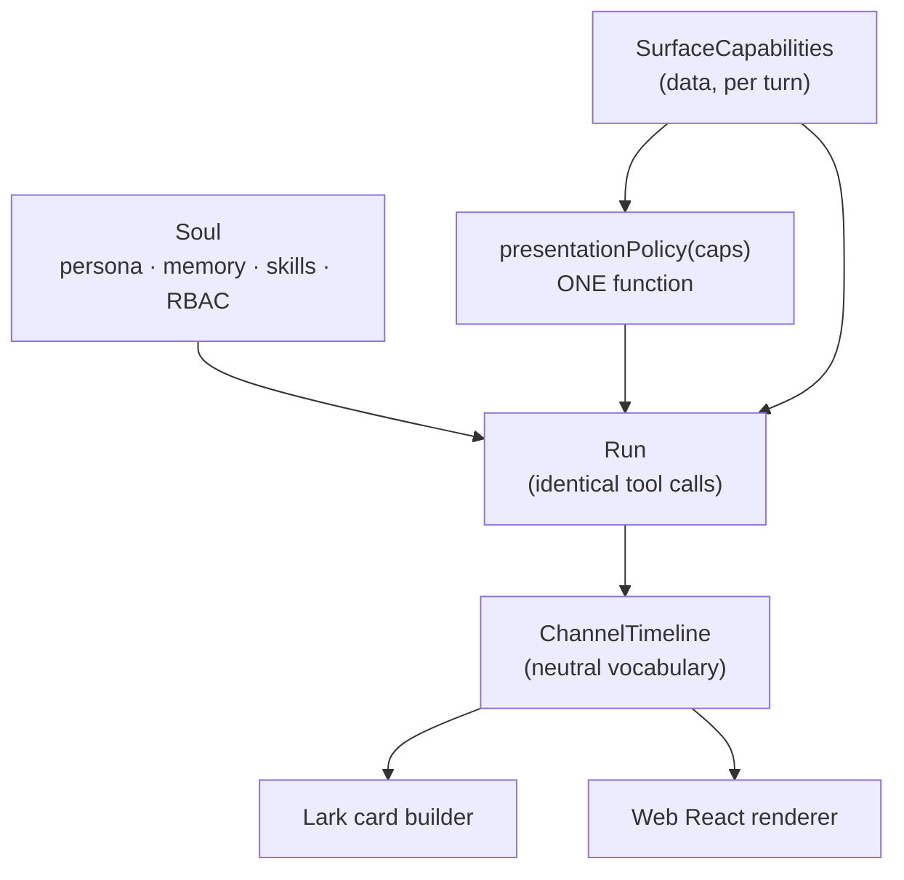

# One soul, two surfaces

**Status:** **level 1 complete** (steps 1.0–1.3, 2026-08-12). Level 2 not started.
Written after a five-agent survey of the live tree (`advance-backend/`,
`divo-pi/`, `admin/`, `jan/`).

---

## 1. What this is for

Divo answers in Lark today. Lark is the right surface when you are travelling and
on your phone; it is the wrong surface for the work itself. A messaging app cannot
show research, cannot render a chart, makes artifacts look like nothing, and makes
copying anything painful. The web UI is not a second front-end — it is where the
work is meant to happen, and the place where a good-looking result makes someone
want to do more work.

There is a second, less glamorous reason, and it may be the one that pays for the
first. Testing a change today means `advance-backend/scripts/run-engine-harness.ts`,
which boots the real DI graph, resolves a real identity, issues a real lease, drives
the real Docker controller, and delivers a real card into a real Lark DM. It works.
It is a lot of architecture to prove one edit. If the same run could be driven from
the web and trusted to behave the same on Lark, most changes would never need the
harness.

So the goal is one agent, one set of reasoning, one set of skills, presented two
ways — and a *provable* claim that only the presentation differs.

---

## 2. The one idea

**Do not branch on channel. Branch on capability.**

The tempting design is `if (channel === 'lark') … else …`. It fails for three
reasons, all of which are already visible in the tree:

1. **The numbers live somewhere else.** The Lark card builder enforces
   `MAX_ELEMENT_LEN 1200`, `MAX_ELEMENTS 30`, `MAX_TABLE_ROWS 15`,
   `MAX_TABLES_PER_CARD 3`, `MAX_CARD_BYTES 18_000`
   (`advance-backend/src/infrastructure/channels/lark/lark-card.builder.ts:18-23`).
   None of them are told to the model. Copy them into a prompt constant in
   `divo-pi/` and they drift the first time someone tunes the renderer.
2. **A third surface becomes code, not data.** WhatsApp, AirNote, or a Slack
   installation would each add another arm to every branch.
3. **It is not auditable.** Nobody can answer "what exactly differs between Lark
   and web?" by reading a diff.

Instead, each surface publishes a **capability descriptor** — a small typed record
saying what it can carry. The agent reads capabilities. The renderer owns the
numbers. The difference between two surfaces becomes a value you can diff.

```ts
type SurfaceCapabilities = {
  key: 'lark' | 'web'
  /** Can a generated file be handed back, and how? */
  artifacts: 'none' | 'link' | 'inline'
  /** Can a chart render, or must it become a table? */
  charts: boolean
  tables: { maxRows: number; maxPerMessage: number }
  maxBlockChars: number
  maxMessageBytes: number
  /** How the work log reaches the reader. */
  worklog: 'patched-card' | 'streamed'
  approvals: 'card-buttons' | 'inline'
  /** May Divo offer "this is better on the web"? */
  handoff: boolean
}
```

---

## 3. The four layers, and where difference is allowed

| Layer | Varies by surface? | Owner |
|---|---|---|
| **1. Soul** — company persona, department persona, personal memory, skills, tool authorization | **No. Never.** | `divo-pi` extension + backend RBAC |
| **2. Capability** — the descriptor above | Yes, as **data** | backend (it owns the renderers) |
| **3. Presentation policy** — a short `<divo_presentation_policy>` prompt block | Yes, but **generated from layer 2** | one pure function |
| **4. Renderer** — Lark card builder vs web React | Yes, completely | each channel adapter |

**The invariant that keeps the soul single:**

> Layer 3 is *generated* from layer 2. There is exactly one function
> `presentationPolicy(caps: SurfaceCapabilities): string`, and it is the only
> place in the system where a surface turns into prose.

You never write two prompts. If someone wants Lark to behave differently they
change a capability flag and the sentence follows. This is what stops the drift
into two products.



---

## 4. What the survey found

Condensed. Every claim below was verified against the live tree.

### Good — better than expected

- **A neutral vocabulary already exists.** `advance-backend/src/domain/channel/outbound.ts`
  defines `ChannelTimeline`, `ChannelLedgerRow`, `ChannelRunState`, `StatusUpdate`,
  `FinalReply` with zero Lark in the file. `ChannelAdapter`
  (`src/application/channels/channel.adapter.ts:34`) states the intent outright:
  *"The engine only ever talks to this interface — never to channel SDKs directly."*
  `grep ChannelTimeline` returns two files: its definition and the Lark renderer.
- **The runtime already emits structured progress.** The container controller
  streams NDJSON frames — `starting`, `thinking`, `working`, `writing`, `say`,
  `tool_start`, `tool_progress`, `tool_end` — over `POST /v1/lark-runs`.
- **The prompt is recomposed every single turn.**
  `divo-pi/divo/extensions/divo-gateway/index.ts:305-364`, in `before_agent_start`.
- **`channel` already reaches inside the container**, written to a run-correlation
  JSON file and read back by the extension. Two call sites already branch on it.
- **Identity is solved.** A Lark user resolves to a real Divo user; the session a
  web sign-in mints is the same session a Lark run consumes, deliberately
  (`lark-pi-runtime.service.ts:395-428`).
- **The permission layer is per-call and backend-side.**
  `typed-tools.ts:16` — *"Pi validates; the backend still authorizes."*

### Bad — and each is a concrete task

- **The reducer is trapped.** The code turning progress events into a
  `ChannelTimeline` is `reportProgress` at
  `src/infrastructure/channels/lark/lark.webhook.routes.ts:1656`, inside a
  3,796-line Lark file, together with its tool-label copy table (`:1274`). Written
  channel-neutral; physically un-reusable.
- **Half the neutral contract has no producer.** `subject`, `plan`, `narration`,
  `ChannelBranding`, `progressPct` — declared in `outbound.ts`, never populated.
  The card title is permanently a state word.
- **Structure dies at the port.** `runTranscript` (`:1490`) pre-renders the ledger
  into Lark-flavoured markdown and passes it across as an opaque
  `FinalReply.executionTrace` string.
- **`FinalReply.attachments` is declared and completely unimplemented** — and that
  gap is papered over *inside the model's instructions*:

  > `divo-pi/divo/prompts/company-workspace.md:29` — "Lark cannot deliver local
  > workspace artifacts yet. Put the complete user-facing result in chat; do not
  > create a local deliverable solely to return an inaccessible workspace path."

  This is the leak. It does not change how work is *shown*; it changes what the
  agent decides to *produce*. Divo is currently told not to make files because
  Lark cannot carry them.
- **Pi's stock guideline contradicts it.** `"Show file paths clearly when working
  with files"` (`packages/coding-agent/src/core/system-prompt.ts:126`) is
  unconditional and is the opposite instruction.
- **There is no transcript.** DM threads persist only final-text pairs — no tool
  calls, no intermediate messages. Group threads persist nothing on the success
  path; they get a bounded ring that compacts and discards. The real conversational
  memory is filesystem state in the per-member container volume.
- **`channel` is part of the conversation primary key** —
  `@@unique([companyId, channel, channelConversationKey])`. Same thread on two
  surfaces is structurally two rows. `DesktopThread.canonicalThreadKey` exists,
  was designed for exactly this, and is written by nothing and read by nothing.
- **Steps are pruned at 7 days**, blanket `deleteMany` on `createdAt`, no
  per-company or per-channel exemption (`TRACE_RETENTION_DAYS`, `env.ts:288`).
- **The adapter registry has one entry.** The abstraction has never been tested
  against a second implementation.
- **`DivoRunCorrelationV1.channel` is `?: "lark"`** — a boolean in disguise.
  Anything not literally `"lark"` is silently dropped.
- **There is no file egress from the container.** `/data/workspace` is durable per
  member; nothing lists or reads it from outside.

---

## 5. The design

### 5.1 Capability descriptor

Lives in `advance-backend`, beside the renderers that enforce the numbers. Shipped
per turn through the existing `runtime-context` JSON path — the same file that
already carries the persona, memory and capability bootstrap. No new transport.

Lark's descriptor is written to match today's reality exactly, so wave 1 changes
no Lark behaviour.

### 5.2 Presentation policy

One pure function, one tagged block, emitted into the existing ordered array in
`composeDivoSystemPrompt` (`department-persona.ts:143-172`), which already has
regex-based idempotency so re-composition on later turns cannot duplicate it.

The precedent to copy is three lines away: `index.ts:351` already does a
runtime-conditional prompt swap (`DIVO_LOCAL_EXECUTION_PROMPT` vs
`…_UNAVAILABLE_PROMPT`) chosen by capability. This is the same shape.

**Delete `company-workspace.md:29`.** It becomes `artifacts: 'none'` for Lark and
`artifacts: 'inline'` for web, and the generator emits the right sentence. When
Lark gains file upload, one field flips.

### 5.3 The reducer

Move `reportProgress` and the tool-label copy table out of the Lark webhook file
into a shared `application/channels/` module that produces a `ChannelTimeline` and
knows nothing about any channel. Populate the fields that currently have no
producer while it is being moved.

Stop pre-rendering `executionTrace` to markdown. Pass the structured ledger across
the port and let each renderer flatten it — Lark to a collapsible panel, web to the
step components that already exist in `jan/web-app/src/components/pi/`.

### 5.4 Tool access in a warm container

The survey's sharpest finding: **the container is not the constraint, the Pi
process is, and only for one thing.**

Free per turn today: the system prompt (fully recomposed), skills (re-staged by
digest), backend permissions (re-resolved per call), and an environment patch
pushed into a warm process between turns. The container is created with zero
identity baked in — it is a generic sandbox by construction.

Frozen at Pi process spawn: the outer `--tools` allowlist. It is a CLI arg,
captured once into `_allowedToolNames`, and there is no `set_tools` RPC.

**Resolution — do not vary the allowlist at all.** Make it the union of every
surface, and let the backend deny per call as it already does. Denied tools are
already registered as *explicit denials* rather than omitted, which is
[[project-divo-denial-vs-absence]] applied. A web-only tool on Lark then says
"not available on this surface" instead of vanishing — which is exactly the
behaviour that decision exists to guarantee.

Cost: zero. No process restart, no container rebuild. If a future case genuinely
needs a surface-varying ceiling, the fallback exists — add `surface` to
`piProcessBinding`, which already discards and respawns a Pi process inside the
same warm container on a model or department switch.

**Prerequisite:** widen `DivoRunCorrelationV1.channel` from `?: "lark"` to a real
union before anything else. Touches `run-correlation.ts`, `trace.ts`,
`runtime.mjs`. Small, and everything downstream depends on it.

### 5.5 Threads and continuity

Two additions:

1. **A canonical thread id.** `RuntimeConversation` gains one; `channel` stays as
   provenance and comes out of the identity key. The dead `canonicalThreadKey`
   field shows this was always the intent.
2. **Persist the neutral ledger per run.** Not the final text — the
   `ChannelTimeline`. This is the replay substrate both surfaces read.

**Split product data from ops data.** The worklog a user re-reads is product data.
The execution trace is ops/debug data and is correctly pruned at 7 days. They are
the same table today, which is why retention blocks replay.

**The product side has no expiry (decision 4).** The neutral ledger is kept
indefinitely — nothing a user can see disappears on a timer. Deletion is the
user's action, not a background job: delete a single run, or delete a thread and
everything under it. The ops trace keeps its 7-day prune unchanged. The split
between the two is the mechanism that lets both be true at once.

### 5.6 Artifacts — the web's reason to exist

This is the concrete form of decision 2: web gets somewhere to *put* things.

**The desktop already has the whole system, and it is portable.** Survey of
`jan/web-app/src`:

- **The shell** is a `ResizablePanelGroup` (`react-resizable-panels`) wrapping the
  root `<Outlet/>` — deliberately above the route, so the rail survives navigation
  (`components/auxiliary/AuxiliaryWorkspace.tsx:69`). Resizable, not fixed:
  default 38% of width, clamped 22–55%. Two zustand stores — shell open/width
  (persisted to `localStorage`) and tab host (max 8, LRU, not persisted).
- **Tabs are upsert-by-identity** (`useAuxiliaryTabs.ts:73`) — matched on
  `artifactId` or a normalized path compare, with a `version` counter that
  increments on replace. This is what makes live refresh work rather than
  spawning duplicate tabs.
- **The viewer** is a Preview/Source pair. Markdown renders through streamdown
  (GFM tables, KaTeX, mermaid, Shiki fences); HTML and SVG render in a sandboxed
  `<iframe srcDoc>` with an injected CSP that is deliberately emitted *before* any
  model markup so a later `<meta>` cannot loosen it.
- **The chat affordance is a chip row, not a card** —
  `components/pi/ArtifactLinks.tsx`. An uppercase "Created"/"Updated" eyebrow,
  then per artifact: violet `FileCode2` icon, title, muted basename. No file size,
  no type badge, no thumbnail. Content is read *before* the drawer opens, so a
  failed read leaves the rail untouched instead of opening an empty tab.
- **Live refresh already exists**: when any `write`/`edit` completes on a path with
  an open tab, the tab silently re-reads. No watcher, no polling — it piggybacks
  on the message stream re-rendering.
- **Violet is the artifact colour** throughout; sky is side-chat.

**The only Tauri coupling in the entire subsystem is ten lines** —
`lib/pi/artifact-fs.ts`, whose whole interface is
`(absolutePath: string) => Promise<string>`. Swap the body for an HTTP GET and
everything else moves unchanged: the parser, the stores, the panels, the chips,
the refresh hosts, the markdown citation logic.

**What the tool actually is.** `divo-pi/divo/extensions/divo-artifact/index.ts`
does not write, upload, or carry content — it *badges a path* so the sidebar knows
which workspace file to open. Its own header: *"This tool is presentation only. It
does not grant permissions, request approvals, or change company systems."* That
is decision 2 already enforced in code, which is a good sign the line we drew is
the natural one.

**Four things must change for web:**

1. **Enable it in the cloud runtime.** `divo-artifact` is absent from
   `runtime-manifest.json` — it is registered only in the Jan desktop Rust
   launcher, and a test asserts it never appears in cloud args. Enabling it is
   part of this work, gated by the capability descriptor (`artifacts: 'inline'`).
2. **Widen the mime gate.** The tool hard-rejects anything but `.md`/`.markdown`.
   HTML/SVG tabs today only arise from a "promote to sidebar" button on inline
   chat artifacts.
3. **Serve HTML artifacts from a separate origin.** `srcDoc` + CSP is safe on
   desktop because the app origin is not credentialed. In a browser admin app it
   is not — this is a real security requirement, not a nicety.
4. **Re-jail the path server-side.** The tool returns an absolute realpath already
   confined to the workspace root; desktop trusts it because the same machine
   produced it. The backend must not.

**One free win:** `summaryForChat` is already supplied by the model, already
parsed onto the details object, and never rendered by any component. It is sitting
there unused and would make a natural chip subtitle or caption.

### 5.7 Files and projects

`/data/workspace` is durable per member with no egress path. Add a read-only file
API on the controller, proxied through the backend under member auth: **list, read,
download.** No write. Scope it to the workspace root and refuse traversal.

---

## 6. The property this buys

Because layer 1 is identical and layer 3 is generated, this becomes testable
rather than hoped-for. But it needs stating precisely, because **the model is
allowed to choose its presentation on web** (decision 1, §8), and that choice
does change what it does.

Split every tool call into two classes:

- **Work** — reading Gmail, querying Zoho, searching the web, computing. What the
  user actually asked for.
- **Delivery** — writing an artifact, uploading a file, formatting the reply.
  How the answer gets handed over.

> Run the same thread with `caps=web` and `caps=lark`, and diff the tool calls.
> The **work** sequence must be identical. The **delivery** tail is allowed to
> differ.

That is still a CI test, and it still catches the failure this plan exists to
prevent — a surface quietly changing what Divo decides to *do*. It just doesn't
overclaim: on web Divo may write an artifact where on Lark it puts the result in
chat, and that is the intended behaviour, not drift.

**The test is stricter during level 1, and that is the point.** While both
surfaces carry identical capabilities (§7), the *entire* sequence must match —
work and delivery. Any difference at all is a bug. The relaxed work-only form
above is what the test becomes at level 2, when web is deliberately given more.
Landing the strict version first means the relaxation is a conscious, reviewable
edit rather than an assumption baked in from the start.

A second test worth having: assert the soul blocks (§3 layer 1) contain no channel
or surface token at all.

Rendering bugs still need the surface they render on. That is irreducible and
fine — it is a small residue compared to today, where every change needs a real
Lark DM to verify.

---

## 7. Two levels

**The work is split into two levels, and level 2 does not begin until level 1 is
finished.** This is a structural commitment, not a scheduling preference.

- **Level 1 — parity.** The web does everything Lark does, and Divo behaves
  *identically* on both. Same reasoning, same output, same brevity. The only
  difference is that the web draws the work log natively instead of as a card.
- **Level 2 — superset.** Everything the web can do that Lark structurally
  cannot: artifacts, charts, richer presentation, shared threads.

### Why the split matters

In level 1 the capability descriptor (§5.1) is **built, and both surfaces are
given the same values.** Web is not allowed to be richer yet. That sounds like
wasted effort and is the opposite: it means level 2 begins by changing *data*, not
by writing code.

If turning on "web may show artifacts" turns out to need a rewrite, the
architecture was wrong — and this ordering surfaces that at the start of level 2
rather than after level 2 has shipped.

It also means level 1 is a complete, defensible thing on its own: a second surface,
provably identical, and the testing problem solved.

### Level 1 — parity

| Step | Content | Visible change |
|---|---|---|
| **1.0** ✅ | Widen the channel union. Extract the reducer + label table out of the Lark webhook file. Populate the unproduced `ChannelTimeline` fields. Stop flattening `executionTrace` at the port. | None. Pure refactor. |
| **1.1** ✅ | Strip Pi's two always-on guidelines and the pi-docs block (§8.3, minimal form). Capability descriptor + `presentationPolicy()`, **web and Lark given identical values**. Delete `company-workspace.md:29`. | None. |
| **1.2** ✅ | Member-auth run endpoint. SSE of the neutral timeline. Wire `admin/src/pages/workspace/chat/` to it — its own header comment names the seam: *"giving the player a stream instead of a timer — the components below do not change."* | Web chat runs. |
| **1.3** ✅ | **Approvals in the live run. Stop/interrupt. File upload into a run.** | **Parity.** A normal Lark day can be done in the browser. |

#### Step 1.0, as built (2026-08-12)

Backend `3454 pass / 0 fail`, `divo-pi` `182 pass / 0 fail`. `lark.webhook.routes.ts`
is 305 lines shorter and no Lark behaviour changed.

The survey said "widen `channel` from `?: "lark"`". What the code actually said,
once read at every call site, was something better: **every one of those checks
meant "did the backend launch this run?", not "is this Lark?"** — Lark was simply
the only answer. Ten sites across `divo-pi` and the backend, including the ones
requiring a run id, cleaning per-run directories, recording an interruption on
abort, and skipping the desktop's local approval step.

So the widening was a rename, not a branch: `isRuntimeChannel(channel)` in
`divo/runtime-channels.mjs`, `RUNTIME_CHANNELS = ['lark', 'web']` in
`domain/channel/runtime-channel.ts`. Web now inherits every one of those
behaviours by construction rather than by being added to each condition.

Two things fell out of it that are worth recording:

- **The lease was the leak.** `PI_RUNTIME_CHANNEL = 'lark'` was a module
  constant, and `member-auth.middleware.ts` read it back as
  `channel = hasRuntimeClaims ? 'lark' : 'desktop'`. That single line is what
  made "the backend drove this run" and "this is Lark" the same fact everywhere
  downstream. The lease now carries its own channel and the middleware reports
  what it says.
- **`PermissionQuery` carries a channel and `permission.service.ts` never reads
  it.** Decision 2 — more room to show, never more power to act — is already
  true in code. Keep it that way; it is now a comment on `RUNTIME_CHANNELS`.

Also done here: `ChannelPlanStep` / `ChannelTimeline.plan` deleted (declared,
never produced, never read — `declared.items` had superseded them);
`completedSteps` / `totalSteps` / `progressPct` now derived from the declared
checklist, which the Lark card ignores and a web renderer will not; and
`FinalReply.executionTrace: string` replaced by `FinalReply.ledger: rows`, with
the markdown flattening moved into the Lark adapter beside the budgets it obeys.

#### Steps 1.1–1.3, as built (2026-08-12)

Backend `3469 pass / 0 fail`, `divo-pi` `376 pass / 0 fail`, admin typechecks.

**1.1 — the prompt.** Pi's two always-on guidelines (`"Be concise in your
responses"`, `"Show file paths clearly when working with files"`) and the
pi-documentation block are stripped in `composeDivoSystemPrompt`, on the string
Divo already rewrites — not in Pi's core, which is upstream code a fork pays for
at every merge. The strip is string matching, so `divoPromptStripReport` logs
anything that stopped matching rather than failing silently. Pi's tool guidelines
are kept: Pi is right about tools.

The descriptor ships through the existing runtime-context path
(`surfaceCapabilities(asChannelKey(res.locals['channel']))`), and
`presentationPolicy()` in `divo-pi/divo/extensions/divo-gateway/` is the only
function in the system that turns a surface into prose. `company-workspace.md:29`
is gone; what replaced it says the question is the surface's to answer.

**1.2 — the run.** `WebRunService` is ~180 lines and contains no decision about
what Divo should do. It calls the same `LarkPiRuntimeService` a Lark message
calls and yields `WebRunEvent`s; `web-chat.routes.ts` turns those into SSE. The
runtime's eight hard-coded `'lark'` literals now follow `incoming.channel` —
lease, pending attachments, knowledge recall, learning, conversation scope. Only
`rememberRunOrigin` stays Lark-only, and it says why (a run origin is a Lark open
id, so an OAuth card can return to the chat it came from).

On the front end `useLiveRun` returns the same `{ run, state }` pair
`useRunPlayer` did. **No component below it changed** — which is the seam paying
off, and also the proof that the scripted transcripts were showing the real
shape.

**1.3 — the checkpoint.** Stop is a route rather than "close the connection",
because the point of stopping is to hear what happened: the runtime answers
"Stopped. I did not continue this request." down the still-open stream. Files
travel with the ask as multipart — a separate upload endpoint would have had to
park bytes between two requests, and on Lark the file and the message arrive
together. Approvals ride on the answer (`awaitingApproval`) instead of sitting in
a separate inbox; the decision goes through the existing member-authed approval
route, so the authority check is the approval row's and this stream adds none.

**Two bugs the first real run found**, both now fixed:

1. *"Your Divo cloud session is not active"* on a signed-in member.
   `findActiveSession` required `runContext.tenantId` and `userExternalId` — a
   Lark tenant key and open id — **before** it checked the explicit-session
   branch. A web caller has neither, so the guard returned `null` and the run
   reported the person was not signed in while they demonstrably were. The
   explicit branch now runs first, and the web hands over the exact session it
   authenticated the caller with (`res.locals['sessionId']`). Naming a session
   is a stronger claim than being able to reconstruct one.
2. **The Home → chat handoff was lost twice over.** First: nothing sent it once
   the screen was rewired. Then, once it did, StrictMode ate it — reading and
   clearing session storage in one step meant the first of React's two dev
   mounts took the value and the second, the one that survives, found an empty
   key. The read no longer clears; the clear happens when the run starts, which
   is the only moment that proves the prompt arrived somewhere.

**Three things the first working run exposed:**

- **The reader was told nothing for the length of a container boot.** The stream
  carried no frame until the container produced one, which on a cold start is
  tens of seconds of silence — indistinguishable from a hang. The run is now
  acknowledged before the runtime is called, and the connection carries a
  15-second heartbeat so nothing idle-reclaims it mid-run.
- **The run says what it is doing and we were discarding it.** `starting` events
  carry the container's own stage label; the reducer replaced it with
  "Thinking…" and the screen replaced that with a hardcoded "Working". The label
  now reaches the screen — on both surfaces, since it comes out of the shared
  reducer.
- **Stop was in the header.** Moved into the composer's send control, which
  becomes a stop square while a run is going. While something is running, ending
  it is the only thing you want from that spot, and it belongs under your hand
  rather than at the far edge of the screen.

**Not a bug:** `controller_unreachable` / "Divo is temporarily unavailable" means
nothing is listening on `PI_LARK_CONTROLLER_URL` (default `127.0.0.1:4317`).
Start it with `MAX_ACTIVE_RUNS=2 node divo/local-rpc-server.mjs` in `divo-pi/`.
That the web run reached this boundary at all is the interesting part: it failed
in exactly the place a Lark run fails without a controller, having gone through
the same session lookup, the same lease, and the same container request.

Also removed: the scenario switcher and Replay control. They were three scripted
stories and a way to re-run them — useful while there was no backend, noise the
moment there was one, because none of it referred to anything the reader had
done. In their place is the conversation's own name on a translucent bar the
thread scrolls under, plus Stop while a run is going. The three scripted prompts
survive on the empty state as suggestions, where they now start real runs; the
scripted player is gone and `player.ts` is reduced to the `RunState` shape both
it and the stream produce.

**1.3 is the level-1 checkpoint and is not optional.** Without approvals the web
can only run things that never touch real data, which excludes most real work —
and therefore does not solve the testing problem it was built for.

Within-thread memory needs no work: Divo's conversational memory lives in the
container keyed by thread, so a web thread remembers itself by the same mechanism
Lark uses.

**Deliberately not in scope, at either level:** group chats. Lark does them; the
web is one person. That is Lark's genuine advantage and there is no reason to
copy it. Recorded here so it is never later mistaken for a gap.

### Level 2 — superset

| Step | Content | Visible change |
|---|---|---|
| **2.0** | Change web's capability values. Grant the model presentation latitude on web (decision 1). | Divo starts presenting richly on web. Should be a data change. |
| **2.1** | Artifact drawer (§5.6). Port the auxiliary rail + chips from `jan/`; replace `artifact-fs.ts` with an HTTP read; enable `divo-artifact` in the cloud runtime; separate origin for HTML. | **Artifacts.** The thing Lark cannot do. |
| **2.2** | Charts in the answer. | |
| **2.3** | Canonical thread id. Neutral ledger persisted with no expiry, plus delete controls (run and thread). The "open on web" handoff button. | One conversation, two windows. |
| **2.4** | Container file/project browser. | Files visible in the web UI. |

---

## 8. Decisions

**1. The model chooses its presentation on web. DECIDED — and it is level 2.**
Not renderer-decided. On web the generated policy grants the model latitude —
it may decide a result deserves a chart or an artifact. On Lark the policy is
direct and concise. The invariant in §3 still holds: both policies come out of
the same generator reading the same descriptor. There are still not two prompts.

**This does not happen during level 1.** In level 1 both surfaces get identical
capabilities and Divo presents identically on both. The latitude is switched on at
step 2.0, which should be a change to values rather than to code.

The consequence is the work/delivery split in §6. Accepted deliberately.

**2. Web gets more room to show, not more power to act. DECIDED.**
No wider permissions on web. The difference is that web has somewhere to *put*
things — chiefly artifacts, which Lark cannot carry at all. This settles the
escalation question raised by thread continuation: a Lark thread continued on web
gains display surface, never authority.

**3. Pi's base prompt — open, and worse than it looked.**
`--system-prompt` exists and is unused, so Divo's first sentence is *"You are an
expert coding assistant operating inside pi"* and its real identity arrives ~4k
tokens later. More pointedly, Pi's stock guidelines
(`packages/coding-agent/src/core/system-prompt.ts:125-126`) are
`"Be concise in your responses"` and `"Show file paths clearly when working with
files"` — both unconditional. So a presentation instruction already exists in the
prompt; it is Pi's, it is always on, and the second directly contradicts
`company-workspace.md:29`. Building a presentation layer on top of a base prompt
that is arguing with it is a bad foundation. Recommend fixing before wave 1.

**4. Keep everything; deletion is a button, not a timer. DECIDED.**
No retention limit on the product-facing ledger. Work history a user can see is
kept indefinitely — the ledger is small (step names and outcomes, not payloads),
so storage is not the constraint, and an agent whose past work silently evaporates
is not a workroom. The UI carries explicit delete controls instead: delete one
run, or delete a thread and everything under it.

The ops-side trace is unaffected — `TRACE_RETENTION_DAYS` stays at 7 days. That is
exactly why §5.5 splits the two: ops data expires, product data does not.
