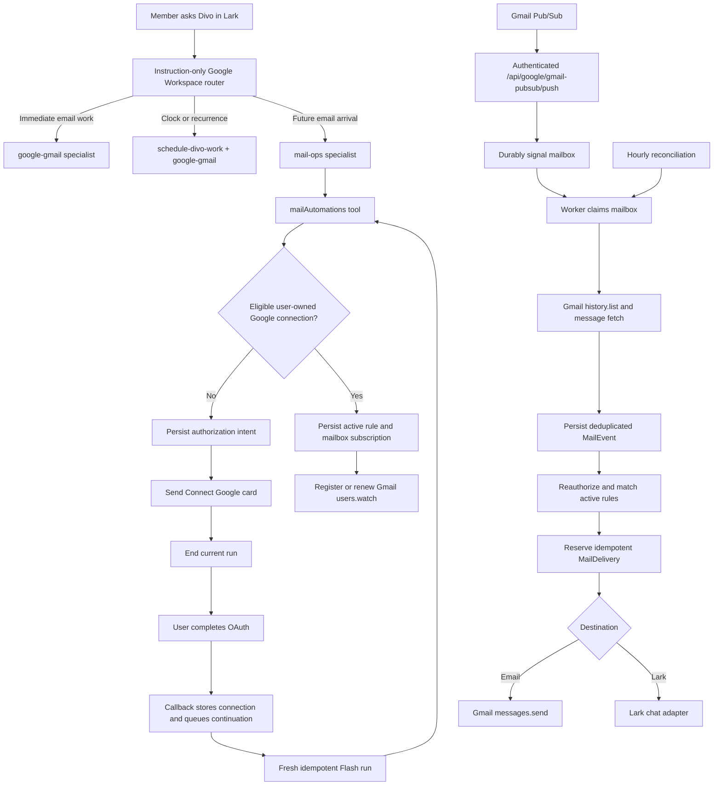

# Divo Mail Automation System — Engineering Handover

> Comprehensive handover for the cloud Google connection flow and Gmail
> arrival automation system known as **Mail Ops**.
>
> **Prepared:** 2026-07-29 · **Revised:** 2026-08-02 after a full end-to-end audit  
> **Repository:** `relicwavetechnologies/zoho-automation`  
> **Backend:** `advance-backend/`  
> **Development URL:** `https://app-dev.103.172.92.187.sslip.io/`  
> **Deployed Mail Ops artifact:** `b8eb000dc9cb3504eb1b921546afc5ef2717ebf2` (as of 2026-07-29)  
> **Deployment run:** [GitHub Actions 30451397036](https://github.com/relicwavetechnologies/zoho-automation/actions/runs/30451397036)

---

## 0. Revision notice — read before trusting any section

This document was written against `b8eb000dc`. As of **2026-08-02** `dev` is
**102 commits ahead**, three of which changed Mail Ops behaviour:

| Commit | Effect |
|---|---|
| `6b9d65751` | stored-rule validity surfaced in `list`; gateway direct-mutation path |
| `c8f9b9a10` | full raw-MIME forwarding; 5/10/20/40s backoff; push→worker `wake()` |
| `e115a9a09` | `src/application/orchestration/tools/` → `src/application/tools/` |

Sections below have been corrected for those changes. Corrections are marked
**[corrected 2026-08-02]** inline.

**Waves 0–2 have since landed on `dev`, and they change behaviour this document
describes.** Anything below about watch gating, history page limits, permission
denial, or readiness is now the *old* system. In brief:

| Was | Is now | Commit |
|---|---|---|
| `claimNextDueMailbox` required a registered watch and cursor when Pub/Sub was on | Reconciliation is unconditional; push is only the fast path | `97be67a46` |
| Watch failure ⇒ mailbox dead | Watch failure ⇒ up to an hour late. `watch_delayed`, escalating to `watch_degraded` after 3 consecutive failures (new `watchFailureCount` column) | `97be67a46` |
| >10 history pages threw, wedging the mailbox forever | Returns what it drained, reports the **last consumed record** as the cursor, and asks to be polled again | `6e0d120cf` |
| `authorizeRule` returned a boolean and threw on any permission error | Returns `allowed \| denied \| unavailable`. Denials never stall the sync; only unanswerable questions hold the cursor | `c4a5e2561` |
| A refused rule left no trace | Writes an inert `blocked` delivery row with the reason. Matching is checked before authorizing | `c4a5e2561` |
| `department_access_denied` covered both real denials and unreadable stores | New `permission_lookup_failed` reason for the latter | `c4a5e2561` |
| `pubsubReady` alone gated `create` | `runtime.pubsubConfigured && runtime.workersEnabled` | `97b4d22b9` |

A full audit — code, prompt layer, permissions, and security — found defects
that this document previously described as intended behaviour. **Do not treat a
description here as an endorsement.** The defect register, decision records, and
wave plan live in
[`mail-automation-production-finalization.md`](mail-automation-production-finalization.md),
which is authoritative for *what should change*. This document remains
authoritative for *how the system is built*.

Headline findings that contradict this document's original framing:

- The seeded skill promises **OTP extraction**; no OTP code exists anywhere.
- `create` reports **"Mail automation is active"** before any Gmail watch exists,
  and a mailbox whose watch never registers is excluded from the reconciliation
  poll meant to cover exactly that (§10.2, §10.7).
- The **OAuth continuation path is dead in production** — `runContext.connectionAuthorization`
  is never populated, so the Connect Google card described in §6 is never sent.
- **Connection governance does not reach background deliveries at all** (§14).

---

## 1. Executive summary

Mail Ops is Divo's backend-owned, event-driven Gmail automation capability. It
lets a member describe a durable future-arrival rule in natural language, such
as:

- forward future OTP emails from an exact sender to another email address;
- deliver matching future email to the current Lark conversation;
- deliver matching future email to another exact Lark chat;
- inspect, update, pause, resume, or archive owned rules.

The implementation deliberately separates three kinds of email work:

| User intent | Owning capability |
|---|---|
| Search, read, summarize, draft, send, or forward an existing email now | `google-gmail` |
| Run inbox work at a time or recurrence | Scheduler plus `google-gmail` |
| React whenever a future matching email arrives | Mail Ops / `mailAutomations` |

Mail Ops is not a five-minute polling agent and does not keep an LLM alive.
Gmail Pub/Sub is the primary trigger. A deterministic backend worker uses
Gmail `history.list`, evaluates exact stored rules, reserves an idempotent
delivery, and sends through Gmail or Lark. An hourly reconciliation pass exists
only as a missed-notification safety net.

The Google connection experience is also backend-owned. If a member has no
eligible user-owned Google connection, Divo sends a **Connect Google** card and
ends the current run. OAuth completion queues a fresh, idempotent Flash-model
run using the stored original request and exact original Lark conversation.
The original model stream is never suspended or resurrected.

---

## 2. Current status at handover

| Area | Status |
|---|---|
| Cloud Google OAuth issuance and callback | Implemented |
| User-owned encrypted Google connection persistence | Implemented |
| Automatic fresh-run continuation after OAuth | Implemented and locally E2E verified |
| DB-seeded Google router and Mail Ops skill | Implemented |
| Company-wide `mailAutomations` permission provisioning | Implemented |
| Rule create/list/update/pause/resume/archive | Implemented |
| Gmail `users.watch` registration and daily renewal | Implemented |
| Authenticated Gmail Pub/Sub push endpoint | Implemented and configured in dev |
| Gmail history ingestion and stale-cursor recovery | Implemented |
| Deterministic matching and delivery outbox | Implemented |
| Email and Lark delivery | Implemented |
| Pub/Sub numeric `historyId` compatibility fix | Deployed in `b8eb000dc` |
| Exact sender/domain matching fix | Deployed in `b8eb000dc` |
| CI, typecheck, full tests, Docker build, deploy, HTTPS smoke test | Passed |
| A fresh real Gmail arrival observed after the `b8eb000dc` deployment | Still needs explicit verification |
| Semantic summary/classification actions inside arrival rules | Not implemented |
| Full MIME/attachment forwarding | **Implemented** in `c8f9b9a10` — [corrected 2026-08-02], was "not implemented by design" |
| Shared or company-owned Gmail connections | Not implemented by design |
| OTP extraction (claimed in seeded skill text) | **Removed from the instructions** 2026-08-02 — there is no extractor; the whole message is forwarded |
| Connect Google card / OAuth continuation | **Dead in production** — see §0 and §6 |
| Connection governance over background delivery | **Not wired** — see §14 |
| Member-facing read API (rules, deliveries, mailbox health) | **Implemented** 2026-08-02 — see §15.4 |
| Owner notification when a mailbox stops working | **Implemented** 2026-08-02, Lark only — see §15.4 |
| Mail rules screen in the web UI | Not implemented — next |

### Source versus deployed artifact

The successful development deployment was built from:

```text
b8eb000dc9cb3504eb1b921546afc5ef2717ebf2
fix mail ops push ingestion and sender matching
```

**[corrected 2026-08-02]** As of 2026-08-02, `dev` is **102 commits ahead** of
`b8eb000dc` (the previously named `0ed7c3f48` is now 100 commits behind head).
Three of those commits changed Mail Ops — see §0.

Therefore, do not assume the deployed backend exactly equals the current
`dev` branch head. The deployment evidence in this document refers specifically
to the `b8eb000dc` artifact.

---

## 3. Product and architecture decisions

These decisions were explicitly made during implementation and should not be
silently changed.

### 3.1 Backend is the authority

`advance-backend` owns:

- member and company identity;
- connection ownership and encrypted credentials;
- Google OAuth;
- tool registration and RBAC;
- skill provisioning;
- rule persistence;
- Pub/Sub authentication;
- Gmail history synchronization;
- deterministic matching;
- destination validation;
- retry, idempotency, and audit/operational logs;
- external Gmail and Lark execution.

The agent and skills help interpret intent and construct valid tool arguments.
They do not store tokens or enforce authorization.

### 3.2 Google connections are user-owned

Phase 0 creates and uses only `ownerType: user` Google connections. The member
who started OAuth owns the connection. Shared and company-owned mailboxes are a
future feature.

The tool is company-wide, but credentials and rules remain user-scoped. A
company-wide capability does not mean one user's mailbox becomes accessible to
another user.

### 3.3 OAuth asks for the Desktop-equivalent Google scope set

The cloud OAuth flow reuses
[`GOOGLE_WORKSPACE_OAUTH_SCOPES`](../advance-backend/src/domain/google/google-workspace-scope.ts).
It includes the complete Gmail, Drive, Calendar, Docs, Sheets, Slides, Forms,
Tasks, Contacts, Google Chat, and Apps Script scope set used by the Desktop
flow.

Gmail Pub/Sub does not require an additional end-user OAuth scope. `users.watch`
uses the already granted Gmail access. Pub/Sub adds one-time Google Cloud
infrastructure, not another consent checkbox for every member.

### 3.4 OAuth continuation is a fresh run

The first run ends after sending the connection card. OAuth may take seconds or
minutes. No LLM call or HTTP response is held open.

After callback success:

1. the backend identifies the durable authorization intent;
2. the callback marks it connected and queues continuation work;
3. a worker re-resolves current identity, permissions, and connection access;
4. the worker reconstructs the original request and Lark target;
5. the engine starts a new Flash-model run;
6. the fresh run finishes the original request in the same conversation.

The continuation is internal metadata, not a fabricated user message.

### 3.5 Gmail Pub/Sub is the normal trigger

The architecture is:

```text
Gmail mailbox change
  → Gmail publishes Pub/Sub notification
  → authenticated Divo push endpoint
  → durable mailbox signal
  → Gmail history.list
  → durable MailEvent
  → deterministic rule matching
  → durable MailDelivery
  → Gmail or Lark delivery
```

There is no five-minute steady polling loop. The one-hour mailbox
reconciliation is a reliability fallback for delayed or dropped Pub/Sub
notifications.

### 3.6 Rule creation is the approval

There is no per-message approval for OTP forwarding or other deterministic
rules. The member's explicit create/update/resume instruction authorizes future
matching execution, subject to current RBAC and connection access being
rechecked at delivery time.

### 3.7 DB-seeded skills, not runtime Markdown files

The Google router and Mail Ops specialist are provisioned as database
`Skill`/`SkillVersion` records. Their definitions live in TypeScript only as
reconciliation seed input. Do not add standalone router or Mail Ops `.md`
runtime files to the repository.

---

## 4. End-to-end architecture



### Ownership boundaries

| Component | Responsibility |
|---|---|
| Google Workspace router skill | Selects the correct specialist; has no tools |
| Mail Ops skill | Guides exact rule authoring and calls `mailAutomations` |
| `mailAutomations` | Validates args, RBAC, connection, destination, and rule CRUD |
| Authorization intent | Durable OAuth and exact continuation target |
| `IntegrationConnection` | Encrypted provider tokens, account identity, owner, status, scopes |
| `MailboxSubscription` | One Gmail cursor, watch, signal, health, and lease per connection |
| `MailAutomationRule` | Deterministic match plus one action and one destination |
| `MailEvent` | Deduplicated new Gmail message discovered from history |
| `MailDelivery` | Durable idempotent outbox execution |
| `MailOpsWorker` | Watch renewal, mailbox sync, rule evaluation, and delivery |
| Scheduler | Time-triggered work only |
| Existing Gmail capability | Immediate user-requested Gmail operations |

---

## 5. User experience flows

### 5.1 Creating a rule with an existing Google connection

Example request:

```text
Whenever an email from alerts@example.com with OTP in the subject arrives,
forward it to person@company.com.
```

Expected flow:

1. Agent loads `google-workspace-router`.
2. Router selects `mail-ops`.
3. Mail Ops grounds:
   - an exact sender mailbox or exact `@domain`;
   - optional subject/body/recipient/attachment criteria;
   - one exact email or Lark destination;
   - the exact user-owned Google connection when necessary.
4. Agent invokes `mailAutomations` with `operation: "create"`.
5. Tool performs RBAC and execute checks.
6. Tool creates or reactivates the deduplicated rule.
7. Tool returns an active `ruleId`.
8. The mailbox worker registers `users.watch`.
9. Future matching mail is processed without another LLM call.

### 5.2 Creating a rule when Google is not connected

1. Agent invokes `mailAutomations`.
2. Connection resolution returns unavailable.
3. The tool calls the authorization issuance service.
4. The backend persists the original request and exact Lark continuation target.
5. A Lark card with **Connect Google** is sent.
6. The current engine run ends.
7. User completes Google OAuth in the browser.
8. The callback stores/reactivates the user-owned Google connection.
9. The callback queues continuation and returns its browser result immediately.
10. The continuation worker starts a fresh Flash run.
11. The fresh run resumes the original request and creates the rule.

The user should not send “continue” or repeat the original request.

### 5.3 Ambiguous sender requests

The post-fix system must not turn a brand name into a loose sender match.

Ambiguous:

```text
Forward every mail from Anthropic to Anish.
```

The agent should ask whether the user means:

- every message from an exact domain such as `@anthropic.com`; or
- only a specific sender or email series, optionally narrowed by subject.

If helpful, the agent can load `google-gmail`, inspect a bounded matching
message, and present the exact sender address/domain before creating the rule.

### 5.4 Immediate forwarding versus future forwarding

If “forward this email” can mean either a one-time action or an ongoing arrival
rule, the router must ask. It must not silently create a durable rule or silently
use Scheduler.

### 5.5 Delivery to Lark

- `current_lark_chat` resolves to the current Lark conversation and is invalid
  outside Lark.
- Another Lark destination requires an exact `chatId` returned by governed Lark
  chat discovery.
- The agent must never invent a Lark chat ID.

---

## 6. Google OAuth and continuation implementation

> ## ⚠ [audit 2026-08-02] This entire flow is dead in production.
>
> Everything described in this section is implemented and unit-tested, and
> **none of it runs.** `RunContext.connectionAuthorization` appears in the whole
> `src/` tree exactly twice: declared at
> [`run-context.ts:78`](../advance-backend/src/domain/orchestration/run-context.ts:78)
> and read at [`composition.ts:609`](../advance-backend/src/composition.ts:609).
> **It is never written.** Neither the Lark ingress path nor
> `ToolExecutor.buildRunContext` — whose own comment calls itself *"the run
> context every tool actually sees"* — assigns it.
>
> `beginGoogleAuthorization` therefore short-circuits to `unavailable` on every
> production call, and the consequence chain is total:
>
> 1. `mailAutomations` can never return `google_workspace_authorization_pending`;
>    it falls through to an `unrecoverable` ToolError.
> 2. No `ConnectionAuthorizationIntent` is ever created for it — the only live
>    intent producer in production is the data-export card handler, hard-coded
>    to `['dataExport']`.
> 3. No continuation run is ever scheduled, so §6.3's state machines never start.
>
> **This is not mail-specific.** Every `google-<product>` skill instructs the
> model that only `google_workspace_authorization_pending` proves the Connect
> card was sent — a code that cannot be returned. Meanwhile the `mail-ops` skill
> tells the model the card *was* sent and to end the run and wait.
>
> **Why tests did not catch it:** the covering test stubs `beginAuthorization`
> to return `{status:'sent'}` and hand-builds `connectionAuthorization` into the
> context, then asserts the tool forwards the field it was handed. The mock
> supplies the exact precondition production never supplies.
>
> Also dead: `RunContext.continuationToolIds` is written at
> `google-connection-continuation.ts:367` and read nowhere, while its doc comment
> describes an RBAC intersection that does not happen.
>
> **Off-Lark, the flow is broken by construction three separate ways** — card
> delivery is `larkAdapter.sendCardToChat`, the intent shape requires
> `larkOpenId`/`larkTenantKey`/`chatId`/`chatType`, and the continuation worker
> builds `channel: 'lark'` and throws unless `chatType` is `p2p`/`group`. A
> desktop user gets a generic `unrecoverable` error and their request is lost.
>
> See defect D5, Wave 3. **P0, and cross-cutting beyond Mail Ops.**

### 6.1 Main files

- [`connection-authorization-intent.ts`](../advance-backend/src/application/connections/connection-authorization-intent.ts)
- [`google-connection-authorization.service.ts`](../advance-backend/src/application/connections/google-connection-authorization.service.ts)
- [`google-connection-continuation.ts`](../advance-backend/src/application/connections/google-connection-continuation.ts)
- [`connection-authorization.repository.ts`](../advance-backend/src/infrastructure/persistence/connection-authorization.repository.ts)
- [`google-connection.routes.ts`](../advance-backend/src/http/google/google-connection.routes.ts)
- [`lark-google-connect.ts`](../advance-backend/src/infrastructure/channels/lark/lark-google-connect.ts)
- [`google-oauth.service.ts`](../advance-backend/src/infrastructure/google/google-oauth.service.ts)

### 6.2 Authorization intent contents

`ConnectionAuthorizationIntent` binds:

- provider;
- company and user;
- optional department;
- Lark open ID and tenant key;
- chat ID and chat type;
- original message ID;
- root message ID and reply/thread behavior;
- original user request;
- requested tool IDs;
- completed connection ID;
- authorization and continuation statuses;
- one stable continuation idempotency key;
- correlation ID;
- expiry and lifecycle timestamps;
- safe failure code.

Only a hash of the browser `state` is stored. The raw state is returned in the
OAuth URL. The repository may temporarily stage the authorization code and
exchange tokens encrypted so a process crash during exchange can be recovered.
These values are never given to the agent.

### 6.3 State machines

Authorization:

```text
pending → exchanging → connected
        ↘ expired
        ↘ failed
```

Continuation:

```text
blocked → pending → running → completed
                           ↘ failed
```

The authorization TTL is ten minutes.

### 6.4 Idempotency

- Browser state is 32 random bytes encoded as base64url.
- Only its SHA-256 hash is persisted.
- An active dedupe key is derived from provider, company, user, tenant, and
  original message.
- The continuation job ID is deterministic:
  `google_oauth_<intentId>`.
- The continuation run request ID is a stable value derived from the intent
  correlation ID.
- Duplicate callbacks return an “already handled” page and do not create a
  second run.
- BullMQ continuation jobs retry up to five times with exponential backoff.
- A 30-second reconciliation scan re-enqueues durable pending continuations if
  callback enqueueing failed.

### 6.5 Revalidation before continuation

The continuation worker:

- resolves the current Lark tenant identity;
- verifies the same company and user still own the intent;
- verifies the completed Google connection is still accessible;
- verifies it is still user-owned by the same member;
- reconstructs DM versus group/thread reply semantics;
- runs through the orchestration engine with the Flash model.

### 6.6 Callback URLs

Local:

```text
http://localhost:8000/api/google/connection/callback
```

Development:

```text
https://app-dev.103.172.92.187.sslip.io/api/google/connection/callback
```

These exact URLs must exist in the Google OAuth client configuration. A
localhost callback works only when the browser is on the same machine as the
local backend.

---

## 7. Skill routing and provisioning

### 7.1 Definitions

The seed definitions are in:

[`mail-ops-system-skills.ts`](../advance-backend/src/application/skills/mail-ops-system-skills.ts)

**[corrected 2026-08-02]** They are **not** provisioned by
`provision-google-workspace-skills.ts` — that script contains zero Mail Ops
references. Mail Ops is provisioned by two different paths:

| Path | What it provisions | When it runs |
|---|---|---|
| [`admin-auth.routes.ts`](../advance-backend/src/http/admin/admin-auth.routes.ts) `:420` | `mail-ops` + `google-workspace-router` **skills** | at company creation |
| [`reconcile-capabilities.ts`](../advance-backend/scripts/reconcile-capabilities.ts) `:46`, `:53` | skills **and** `mailAutomations` permission rows | *[corrected 2026-08-02]* **on every backend boot** — `package.json` binds it to `prestart`, the image `CMD` is `pnpm start`, and the compose service has no `command:` override |
| `memberTemplateGrants()` in [`department-admin.service.ts`](../advance-backend/src/application/departments/department-admin.service.ts) `:27` | `mailAutomations` permission rows for the two system roles | at **department** creation |

> **[corrected 2026-08-02] The operational trap was the opposite of what was
> written here.** The claim was that provisioning depended on an operator
> remembering to run `reconcile-capabilities.ts`. It runs on every boot, and the
> real problem was what it did when it ran: it granted all five actions to
> **every** `DepartmentRole` including hand-configured ones, so an admin could
> narrow a custom role and watch it re-widen at the next deploy — and it *threw*
> on any company without an active administrator, which failed `prestart` and so
> kept the backend from serving at all.
>
> Fixed in Wave 7. It now writes only to the two system roles, exactly as
> department creation does; skips any role already holding a `mailAutomations`
> row, allowed or denied; skips and reports a company between administrators
> instead of throwing; and invalidates the permission cache for each department
> it wrote to, so a grant is visible immediately rather than within fifteen
> minutes. A second run writes nothing. See P1–P3 in the finalization plan.

### 7.2 `google-workspace-router`

Properties:

- instruction-only;
- `toolIds: []`;
- routes immediate Gmail, future-arrival automation, timed inbox work, Calendar,
  and other Google Workspace products;
- contains positive routes and anti-routes;
- does not inspect connections itself;
- must load the specialist before claiming that Google is unavailable.

### 7.3 `mail-ops`

Properties:

- executable specialist;
- `toolIds: ["mailAutomations"]`;
- only for future Gmail arrival rules;
- requires a deterministic, grounded match;
- requires one grounded destination;
- explains OAuth continuation;
- explicitly prohibits loose brand/display-name sender criteria;
- asks whether subject narrowing is desired when it changes scope;
- prohibits Scheduler/polling/native-filter substitution when Mail Ops platform
  configuration is missing;
- explains that matching and deterministic forwarding do not invoke an LLM.

### 7.4 Company-wide permissions

Provisioning creates missing permission rows for every existing department role
for:

```text
read
create
update
delete
execute
```

Provisioning is additive and preserves existing explicit permission rows.

Company-wide availability does not bypass user ownership:

- rule CRUD is filtered by authenticated creator;
- connection resolution is user-owned;
- execution is reauthorized before reservation and delivery.

---

## 8. `mailAutomations` tool contract

Main file:

[`mail-automations.tool.ts`](../advance-backend/src/application/tools/families/mail-automations.tool.ts)

The tool is registered as `mailAutomations`. Its registry family is currently
`scheduling`, but Mail Ops is not implemented as a `ScheduledWorkflow`; the
family label is an internal registry grouping.

### 8.1 Operations

#### Create

```json
{
  "operation": "create",
  "connectionId": "<optional UUID when exactly one connection is not implicit>",
  "name": "Forward account OTP",
  "match": {
    "from": "alerts@example.com",
    "subjectContains": "OTP"
  },
  "destination": {
    "type": "email",
    "email": "person@company.com"
  }
}
```

#### List

```json
{
  "operation": "list",
  "includeInactive": true
}
```

List returns owned rule summaries with:

- rule ID;
- name and status;
- mailbox email and connection ID;
- full match, action, and destination;
- creation timestamp;
- **[added 2026-08-02]** `valid: boolean`, and `invalidReason: string` when a
  stored rule no longer parses under the current schema. Shipped in `6b9d65751`.
  This is the only user-reachable signal that a rule has stopped matching — and
  **no skill or `parameterDocs` text tells the model to read it**. Wave 0 fixes
  that.

`includeInactive` defaults to `false`, so paused and archived rules are hidden
unless it is set. The seeded skill only ever shows the model
`"includeInactive": false`, so "what rules do I have, including paused ones?"
currently gets an incomplete answer.

#### Update

Update is a complete replacement, not a partial patch:

```json
{
  "operation": "update",
  "ruleId": "<exact UUID returned by list>",
  "connectionId": "<exact UUID returned by list>",
  "name": "Forward Anthropic security notices",
  "match": {
    "from": "@anthropic.com",
    "subjectContains": "security"
  },
  "destination": {
    "type": "email",
    "email": "person@company.com"
  }
}
```

#### Pause, resume, archive

```json
{ "operation": "pause", "ruleId": "<UUID>" }
```

```json
{ "operation": "resume", "ruleId": "<UUID>" }
```

```json
{ "operation": "archive", "ruleId": "<UUID>" }
```

Archived rules cannot be resumed — `resume` on one returns the misleading
*"Mail automation rule was not found in your account."*

**[added 2026-08-02] Three undocumented behaviours here, all user-visible:**

- **Pausing the last active rule pauses the whole mailbox subscription**, which
  stops watch renewal *and* sync claims. Resuming after longer than Gmail's
  ~1 week history retention both loses the intervening mail and replays up to a
  day of old mail through the resumed rule. (Defect D8.)
- **`create` silently resurrects an archived rule.** `mailRuleDedupeKey` hashes
  companyId + userId + connectionId + match + action + destination — **not
  `name`**. Re-creating an identical rule un-archives the old one, renames it,
  and returns the same `ruleId`, which the model reports as brand new. It is
  also the only way to undo an archive.
- **`update` silently resumes a paused rule** — `replaceRule` unconditionally
  sets `status: 'active'`.
- **`pause` requires the `execute` action group**, because `actionFor` maps it
  to `update`. Revoke `execute` and a user can no longer stop their own live
  rules. (Defect S4.)
- **[added 2026-08-02] A rule's identity is canonical, and old keys migrate one
  at a time.** `mailRuleDedupeKey` folds case on the match clause and a
  destination email (never a Lark `chatId`) and is derived from a fixed
  sequence, so asking for the same rule as `otp` and as `OTP` no longer forks it
  into two that both forward. Rules written before that carry a key no request
  can reproduce, so `create` recognises them by recomputing the canonical key
  from what each stored rule holds and moves the match onto it before creating
  anything. Rules that had *already* forked are not merged.
- **[added 2026-08-02] `update` can now refuse with two new answers.**
  `replaceRule` returns `duplicate` when the edit would land on a rule the
  member already holds live on that mailbox — reported rather than left to raise
  a unique violation they can do nothing about — and `duplicate_archived` when
  the rule it collides with is archived, where the remedy is to recreate that
  rule rather than archive anything. Both are recognised by recomputed identity,
  not by stored key, for the same reason as `create`.

**[added 2026-08-02] Two more destinations and one more operation (Wave 8).**

`destination: {"type":"organize","label":"Receipts","archive":true,"markRead":false}`
files the message in the member's own Gmail and **sends nothing**. At least one
of `label`, `archive`, `markRead` must be set; a missing label is created.
Archiving is removing `INBOX`. A destination address on an `organize` rule is
refused rather than ignored, because a stray one means its author believed mail
was going somewhere.

`rateLimitPerHour` sits beside the destination (1–1000) and applies to `email`
and `lark_chat` only. Over the ceiling a message is **dropped and recorded as
`blocked`, not queued** — the rest does not arrive later. It is not part of a
rule's identity, so re-creating a rule with a new ceiling updates the existing
rule rather than forking it.

`{"operation":"test","ruleId":"<uuid>","limit":50}` — and `POST
/api/mail-automations/rules/:ruleId/test` — replay the rule over mail Divo has
already recorded and report what it would have matched. Nothing is sent, no
Gmail API is touched, and it reads through `MailOpsReadRepository` so it cannot
reach a lease or a cursor. Gated on `read`, deliberately: the member whose edit
rights were just withdrawn is the one most likely to need it. `predatingCount`
counts hits older than the rule's `activatedAt` — real matches the runtime will
never act on, kept separate so they cannot read as a promised backfill. A
`consideredCount` of 0 means the mailbox has no recorded mail yet, which is not
the same answer as "this rule matches nothing".

### 8.2 Match fields

At least one is required. All supplied criteria are combined with logical AND.

| Field | Current semantics | **[audit 2026-08-02] caveat** |
|---|---|---|
| `from` | Exact mailbox address or exact `@domain`; case-insensitive | **Does not match subdomains** — `@stripe.com` misses `receipts@mail.stripe.com`, and most transactional senders use a bounce subdomain. (D12) |
| `to` | Exact mailbox address or exact `@domain`, matched against `To`, `Cc`, `Bcc` and `Delivered-To` together | *[corrected 2026-08-02]* Validated exactly like `from`, so a display-name substring is rejected. Carries the same subdomain limit as `from` (D12). A stored `to` that already held a mailbox or `@domain` takes these semantics in full, so it stops matching lookalike addresses and starts matching Cc — the one change on deploy worth telling members about. Only a free-text `to` is frozen, keeping its substring test against `To` alone, and it cannot be recreated in that shape. **Sender-authored — a filter, never an identity boundary** (see §Matching limitations). (D11, T7 — fixed) |
| `subjectContains` | Case-insensitive substring | Literal `String.includes`. `"OTP\|verification code"` and `"*invoice*"` match nothing. (T8) |
| `bodyContains` | Case-insensitive substring of extracted bounded text | Sees the first `text/plain` part, else stripped HTML, capped at 50,000 chars. Never attachment contents. |
| `hasAttachment` | Exact Boolean equality | *[corrected 2026-08-02]* True only for an attached file. A part saying `Content-Disposition: inline`, or carrying a `Content-ID` without saying `attachment`, no longer counts — a signature logo does not make a message "has attachment". (D10 — fixed) |
| `notFrom` | *[added 2026-08-02]* Exact mailbox or `@domain`, excluded | Narrowing-only: rejected unless the rule also has `from`, `to`, `subjectContains` or `bodyContains`. Rejected when it cancels its own `from`. A `From` header that cannot be parsed **fails** the exclusion, so the rule does not fire — an unreadable header is not evidence the sender is someone else. (Wave 8) |
| `notSubjectContains` | *[added 2026-08-02]* Case-insensitive substring, excluded | Narrowing-only. Rejected when every subject satisfying `subjectContains` would also contain it. Tests the subject only, never the body. (Wave 8) |
| `activeWindow` | *[added 2026-08-02]* `{days?, start, end, timeZone}` in local wall clock | Narrowing-only. `timeZone` is a **required** IANA name with no default. Half-open: `09:00`–`18:00` includes 09:00, excludes 18:00. An `end` at or before `start` is overnight and belongs to the day it opened on. Judged on **arrival time**, not processing time. Unlike `to`, it is *not* loosened for stored rules — an unresolvable timezone fails to parse and the rule reports itself broken. (Wave 8) |

Valid sender examples:

```json
{ "from": "alerts@example.com" }
```

```json
{ "from": "@example.com" }
```

Invalid:

```json
{ "from": "Anthropic" }
```

**[corrected 2026-08-02] Unknown match keys are rejected.** They used to be
stripped: `mailRuleMatchSchema` was a plain `z.object`, so
`{"from":"@x.com","cc":"finance@y.com"}` created a rule matching **only**
`from`, reported success, and the narrowing the user asked for was gone. The
creation schema is `.strict()` now. A rule already stored is parsed by a looser
schema that does not add keys it never had, so nothing in the database changed.
(D13 — fixed.)

**[corrected 2026-08-02] "At least one is required" is now a narrowing check.**
`{"hasAttachment": true}` used to be legal and forwarded every
attachment-bearing inbox message to an arbitrary external address. A match must
now carry at least one of `from`, `to`, `subjectContains`, `bodyContains`, and
an unrecognised key is rejected rather than stripped. One narrowing field can
still be broad, and `parameterDocs` still tells the model not to ask for
per-message approval after rule creation, so breadth remains a judgement the
instruction layer has to make. (T7, S3 — partly fixed.)

### 8.3 Destinations

Email:

```json
{ "type": "email", "email": "person@company.com" }
```

Current Lark conversation:

```json
{ "type": "current_lark_chat" }
```

Another grounded Lark chat:

```json
{ "type": "lark_chat", "chatId": "<exact discovered ID>" }
```

Internally, email becomes action `forward`; Lark becomes action `deliver`.

### 8.4 Connection behavior

- `connectionId` may be omitted only when one eligible user-owned Google
  connection exists.
- Multiple eligible connections return
  `google_workspace_connection_selection_required`.
- No eligible connection starts OAuth and returns
  `google_workspace_authorization_pending`.
- Missing/partial Pub/Sub configuration returns
  `mail_ops_configuration_required` for create/update/resume.
- The agent must stop on these structured results instead of pretending the
  rule exists.

### 8.5 Permission mapping

| Operation | Required action |
|---|---|
| `list` | `read` |
| `create` | `create` plus `execute` |
| `update` | `update` plus `execute` |
| `pause` | `update` |
| `resume` | `update` plus `execute` |
| `archive` | `delete` |

---

## 9. Gmail Pub/Sub infrastructure

### 9.1 Development resources

Google Cloud project ID:

```text
silver-adapter-498510-m6
```

Topic:

```text
projects/silver-adapter-498510-m6/topics/divo-gmail-events
```

Push subscription:

```text
projects/silver-adapter-498510-m6/subscriptions/divo-gmail-push-dev
```

Push endpoint and OIDC audience:

```text
https://app-dev.103.172.92.187.sslip.io/api/google/gmail-pubsub/push
```

Push authentication service account:

```text
divo-pubsub-push@silver-adapter-498510-m6.iam.gserviceaccount.com
```

Gmail publisher principal:

```text
gmail-api-push@system.gserviceaccount.com
```

The Gmail publisher has Pub/Sub Publisher on the topic. The push subscription
uses authenticated OIDC delivery. The Pub/Sub service agent was granted the
token-creation permission required to mint the push identity token.

This infrastructure is configured once per Google Cloud project/environment,
not once per end user. Each active mailbox still needs its own `users.watch`
registration and renewal.

### 9.2 Required environment variables

All four must be present or the complete Mail Ops trigger surface is disabled:

```text
GOOGLE_PUBSUB_TOPIC
GOOGLE_PUBSUB_SUBSCRIPTION
GOOGLE_PUBSUB_PUSH_AUDIENCE
GOOGLE_PUBSUB_PUSH_SERVICE_ACCOUNT
```

**[corrected 2026-08-02] These four are not a sufficient readiness checklist.**
A fifth, independent flag decides whether anything actually runs:

```text
DIVO_AUTONOMOUS_WORKERS_ENABLED   # default: true
```

`MailOpsWorker.start()` is called only when it is true
([`server.ts:177`](../advance-backend/src/server.ts:177)), and the Pub/Sub push
route's `wakeMailOps()` is gated on it too
([`server.ts:454`](../advance-backend/src/server.ts:454)). The `mailAutomations`
tool's own readiness gate reads `pubsubReady`, derived from the four variables
above — **not** from this flag. With Pub/Sub configured and autonomous workers
disabled, rule creation returns *"Mail automation is active"* and nothing ever
polls, syncs, or delivers. It defaults to `true`, so this is a foot-gun rather
than a live incident. See defect D14.

Parsing is implemented by
[`getGmailPubSubConfig`](../advance-backend/src/config/env.ts). Partial
configuration returns `null`. Server startup logs `gmail.pubsub.disabled`, does
not mount the push route, does not register watches, and prevents rule
create/update/resume from treating hourly reconciliation as the primary trigger.

Public identifiers are documented in
[`advance-backend/.env.example`](../advance-backend/.env.example). OAuth client
secrets, refresh tokens, SSH keys, database credentials, and server passwords
must remain outside this handover and outside Git.

### 9.3 Push authentication

[`GooglePubSubPushVerifier`](../advance-backend/src/infrastructure/google/google-pubsub-push-auth.ts)
validates:

- `Bearer` token presence and JWT structure;
- `RS256`;
- Google signing key from Google's JWKS endpoint;
- signature;
- issuer `accounts.google.com` or `https://accounts.google.com`;
- exact configured audience;
- expiry and issued-at time with a 60-second tolerance;
- exact configured service-account email;
- verified email claim.

JWKS keys are cached using Google's cache-control max age.

### 9.4 Push payload

Pub/Sub sends a wrapped JSON envelope:

```json
{
  "subscription": "projects/.../subscriptions/...",
  "message": {
    "messageId": "...",
    "data": "<base64url JSON>"
  }
}
```

Decoded Gmail data contains:

```json
{
  "emailAddress": "member@example.com",
  "historyId": "123456789"
}
```

The notification contains no email body or subject. It is only a mailbox-change
signal.

The decoder accepts `historyId` as:

- a string of digits; or
- a non-negative safe JavaScript integer, normalized to a string.

Unsafe numeric values are rejected to prevent precision loss.

### 9.5 Acknowledgement contract

The route:

1. verifies OIDC;
2. validates exact subscription;
3. decodes and normalizes the Gmail signal;
4. updates matching active mailbox subscriptions durably;
5. returns `204` only after durable admission.

If durable admission or validation fails, the route returns a non-2xx response
so Pub/Sub can retry.

---

## 10. Gmail watch, sync, and reconciliation

### 10.1 Worker cadence

[`MailOpsWorker`](../advance-backend/src/application/mail-ops/mail-ops.worker.ts)
wakes every ten seconds by default. A wake-up is not a provider poll; it scans
the DB for due durable work.

Each pass processes at most:

- 20 watch renewals;
- 20 due mailbox syncs;
- 50 due deliveries.

One process prevents overlapping local `runOnce()` execution. Database claims
provide cross-instance safety.

### 10.2 Watch registration

When a rule activates its mailbox subscription:

- `nextWatchRenewalAt` becomes due;
- the worker claims the watch row;
- it resolves the encrypted connection server-side;
- it calls Gmail `users.watch`;
- watch filters are limited to `INBOX`;
- returned history ID and expiration are persisted;
- renewal is scheduled for 24 hours later.

Gmail watches expire in at most seven days, so daily renewal provides margin.
Watch failures retry after 15 minutes and persist a safe failure code.

### 10.3 Mailbox signaling and claims

An admitted Pub/Sub signal:

- finds active subscriptions by normalized mailbox email;
- sets `nextPollAt` to now;
- increments `signalVersion`;
- stores last signal time, history ID, and Pub/Sub message ID.

The sync claim records a random claim token and timestamp. A claim is considered
stale after ten minutes.

When Pub/Sub is configured, only subscriptions with a registered watch and
history cursor can be claimed for sync.

### 10.4 Gmail history sync

[`GmailHistoryClient`](../advance-backend/src/infrastructure/google/gmail-history.client.ts):

- calls `history.list` from the stored cursor;
- requests `messageAdded`;
- filters to `INBOX`;
- reads up to ten history pages of 100 entries;
- deduplicates Gmail message IDs;
- fetches each new message with `format=full`;
- extracts headers, snippet, bounded text body, and attachment presence.

The body is limited to 50,000 characters. Plain text is preferred. If only HTML
exists, basic tag/style/script stripping produces bounded plain text.

### 10.5 First cursor and stale cursor

If no history cursor exists, `profile` initializes the current history ID and
does not replay the whole mailbox.

If Gmail returns `404` for a stale cursor:

1. fetch the current profile history ID;
2. search `in:inbox newer_than:1d`;
3. load at most 100 recent messages;
4. persist and evaluate those bounded events;
5. store the current cursor.

There is intentionally no unbounded mailbox replay.

### 10.6 Cursor advancement

The worker advances the cursor only after:

- events are persisted;
- every matching delivery reservation succeeds.

If a new Pub/Sub signal arrives while a sync is in progress, `signalVersion`
changes. Cursor advancement then keeps the mailbox due immediately for another
sync instead of waiting an hour.

On sync failure:

- claim is released;
- failure health is stored;
- retry is scheduled five minutes later;
- cursor is not advanced.

### 10.7 Reconciliation

After a successful sync, `nextPollAt` is one hour later:

```text
MAILBOX_RECONCILIATION_INTERVAL_MS = 60 * 60_000
```

This is a safety net, not normal ingestion. Pub/Sub should normally set
`nextPollAt` to now.

> **[audit 2026-08-02] The safety net does not cover the case it exists for.**
> When Pub/Sub is configured, `claimNextDueMailbox` is called with
> `requireRegisteredWatch = true`, which adds `watchRegisteredAt != null` **and**
> `historyId != null` to the claim predicate. A mailbox whose `users.watch` never
> succeeds — most commonly because the Pub/Sub topic is missing its publisher
> grant to `gmail-api-push@system.gserviceaccount.com` — therefore never gets
> `watchRegisteredAt` set, retries watch registration every 15 minutes forever,
> and is **excluded from this hourly reconciliation**. Its rules are 100% dead
> and the tool still reports them as active. Fix: drop both conditions from the
> claim predicate; a null `historyId` is already handled because `sync()`
> bootstraps the baseline from `users/me/profile`. See defect D2.

---

## 11. Rule matching

Main file:

[`mail-rule.matcher.ts`](../advance-backend/src/application/mail-ops/mail-rule.matcher.ts)

### 11.1 Sender matching

`from` is validated before persistence and again when a stored rule is read.
Only:

- one valid exact email; or
- one valid exact `@domain`

is accepted.

Matching extracts the actual mailbox from the Gmail `From` header. If angle
brackets exist, it uses the address inside the brackets. This prevents a display
name such as:

```text
"support@anthropic.com" <attacker@evil.example>
```

from matching `@anthropic.com`.

Exact address uses equality. Domain uses `address.endsWith("@domain")`.

This protects against display-name confusion, but it is not a separate
SPF/DKIM/DMARC verifier. It trusts the `From` header Gmail exposes.

### 11.2 Other matching

- *[corrected 2026-08-02]* Subject and body are case-insensitive substring
  comparisons. `to` is an exact mailbox or `@domain` matched across `To`,
  `Cc`, `Bcc` and `Delivered-To`; rules stored before that keep a substring
  test against `To` alone.
- `hasAttachment` is exact.
- All specified fields must match.
- Matching is deterministic and does not invoke an LLM.

### 11.3 Existing legacy loose rules

Before `b8eb000dc`, the schema accepted arbitrary non-empty sender strings and
used substring matching. A rule such as:

```json
{ "from": "anthropic" }
```

could be created.

After the fix, such a stored rule fails parsing. The worker logs
`mail_ops.rule_skipped` and does not deliver it. The DB row may still say
`active`; there is no automatic data rewrite because the exact intended domain
or mailbox cannot be inferred safely.

**[corrected 2026-08-02]** Such a rule is no longer invisible. `6b9d65751` added
`storedRuleValidity`, so `list` returns `valid: false` plus an `invalidReason`
of the form *"Update this rule before it can match new mail: …"*. The DB row is
still not rewritten. The remaining gap is that no instruction tells the model to
read those fields — Wave 0.

**[dated 2026-07-29 — re-verify before acting]** At the last read-only
production inspection, two active test rules existed:

- one valid rule with `from: alerts@example.com` and subject containing `OTP`;
- one legacy invalid rule with `from: anthropic`.

The legacy rule should be explicitly updated through Divo to an exact mailbox or
`@anthropic.com`, optionally with subject narrowing, or paused/archived.

---

## 12. Event persistence, outbox, and delivery

### 12.1 Event deduplication

`MailEvent` is unique on:

```text
(subscriptionId, providerMessageId)
```

Overlapping Gmail history pages, duplicate Pub/Sub notifications, and hourly
reconciliation therefore converge on one event row.

### 12.2 Delivery reservation

For every matched `(rule, event)`:

- a SHA-256 idempotency key is calculated;
- `MailDelivery` is inserted as `pending`;
- DB uniqueness on `(ruleId, eventId)` and `idempotencyKey` prevents duplicates;
- a conflict resolves as delivered, in-flight, or abandoned rather than
  creating another send.

### 12.3 Delivery claims and retries

Delivery states:

```text
pending → sending → delivered
                  ↘ pending (retry)
                  ↘ abandoned
```

Rules:

- stale `sending` claims older than ten minutes return to `pending`;
- at most five delivery attempts;
- **[corrected 2026-08-02]** backoff is `5_000 * 2^(attempts-1)` — a
  **5 / 10 / 20 / 40 second** sequence across the five-attempt budget. There is
  no cap logic. (Previously stated as "starts at 30 seconds, capped at one hour".)
- attempt five becomes `abandoned`;
- authority revocation becomes immediately `abandoned`.

**[added 2026-08-02]** The status union in `mail-ops.types.ts` also declares
`'failed'`. **No code path ever writes it** — `markDeliveryFailed` writes
`'abandoned'` or `'pending'`. Treat it as reserved/unused.

**Total retry window is ~75 seconds.** A provider outage or 429 lasting two
minutes permanently abandons the forward, with no user notification.

### 12.4 Delivery-time authorization

Before reserving and again before provider delivery, the backend verifies:

- current company/user identity;
- current department context;
- current `mailAutomations.execute` access;
- exact accessible Google connection;
- connection remains user-owned by the same member;
- refresh credential exists;
- Gmail modify/send scopes remain usable.

Revoked work is not sent and is not retried.

### 12.5 Email forwarding

Email forwarding uses Gmail `messages.send` through the same user's Google
connection.

**[corrected 2026-08-02]** Forwarding preserves the original MIME. The source is
fetched with `?format=raw` and its content entity is embedded **verbatim** inside
a new `multipart/mixed` message. Part one is a short header summary; part two is
the original content, carrying its own `Content-Type`, `Content-Transfer-Encoding`
and `Content-Language`, so `multipart/related` structure and CID references
survive.

```text
--boundary
Content-Type: text/plain; charset=UTF-8

Forwarded by Divo Mail Ops

From: <original From>
To: <original To>
Date: <original Date, if present>
Subject: <original Subject>

--boundary
<original content headers>

<original body bytes, unmodified>
--boundary--
```

So HTML layout, inline images, and attachments **are** retransmitted. The
original envelope and authentication headers are **not** reused — only
`content-type`, `content-transfer-encoding`, and `content-language` pass the
allowlist; any other top-level header (including a top-level
`Content-Disposition`) is dropped. The message is sent `From:` the connected
mailbox.

The subject is prefixed with `Fwd:` unless already prefixed.

Provider-level idempotency, **as currently built**:

1. build a deterministic RFC822 `Message-ID` from the delivery idempotency key;
2. search the user's Sent mailbox for that `Message-ID`;
3. return the existing Gmail message ID if found;
4. otherwise send.

> **[audit 2026-08-02] This mechanism is unsound and is scheduled for
> replacement.** Gmail's `messages.send` does not reliably preserve a
> client-supplied `Message-ID` — it commonly generates its own and demotes the
> supplied value to `X-Google-Original-Message-ID`. And `rfc822msgid:` queries an
> eventually-consistent **search index**, while the first retry fires 5 seconds
> after a failure. A send whose response is lost can therefore be forwarded
> twice. `MailDelivery.ambiguous` exists for this case and is only ever written
> `false`. Replacement is `drafts.create` → persist `providerDraftId` →
> `drafts.send`, so a missing draft proves the send completed. See defect D1 in
> the finalization plan.

### 12.6 Lark delivery

Lark delivery sends up to 20,000 characters:

```text
New mail from <sender>
Subject: <subject>

<bounded body or snippet>
```

The Lark adapter receives the same deterministic idempotency key.

---

## 13. Data model

Schema:

[`advance-backend/prisma/schema.prisma`](../advance-backend/prisma/schema.prisma)

This workstream applies Prisma changes with `prisma db push`; it does not create
new Prisma migration folders.

### 13.1 `ConnectionAuthorizationIntent`

Purpose: one OAuth attempt plus exact continuation target.

Important invariants:

- unique `stateHash`;
- unique active dedupe key;
- unique continuation idempotency key;
- unique correlation ID;
- relation to the exact user-owned connection by connection/company/user;
- indexes for authorization expiry and continuation claims.

It also stores encrypted staged authorization code/exchange tokens for recovery.

### 13.2 `MailboxSubscription`

Purpose: one Gmail cursor, watch, health record, and lease per Google connection.

Important fields:

- `companyId`, `userId`, unique `connectionId`;
- normalized `mailboxEmail`;
- status: active/paused/disconnected;
- current `historyId`;
- `nextPollAt`;
- watch expiration, renewal time, registration time, claim, and failure code;
- monotonically incremented `signalVersion`;
- last Pub/Sub signal metadata;
- sync claim token and timestamps;
- last success/failure and safe health text.

Important invariants:

- one row per connection;
- relation requires the same company and owner user;
- due/claim indexes support multi-instance workers.

### 13.3 `MailAutomationRule`

Purpose: one deterministic rule owned by one creator.

Important fields:

- company and creator;
- optional department context;
- mailbox subscription;
- name and status;
- `matchJson`, `actionJson`, `destinationJson`;
- optional globally unique dedupe key;
- version;
- pause/archive timestamps.

The dedupe key makes repeated identical create calls reactivate the same rule
instead of producing duplicates.

### 13.4 `MailEvent`

Purpose: one deduplicated provider message discovered through Gmail history.

Important fields:

- subscription and company;
- Gmail message/thread/history IDs;
- bounded metadata JSON;
- occurrence and creation timestamps.

Important invariant:

```text
unique(subscriptionId, providerMessageId)
```

### 13.5 `MailDelivery`

Purpose: one durable execution of one rule against one event.

Important fields:

- rule, event, subscription, company;
- unique idempotency key;
- status and attempt count;
- frozen delivery payload;
- provider message ID;
- safe error;
- attempt, start, delivery, and retry timestamps;
- **[added 2026-08-02]** `firstAttemptAt`;
- **[added 2026-08-02]** `ambiguous Boolean @default(false)` — intended to mark a
  send whose outcome is unknown. **No code ever writes `true`**; the only write
  in the codebase is `ambiguous: false` on success. The case it exists for is
  exactly defect D1, and it was never implemented.

Important invariants:

```text
unique(ruleId, eventId)
unique(idempotencyKey)
```

**[added 2026-08-02]** The delivery payload is a **frozen snapshot**, and
`deliver` never re-reads `MailAutomationRule.status`. Pausing a rule therefore
does **not** stop deliveries already reserved for it — the status filter runs
only at reservation time, in `listActiveRules`.

---

## 14. Security properties

### Implemented

- OAuth browser state is random and only its hash is persisted.
- Authorization intent binds server-trusted company/user/Lark context.
- Arbitrary callback return URLs are not trusted.
- Google tokens are encrypted and remain backend-side.
- Agent and Pi never receive Google refresh credentials.
- Connections are user-owned and revalidated.
- Tool operations are RBAC checked.
- Background execution needs `execute`.
- Provider delivery rechecks authorization.
- Pub/Sub uses exact OIDC audience, issuer, signature, and service account.
- Push subscription is checked exactly.
- Pub/Sub is acknowledged only after durable admission.
- Sender matching ignores deceptive display-name text.
- Headers are stripped of CR/LF before outgoing email construction.
- Logs avoid OAuth tokens and raw mail bodies.
- DB uniqueness and provider Message-ID search provide idempotency.

### Important boundaries

- Exact `From` matching is not a standalone SPF/DKIM/DMARC validator.
- *[corrected 2026-08-02]* `to` is an exact mailbox or `@domain`, matched
  against `To`, `Cc`, `Bcc` and `Delivered-To` together. Rules stored before
  that keep a substring test against `To` alone and cannot be recreated.
- `@domain` matching is `address.endsWith('@domain')`, so it does **not** match
  subdomains: `@stripe.com` misses `receipts@mail.stripe.com`.
- Body extraction is basic text/HTML processing, not a full MIME renderer.
- Stored mail metadata includes body text and therefore needs an explicit
  retention/deletion policy.

### Gaps found in the 2026-08-02 audit — treat as open security work

These were previously stated as properties. They are not enforced.

- **Lark chat IDs are not grounded in code.** "Must be grounded by governed
  discovery" exists only as **prompt text**. `destinationSchema` accepts any
  `chatId` string, nothing validates it against the creator's accessible chats,
  and `deliverLark` uses the **app-level** Lark client built from
  `LARK_APP_ID`/`LARK_APP_SECRET` with no `companyId` or `tenantKey` check —
  despite `LarkTenantBinding` existing for that mapping. If one Lark installation
  serves more than one Divo company, a rule in company A can deliver into company
  B's chat. (Defect S1.)
- **Connection governance does not reach background delivery.** `MailOpsWorker`
  is constructed with no `ConnectionRateLimitService` and no
  `ApprovalGateService`. Every forward and Lark delivery bypasses per-action rate
  ceilings and approval modes. Because `connectionId` is *optional* on `create`,
  omitting it also bypasses governance on the interactive path. And approval
  gates on the tool action — `create` — never on `execute`, so a department that
  gates `execute` does not gate the act of authorizing unlimited future
  background execution. (Defect S2.)
- **The forward destination is unbounded and never re-validated.** Any email
  address is accepted, the full original MIME is sent from the user's own
  mailbox, and `{"from":"@company.com"}` is a legal match. Only *matching* is
  LLM-free; *creation* is not, so this is reachable by indirect prompt injection
  into an earlier tool result. (Defect S3.)
- **De-escalation requires the capability being revoked.** `pause` maps to the
  `update` action, which requires `execute`. Revoke `execute` and a user can no
  longer stop their own live rules. (Defect S4.)
- **The owner-access downgrade check is dead code.** Connection owners are
  hardcoded to `admin` access and rules can only exist on owner-owned
  connections, so the `read_write → read_only` check can never fire for any rule
  that can exist. (Defect S5.)
- **"DB uniqueness and provider Message-ID search provide idempotency"** is half
  true. The DB uniqueness holds. The Message-ID search does not — see §12.5.

### What genuinely holds

Verified against `dev` on 2026-08-02 and depended on by other work:

- **Cross-user mailbox access is closed at the database layer.** Composite FKs
  make rule creator ≡ subscription owner ≡ connection owner an invariant, and
  company-owned connections can never carry a subscription. This is why the
  worker authorizing against the subscription's `userId` is safe.
- Push JWT verification (RS256, `kid`, JWKS, issuer, exact audience, exact
  service account, `email_verified`, ±60s tolerance) and the exact-subscription
  check.
- `204` returned only after durable mailbox admission.
- Exact sender mailbox-or-`@domain` matching, validated at write **and**
  re-validated at read.
- Cursor advances only after events persist and every reservation succeeds; a
  `signalVersion` change during sync keeps the mailbox immediately due.
- Header CR/LF stripping before outgoing mail construction.

---

## 15. Observability

### 15.1 Structured logs

Pub/Sub:

```text
gmail.pubsub.notification_admitted
gmail.pubsub.notification_rejected
gmail.pubsub.disabled
```

An admitted log contains Pub/Sub message ID and number of mailbox rows signaled.

An invalid Gmail notification can log only safe field diagnostics:

- error class/message;
- Pub/Sub message ID;
- reason `invalid_email_address` or `invalid_history_id`;
- runtime types of `emailAddress` and `historyId`.

It does not log the mailbox value or message content.

Worker:

```text
mail_ops.tick_failed
mail_ops.gmail_watch_renewed
mail_ops.gmail_watch_failed
mail_ops.event_metadata_invalid
mail_ops.rule_permission_denied
mail_ops.rule_skipped
mail_ops.mailbox_synced
mail_ops.mailbox_sync_failed
mail_ops.delivery_permission_revoked
mail_ops.delivery_failed
mail_ops.wake_failed                 # [added 2026-08-02]
mail_ops.delivery_attempt_started    # [added 2026-08-02]
mail_ops.delivery_delivered          # [added 2026-08-02]
```

`mail_ops.mailbox_synced` includes event count, delivery count, stale-cursor
recovery flag, and duration.

> **These logs are still the only trace of a *declined* message.**
> `mail_ops.rule_skipped`, `mail_ops.rule_permission_denied`, and
> `mail_ops.delivery_permission_revoked` each correspond to a message Mail Ops
> chose not to act on without writing a row, so nothing in §15.4 can show them.
> The finalization plan's DR-2 replaces each with a durable, readable row in
> Wave 2. Until then the read API reports what *was* attempted, not what was
> silently skipped.

Notification logs added 2026-08-02: `mail_ops.notified`,
`mail_ops.notify_no_channel`, `mail_ops.notify_send_failed`,
`mail_ops.notify_state_not_recorded`, `mail_ops.notify_failed`,
`mail_ops.health_review_failed`.

### 15.4 Member-facing read API

**[added 2026-08-02]** Until this shipped, Mail Ops had no reachable state at
all — its only HTTP surface was the Pub/Sub webhook.

| Endpoint | Returns |
|---|---|
| `GET /api/mail-automations/rules` | Owned rules with a resolved `state`, `summary`, `invalidReason`, `lastDeliveredAt`, and 30-day delivered/failing/abandoned counts |
| `GET /api/mail-automations/rules/:ruleId/deliveries` | Recent deliveries with `status`, `attempts`, `lastError`, and the `subject`/`from` of the mail acted on |
| `GET /api/mail-automations/health` | Per mailbox: `state`, `rulesCanFire`, `summary`, `remedy`, `failureCode`, plus a hoisted `anyMailboxBroken` |

Member-authenticated, pinned to the signed-in member server-side — there is no
`userId` parameter and no way to ask about another member. Ownership on the
deliveries route is enforced inside the query, so "not yours" and "does not
exist" are indistinguishable to a caller.

Files: [`mail-automations.routes.ts`](../advance-backend/src/http/mail/mail-automations.routes.ts),
[`mail-ops-read.repository.ts`](../advance-backend/src/infrastructure/persistence/mail-ops-read.repository.ts),
[`mail-ops-health.ts`](../advance-backend/src/application/mail-ops/mail-ops-health.ts).

**Mailbox states**, reported worst-first so a member gets the root cause and
not a list of symptoms: `never_started` → `watch_failing` → `sync_failing` →
`paused` → `healthy`. `never_started` is deliberately checked **before**
`paused`, because a mailbox with no active rules parks itself and would
otherwise report "paused" while concealing a watch that never registered.

**Rule states:** `broken` (stored shape the matcher rejects) → `blocked`
(mailbox cannot fire) → `paused` → `archived` → `working` → `waiting`.
Validity is checked before status, so a paused rule still reports that it
would not match if resumed.

### 15.5 Owner notification

**[added 2026-08-02]** [`mail-ops-notifier.ts`](../advance-backend/src/application/mail-ops/mail-ops-notifier.ts).
The worker reviews mailbox health after every sync and watch outcome and sends
the owner one Lark card when the mailbox becomes unable to run rules.

- Fires on the **transition into** a broken state; stays silent while it
  persists. Recovery is never announced but is recorded, so the next break
  alerts again.
- `MailboxSubscription.notifiedState` / `notifiedStateAt` persist the last
  state the owner was told about. Deliberately not in-memory: that would
  re-alert every mailbox on every deploy.
- A **failed** Lark send is not recorded, so the next pass retries — a
  duplicate alert beats never warning them. An owner with **no Lark identity**
  is recorded, because retrying would never succeed.
- Lark only for now. Email to the mailbox owner is deferred to the operator
  work in the finalization plan's Wave 10.

### 15.2 Harness visibility

[`run-engine-harness.ts`](../advance-backend/scripts/run-engine-harness.ts)
captures the synchronous agent lifecycle and tool calls. It is excellent for:

- skill routing;
- connection selection;
- OAuth card issuance;
- authorization intent transitions;
- fresh continuation;
- rule tool arguments and results.

It does not directly capture a later asynchronous Google Pub/Sub webhook
received by another backend process. For Pub/Sub and worker diagnostics, inspect:

- local `pnpm dev` console output; or
- deployed backend container logs.

### 15.3 Read-only DB inspection

Use a safe read-only database session. Example queries:

```sql
SELECT
  id,
  "mailboxEmail",
  status,
  "historyId",
  "watchRegisteredAt",
  "watchExpirationAt",
  "lastSignalAt",
  "lastSignalHistoryId",
  "lastSyncAt",
  "lastSucceededAt",
  "lastFailedAt",
  "failureCode",
  "lastError"
FROM "MailboxSubscription"
ORDER BY "createdAt" DESC;
```

```sql
SELECT
  id,
  name,
  status,
  "matchJson",
  "actionJson",
  "destinationJson",
  version,
  "createdAt",
  "updatedAt"
FROM "MailAutomationRule"
ORDER BY "createdAt" DESC;
```

```sql
SELECT
  id,
  "subscriptionId",
  "providerMessageId",
  "historyId",
  "occurredAt",
  "createdAt"
FROM "MailEvent"
ORDER BY "createdAt" DESC
LIMIT 100;
```

```sql
SELECT
  id,
  "ruleId",
  "eventId",
  status,
  attempts,
  "providerMessageId",
  "lastError",
  "nextAttemptAt",
  "deliveredAt",
  "createdAt"
FROM "MailDelivery"
ORDER BY "createdAt" DESC
LIMIT 100;
```

Avoid printing `metadataJson` or `payloadJson` into shared logs because they may
contain mail content and destination details.

---

## 16. Incident history and the last high-confidence fix

### 16.1 Symptom

A rule for “mail from Anthropic” was created and displayed as active, but a test
email was not forwarded. The created rule was also too broad:

```json
{ "from": "anthropic" }
```

### 16.2 Root causes

Two independent high-confidence issues were identified.

#### Pub/Sub notification rejection

The live endpoint was receiving authenticated Pub/Sub requests but returning
`400 Invalid Gmail Pub/Sub notification`. The decoder accepted `historyId` only
as a string. A numeric safe value therefore failed before durable mailbox
admission. With no admitted signal, there was no immediate sync, event, or
delivery.

#### Loose sender rule

The old matcher accepted any non-empty sender string and used substring
matching on the entire `From` header. This allowed brand words and display names
to become rules, creating both false-positive and spoofing risk.

### 16.3 Fix in `b8eb000dc`

- Accept string or safe non-negative numeric Gmail history IDs.
- Normalize numeric IDs to strings.
- Reject unsafe numeric IDs.
- Add safe structured rejection diagnostics.
- Require exact sender mailbox or exact `@domain`.
- Extract and compare the actual mailbox from the `From` header.
- Harden the DB-seeded Mail Ops instructions to clarify ambiguous brands and
  ask about subject narrowing.
- Add focused regression tests.

### 16.4 Remaining data action

The code fix does not infer and rewrite the old `"anthropic"` DB rule. That rule
must be explicitly updated, paused, or archived.

---

## 17. Testing and verification evidence

### 17.1 Focused validation for `b8eb000dc`

Executed locally:

```bash
cd advance-backend
pnpm exec node --import tsx --test \
  tests/infrastructure/gmail-pubsub.test.ts \
  tests/tools/mail-automations.tool.test.ts
```

Result:

```text
19 passed, 0 failed   # [corrected 2026-08-02] was 17 before 6b9d65751 and c8f9b9a10
```

Executed:

```bash
pnpm exec node --import tsx --test \
  tests/application/mail-ops.worker.test.ts
```

Result:

```text
5 passed, 0 failed    # [corrected 2026-08-02] was 3
```

Executed:

```bash
pnpm typecheck
```

Result: passed.

### 17.2 Relevant test files

- [`google-connection-flow.test.ts`](../advance-backend/tests/application/google-connection-flow.test.ts)
- [`connection-authorization.repository.test.ts`](../advance-backend/tests/infrastructure/connection-authorization.repository.test.ts)
- [`gmail-pubsub.test.ts`](../advance-backend/tests/infrastructure/gmail-pubsub.test.ts)
- [`mail-ops.worker.test.ts`](../advance-backend/tests/application/mail-ops.worker.test.ts)
- [`mail-ops.repository.test.ts`](../advance-backend/tests/infrastructure/mail-ops.repository.test.ts)
- [`mail-automations.tool.test.ts`](../advance-backend/tests/tools/mail-automations.tool.test.ts)

Covered behavior includes:

- OAuth state, replay, connection persistence, and continuation;
- Google-signed push JWT claims;
- exact Pub/Sub envelope and subscription;
- string and numeric history IDs;
- unsafe history rejection without mailbox/content leakage;
- durable acknowledgement behavior;
- exact mailbox/domain sender matching;
- display-name spoof rejection;
- connection selection and deferred OAuth;
- RBAC and execute requirements;
- missing Pub/Sub configuration;
- watch renewal;
- event deduplication;
- rule matching and delivery reservation;
- cursor advancement and failure safety;
- delivery retry/idempotency;
- authority revocation.

### 17.3 Deployment verification

GitHub Actions run
[30451397036](https://github.com/relicwavetechnologies/zoho-automation/actions/runs/30451397036)
completed successfully for `b8eb000dc`.

Successful jobs:

- backend dependency install and Prisma client generation;
- backend typecheck;
- full backend test suite;
- admin build;
- backend and admin Docker builds;
- Compose validation;
- development image publication;
- deployment to the dev VPS;
- `prisma db push --skip-generate`;
- registered-tool seeding;
- Google Workspace skill provisioning;
- [corrected 2026-08-02] no dynamic-agent seeding step exists in ci.yml;
- container restart;
- backend/admin/local HTTPS smoke test.

### 17.4 Verification still required

The deployment and smoke test prove the artifact started correctly. They do not
prove a new external Gmail notification passed through the full pipeline after
deployment.

Required final live proof:

1. create/update one valid exact sender rule;
2. send a new matching email after rule activation;
3. observe `gmail.pubsub.notification_admitted`;
4. observe `mail_ops.mailbox_synced` with one or more events;
5. observe one `MailDelivery` reaching `delivered`;
6. confirm the email or Lark destination received exactly one message;
7. send a non-matching message and confirm no delivery;
8. resend/duplicate the Pub/Sub signal and confirm no duplicate delivery.

---

## 18. Local development and harness runbook

### 18.1 Start the local environment

```bash
cd advance-backend
pnpm dev:e2e
```

In another terminal:

```bash
cd advance-backend
pnpm dev
```

The local server used for OAuth testing is port `8000`.

### 18.2 OAuth E2E

```bash
pnpm tsx scripts/run-engine-harness.ts \
  --model flash \
  --fresh-context \
  --full-debug \
  --oauth-e2e \
  "Find my latest Gmail message and summarize it. If Google is not connected, send the Connect Google card and stop this run."
```

The harness can:

- create a real Lark DM test request;
- show raw lifecycle events;
- persist detailed debug output;
- monitor the authorization intent and fresh continuation;
- prove that the original model run ended.

The original test default was:

```text
User: abhishek@emiactech.com
Lark DM: oc_4da3c8e6a6a2b9eb29a2aea24fd17e50
Model: Flash
```

Do not delete or revoke a connection as part of a normal harness run without
explicitly scoping and restoring the test data.

### 18.3 Rule-authoring prompts

Exact email and subject:

```text
Whenever a future email from alerts@example.com has OTP in the subject,
forward it to <grounded-recipient-email>. Use my connected emiactech Gmail.
```

Exact domain:

```text
Whenever a future email from @anthropic.com arrives, ask me first whether I
want all subjects or only a specific subject series; do not create the rule
until the match is exact.
```

Current Lark chat:

```text
Whenever a future email from alerts@example.com has "security" in the subject,
deliver it to this Lark chat.
```

List:

```text
List all my Mail Ops rules, including paused and archived rules, with the exact
match, destination, mailbox, connection ID, and rule ID.
```

Update:

```text
Update rule <exact-rule-id> on connection <exact-connection-id>. Replace its
match with from @anthropic.com AND subject containing "security". Keep the
grounded destination <exact-recipient-email>.
```

Lifecycle:

```text
Pause Mail Ops rule <exact-rule-id>.
```

```text
Resume Mail Ops rule <exact-rule-id>.
```

```text
Archive Mail Ops rule <exact-rule-id>.
```

### 18.4 Negative routing prompts

These should not create Mail Ops rules:

```text
Forward the latest email from alerts@example.com to <recipient> right now.
```

Expected owner: immediate Gmail.

```text
Every day at 9 AM summarize yesterday's inbox.
```

Expected owners: Scheduler plus Gmail.

```text
Book a meeting tomorrow at 2 PM.
```

Expected owner: Google Calendar.

---

## 19. Deployment process

Workflow:

[`/.github/workflows/ci.yml`](../.github/workflows/ci.yml)

Development deployment is a manual `workflow_dispatch` on `dev` with:

```text
deploy_development = true
```

The workflow:

1. runs backend typecheck and full tests;
2. builds admin;
3. builds Docker images and validates Compose;
4. publishes commit-addressed GHCR images and `dev-latest`;
5. SSHes as the restricted development deploy user;
6. uploads `docker-compose.dev.yml`;
7. starts Postgres and Redis dependencies;
8. runs `pnpm prisma db push --skip-generate`;
9. seeds registered tools;
10. provisions Google Workspace system skills and permissions;
11. [corrected 2026-08-02] runs `prisma db execute` for a one-off migration SQL file, then `prisma db push --skip-generate`, then `seed-registered-tools.ts`, then `pnpm provision:google-workspace-skills` (which does NOT cover Mail Ops — see §7.1);
12. restarts the complete stack;
13. smoke-tests backend, admin, and public HTTPS.

The development environment file lives outside Git at:

```text
/opt/divo-dev/.env.development.local
```

Never copy secret values into this handover.

---

## 20. Known limitations and unresolved decisions

### Product limitations

- One rule has exactly one destination.
- V1 is Gmail-only.
- Shared/company-owned mailboxes are not supported.
- Semantic summary/classification/extraction arrival actions are not
  implemented.
- Source-mailbox mutations such as label/archive/mark-read are not implemented.
- Full MIME and attachment forwarding is not supported.
- User-visible notification for a later-revoked connection needs a product
  decision.

### Matching limitations

- *[corrected 2026-08-02]* `to` is an exact mailbox or `@domain` across
  `To`/`Cc`/`Bcc`/`Delivered-To` (rules stored before that keep a substring test
  against `To` alone). It is **not** an identity boundary and cannot be made
  one: every recipient header is written by the sender and passed through
  untouched, so anyone who can email a member can put any address in `To` and
  fire that member's rule on their own message. `to` narrows a member's own
  mail. The only recipient header the sender does not author is the
  `Delivered-To` the receiving server adds; using that as a boundary would mean
  reading it alone rather than the union, which is a decision about what `to`
  means, not a fix.
- Subject and body are substring-based by design.
- Sender exactness does not independently validate DKIM/SPF/DMARC.
- The current sender mailbox regex expects a conventional domain with a
  two-or-more-character TLD.
- Legacy loose sender rules are skipped but not automatically marked invalid.

### Ingestion and delivery limitations

**[corrected 2026-08-02]** Several entries below were written as bounded,
benign limits. The audit found them to be failure modes. Corrected wording:

- **Gmail history exceeding ten pages is a hard failure, not a silent
  truncation.** If a `nextPageToken` still exists on page 10 the client
  **throws**, the cursor is not advanced, and retry is scheduled 5 minutes later
  — which throws again. A mailbox that falls ~1000 history records behind wedges
  **permanently**. (Defect D3.)
- **Stale-cursor reconciliation searches only the last day, capped at 100
  messages** — so mail older than that window is **silently lost with no
  record**, and conversely those ≤100 messages are treated as new events, so a
  broad rule can burst-forward up to a day of mail in one tick. (Defect D7.)
- **Pausing the last active rule pauses the whole mailbox subscription**, which
  stops watch renewal *and* sync claims. Watch expiry self-heals on resume; the
  history cursor does not. Pause beyond Gmail's ~1 week history retention and
  resuming both loses the intervening days and replays up to a day of old mail.
  (Defect D8.)
- **Message fetches are unbounded.** `loadEvents` runs `Promise.all` over every
  discovered ID — up to 1000 concurrent `format=full` requests. (Defect D6.)
- Body text is capped at 50,000 characters.
- Lark delivery is capped at 20,000 characters, plain text only — **no HTML, no
  attachments.** The instructions describe MIME fidelity for the email
  destination and say nothing about the Lark destination, inviting an assumption
  of parity.
- **Only the INBOX label is watched.** Mail that a native Gmail filter archives,
  or that lands in Spam, is invisible to Mail Ops — notable given the skill text
  forbids substituting a native Gmail filter.
- **[corrected 2026-08-02] `hasAttachment` counts attached files only.** An
  inline part — a signature logo, a tracking pixel — no longer qualifies.
  (Defect D10, fixed.)
- Sync failures retry after a fixed five minutes; provider/rate-limit-specific
  backoff remains future work.
- Delivery has five attempts on a 5/10/20/40-second backoff — a **~75 second**
  total window.
- Dead-letter tooling and an operator UI are not implemented.
- ~~**There is no user-visible surface of any kind.**~~ **[resolved
  2026-08-02]** A member-facing read API and an owner notification now exist —
  see §15.4 and §15.5. The web screen is still outstanding, and a message
  declined *before* a delivery row is written remains invisible until the
  finalization plan's Wave 2.

### Operations and policy gaps

- Explicit mail event/body/attachment retention and deletion windows remain
  undecided.
- Metrics dashboards for watch health, sync latency, event counts, and delivery
  failure rate are not implemented.
- An operator-triggered reconciliation command/UI is desirable.
- A final post-deploy real Gmail arrival proof for `b8eb000dc` remains pending.
- The subsequent `dev` head must be deliberately redeployed if its orchestration
  change is required in the environment.
- **[added 2026-08-02]** Mail Ops provisioning is not deterministic — see §7.1.
- **[added 2026-08-02]** An empty untracked
  `advance-backend/prisma/migrations/20260729_cloud_google_mail_ops_foundation/`
  directory exists on disk, contradicting the stated `db push`-only protocol.
  Separately, `ci.yml` now runs `prisma db execute` against a migration SQL file,
  so "this workstream creates no migration folders" needs restating.

---

## 21. Recommended next work, in order

**[superseded 2026-08-02]** This list predates the full audit. The authoritative
ordering is the wave plan in
[`mail-automation-production-finalization.md`](mail-automation-production-finalization.md) §5.
Retained here for provenance, with status:

| # | Original item | Status |
|---|---|---|
| 1 | Repair the legacy `"anthropic"` rule | **Still open.** Observation is from 2026-07-29; re-inspect before acting. |
| 2 | One controlled real Gmail arrival test | **Still open** — now Wave 2 acceptance. |
| 3 | Idempotency test | **Reframed.** The mechanism itself is unsound (§12.5). Test the draft-based replacement, not the current one. |
| 4 | Non-match test | **Partly done.** Unknown keys (D13), whole-mailbox recipients and inline attachments are covered by unit tests. Subdomains (D12) still open, pending O-2. |
| 5 | Operator metrics | **Still open** — Wave 10. Preceded by the user-facing read API in Wave 1. |
| 6 | Define retention | **Still open** — Wave 10. |
| 7 | Legacy-rule health visibility | **Done.** Shipped in `6b9d65751`; `list` returns `valid` / `invalidReason`. No instruction tells the model to read it — that is now a Wave 0 item. |
| 8 | Decide `to` semantics | **Done.** Wave 6 (D11): exact mailbox or `@domain`, matched across `To`/`Cc`/`Bcc`/`Delivered-To`. |
| 9 | Operator reconciliation action | **Still open** — Wave 10. |
| 10 | Semantic actions / non-Gmail | **Still deferred** — Wave 11 and out of scope respectively. |

Items the original list could not have known about, now ahead of all of the
above: stop the instruction layer claiming capabilities that do not exist
(Wave 0), build any user-visible surface at all (Wave 1), fix the silent-death
defects (Wave 2), and revive the dead OAuth continuation path (Wave 3).

---

## 22. Source map

### OAuth and continuation

- [`connection-authorization-intent.ts`](../advance-backend/src/application/connections/connection-authorization-intent.ts)
- [`google-connection-authorization.service.ts`](../advance-backend/src/application/connections/google-connection-authorization.service.ts)
- [`google-connection-continuation.ts`](../advance-backend/src/application/connections/google-connection-continuation.ts)
- [`connection-authorization.repository.ts`](../advance-backend/src/infrastructure/persistence/connection-authorization.repository.ts)
- [`google-connection.routes.ts`](../advance-backend/src/http/google/google-connection.routes.ts)
- [`lark-google-connect.ts`](../advance-backend/src/infrastructure/channels/lark/lark-google-connect.ts)

### Skills and tool

- [`mail-ops-system-skills.ts`](../advance-backend/src/application/skills/mail-ops-system-skills.ts)
- [`provision-google-workspace-skills.ts`](../advance-backend/scripts/provision-google-workspace-skills.ts)
- [`mail-automations.tool.ts`](../advance-backend/src/application/tools/families/mail-automations.tool.ts)

### Mail Ops domain and worker

- [`mail-ops.types.ts`](../advance-backend/src/application/mail-ops/mail-ops.types.ts)
- [`mail-rule.matcher.ts`](../advance-backend/src/application/mail-ops/mail-rule.matcher.ts)
- [`mail-ops.worker.ts`](../advance-backend/src/application/mail-ops/mail-ops.worker.ts)

### Google and Pub/Sub

- [`gmail-history.client.ts`](../advance-backend/src/infrastructure/google/gmail-history.client.ts)
- [`google-pubsub-push-auth.ts`](../advance-backend/src/infrastructure/google/google-pubsub-push-auth.ts)
- [`gmail-pubsub.routes.ts`](../advance-backend/src/http/google/gmail-pubsub.routes.ts)

### Persistence and composition

- [`schema.prisma`](../advance-backend/prisma/schema.prisma)
- [`mail-ops.repository.ts`](../advance-backend/src/infrastructure/persistence/mail-ops.repository.ts)
- [`composition.ts`](../advance-backend/src/composition.ts)
- [`server.ts`](../advance-backend/src/server.ts)
- [`env.ts`](../advance-backend/src/config/env.ts)

### Tests and harness

- [`run-engine-harness.ts`](../advance-backend/scripts/run-engine-harness.ts)
- [`google-connection-flow.test.ts`](../advance-backend/tests/application/google-connection-flow.test.ts)
- [`connection-authorization.repository.test.ts`](../advance-backend/tests/infrastructure/connection-authorization.repository.test.ts)
- [`gmail-pubsub.test.ts`](../advance-backend/tests/infrastructure/gmail-pubsub.test.ts)
- [`mail-ops.worker.test.ts`](../advance-backend/tests/application/mail-ops.worker.test.ts)
- [`mail-ops.repository.test.ts`](../advance-backend/tests/infrastructure/mail-ops.repository.test.ts)
- [`mail-automations.tool.test.ts`](../advance-backend/tests/tools/mail-automations.tool.test.ts)

### Planning history

- [`cloud-google-connect-mail-ops.md`](./cloud-google-connect-mail-ops.md)

The living plan records the decision history and phase checklist. This handover
is the current implementation-oriented summary. If they differ, inspect the
actual committed code and deployment artifact before acting.

---

## 23. Handover acceptance checklist

A new engineer or agent should be able to answer all of these before modifying
Mail Ops:

- Which capability owns immediate, timed, and future-arrival Gmail work?
- Why does OAuth continuation start a fresh run?
- Which exact identity and conversation fields are bound to an authorization
  intent?
- Why are the router and specialist DB-seeded?
- Which `mailAutomations` operations and RBAC actions exist?
- What sender criteria are valid?
- What happens when Pub/Sub configuration is incomplete?
- How is a Pub/Sub token authenticated?
- Why does Pub/Sub not contain the email?
- How are watch renewal, history sync, stale-cursor recovery, and hourly
  reconciliation related?
- At what point is the Gmail cursor advanced?
- How do event, delivery, and provider idempotency work?
- What is reauthorized before a background delivery?
- What exactly is sent by V1 email forwarding?
- Which logs and tables prove each stage?
- Which code commit is deployed, and what live test is still pending?

If any of those answers are unclear, read the linked source before editing.

